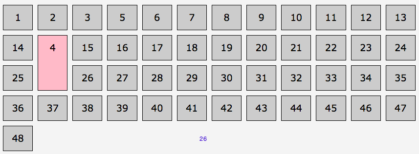
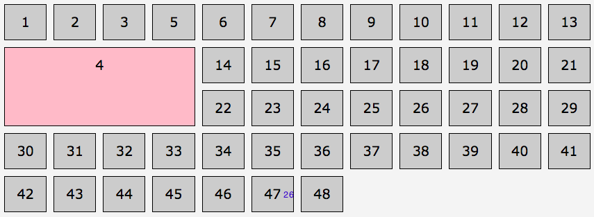
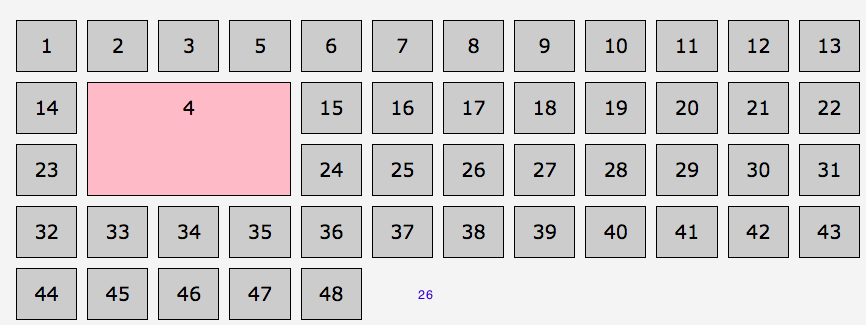

# Grid-area shorthand

```
grid-area: a / b / c / d
grid-row-start / grid-column-start / grid-row-end / grid-column-end
```
`grid-area: a / b / c;`

grid-column-end was omitted 
d = named grid-column-start || auto



`grid-area: a / b; `

grid-row-end and grid-column-end omitted 
c = named grid-row-start || auto
d = named grid-column-start || auto

`grid-area: a;`

Only grid-row-start is declared

if grid-row-start is named, all four longhands are set to that value. Otherwise, set to

We can use naming:

```css
ol { 
  grid-template-columns: [start] repeat(3, 1fr)
[mid]repeat(9, 1fr)[end] ;
}
.myItem { background-color: pink;
  grid-row-start: 2;
  grid-row-end: 4;
  grid-column-start: 1;
  grid-column-end: 5;
  ```

  

  or 

  ```css
  ol { 
  grid-template-columns: 1fr [start] repeat(3, 1fr)
[mid]repeat(8, 1fr)[end] ;
}
.myItem { background-color: pink;
  grid-row-start: 2;
  grid-row-end: 4;
  grid-column-start: start;
  grid-column-end: mid;
/* or we can short with grid-area: 2/start/4/mid */
```

