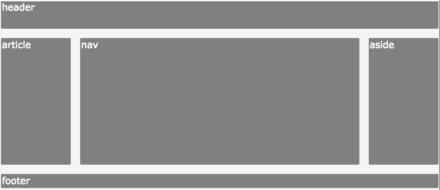

# Grid Item Properties

```
grid-column-start
grid-column-end
grid-column

grid-row-start
grid-row-end
grid-row

grid-area
```
```
justify-self
align-self
```

# Holy Grail Layout 

Basically the difference between flexbox and grid:

* Flexbox is essentially for laying out items in a single dimension — in a row OR a column.
* CSS Grid is for the layout of items in two dimensions — rows AND columns that need to relate to one another.

… they can even be used in tandem! They can work together: a grid item can be a flexbox container. A flex item can be a grid container.

```css
body {
  display: grid;
  grid-template-columns: 1fr 4fr 1fr;
  grid-template-rows: 3em 1fr 1.5em;
  grid-gap: 1em;
}
header {
   grid-row: 1/2;
   grid-column: 1/4;
}
footer {
   grid-row: 3/4;
   grid-column: 1/4;
}
style {
   grid-row: 4/5;
   grid-column: 1/4;
}
```



