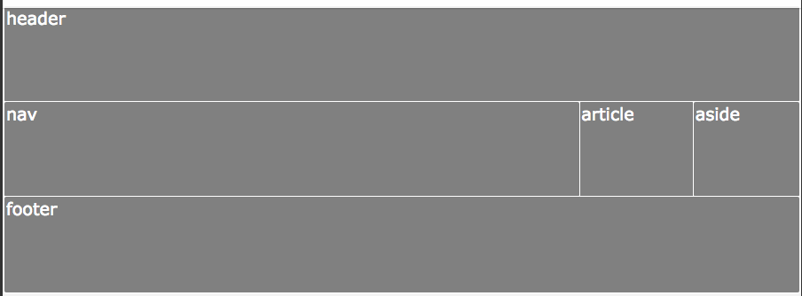
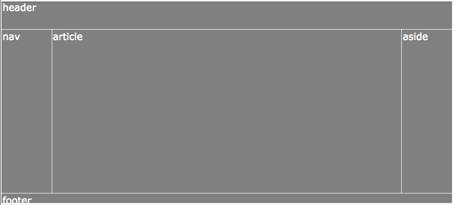

# Template Areas

Another way to make a grid is to name areas

Our magic layout:

```css
body {
    display:grid;
  grid-template-areas:
      "header header header"
      "nav article aside"
      "footer footer footer";
}
```
```css
header {
  grid-area: header;
}
nav {
  grid-area: nav;
}
article {
  grid-area: article;
}
aside {
    grid-area: aside;
}
footer{
    grid-area:footer;
}
```



To make it better looking we can add columns and rows sizes:

```css
body {
display:grid;
  grid-template-areas:
      "header header header"
      "nav article aside"
      "footer footer footer";
grid-template-rows:3em 1fr 1em;
grid-template-columns: 100px 1fr 100px;
}
```

