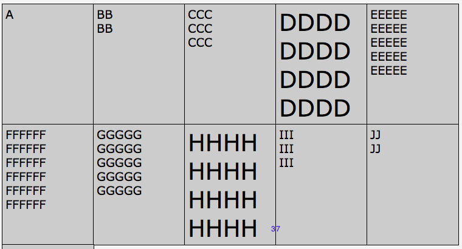
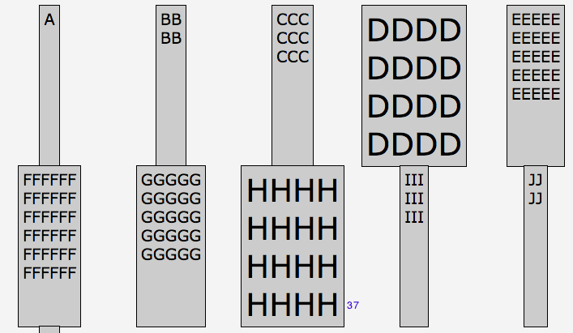
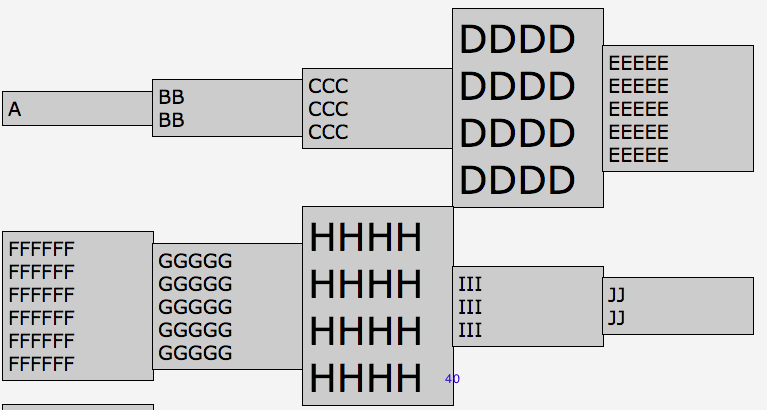

# Alignment

Container Properties

```
justify-items
align-items
justify-content
align-content
grid-auto-columns
grid-auto-rows
grid-auto-flow
grid
```
Item properties

```
justify-self
align-self
```
## Row alignment: justify-items property

```
justify-items: 
  normal | stretch | baseline | start |  end | center | flex-end | 
  flex-start | legacy | safe | unsafe | left | right | 
  center | self-end | self-start | start | stretch | unset
```
Aligns items in the inline direction (horizontal)

```
justify-items: normal | stretch | <baseline-position> | [ <overflow-position>? <self-position> ] |
  [ legacy || [ left | right | center ] ]
```
`<baseline-position> = baseline | first baseline (start) | last baseline (end)`
```
<overflow-position>? <self-position> = [safe | unsafe]? [right | center | left |
   start | flex-start | flex-end | end | self-start]
```
### Example justify-items

```css
.container { 
  grid-template-columns: repeat(5, 150px);
  justify-items: 
}
```


If we use e.g ` justify-items: center` we'll have 

```css
.container { 
  grid-template-columns: repeat(5, 150px);
  justify-items: center;
}
```


### New Terms

`<overflow-position> = unsafe | safe`

**safe**

If it overflows the alignment container, it aligns as if the alignment mode were start.

**unsafe**

No matter the relative sizes overflowing, the alignment value is honored.

`legacy || left | center | right`

**legacy**

Value inherits into descendants. Computes to inherit (if declared) or normal (if defaulting) if left | center | 

## Column alignment: align-items property

Aligns items in the block direction (vertical)

```
align-items:   baseline | center | 
  end | flex-end | flex-start | left |  
  normal | right | safe | self-end | self-start | 
  start | stretch | unsafe 
  ```

* aligns content of all the grid cells to the content within each cell
* individual grid cell content alignment can be overwritten with align-self and justify-self.

### Example align-items

```css
.container { 
  grid-template-columns: repeat(5, 150px);
  align-items: center;
} 
```


## Do both: place-items property

`place-items: <align-items>  <justify-items`

* shorthand for align-items and justify items
* Order matters! align items is first.
* If only one value is declared, will be applied to both.