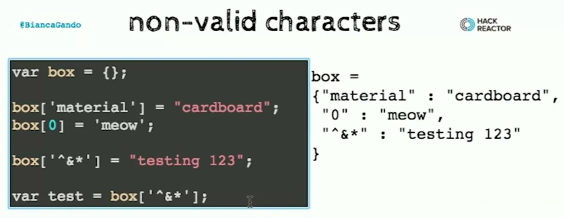
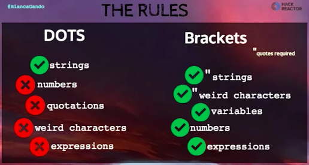

# Dos & Don'ts

* don't use `dot notation` with a `variable`
* don't use quotations around your `variable`

### Non-valid characters 

With `dot notation` you have to use valid `variable names`. Invalid can be:
* numbers
* wierd characters
If you have to use them - use `brackets notation` with quotation marks. 

### The Rules

