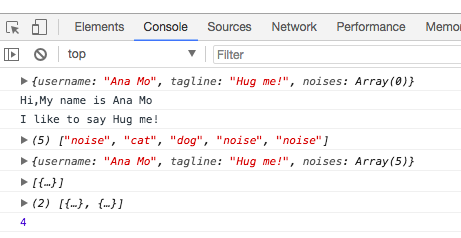

# Challenge - Arrays as Collections

### **Create an array:**

* Create a variable called `noiseArray` and assign it to an `array` literal. Place at least one `element` in the `array`.

- *Using a native array method…*

* Add a `noise` to the beginning of the `noiseArray`.
* Add another `noise` to the end of the `noiseArray`.

- *Using Bracket Notation…*

* Add another `noise` to the end.
* Inspect the `noiseArray`:

1. What is the length?
2. What is the last index? How is it different than the length?
3. Inspect your handiwork! What does it look like?

* Nest the `array` in the `object`:

* Put the `noiseArray` inside the animal `object` on the `noises` property. Your result should look like this:

`{ username: 'DaffyDuck', tagline: 'Yippeee!', noises: ['quack', 'honk', 'sneeze'] }`

Congrats! You just made a nested data structure :)

### **Review**

Let's go over some concepts:

* What are the different ways you can add properties and values to arrays?
* Come up with two ways you can add an element to the end of an array, without knowing the exact length of the array.

### **Animal Collection**

**A collection is an array of objects.**

* Create a `variable` called `animals` and set it equal to an empty `array`.
- *Note that this variable is `animals` (plural) while the variable in the Animal User Model of the Object Exercises is `animal` (singular).*
* Using any `method` you prefer, add your `animal` from the Object Exercises to the `animals array`.
* Create a `variable` called `quackers` and assign it to this example object:
`{ username: 'DaffyDuck', tagline: 'Yippeee!', noises: ['quack', 'honk', 'sneeze', 'growl'] }`
* Add `quackers` to the `animals array` using a different `method` than before.
* Inspect your `animals array` to ensure you have two `objects` inside.
* Create two more `animal objects` and add them to your `animals array`. They should have these `properties` and your choice of `value`s:
- `username (with a string value)`
- `tagline (with a string value)`
- `noises (with an array of values)`
* Check the `length` property of your `array`. It should give you `4`.

### Solution
```js
var animal = {

}

animal.username  = "Ana Mo";
animal.tagline = "Hug me!";
let noises = [ ];
animal['noises'] = noises;  

console.log(animal);
let count = 0;

for(let property in animal){
count ++;
if(property === 'username'){  
console.log("Hi,My name is " +  animal[property]);
}else if(property === 'tagline'){
console.log("I like to say " + animal[property]);
}
}

let noiseArray = ['cat','dog'];
noiseArray.unshift('noise');
noiseArray.push('noise');
noiseArray[4] = 'noise'; 
noiseArray.length;
console.log(noiseArray);

animal.noises = noiseArray;
console.log(animal);

let animals = [];
animals.push(animal)
console.log(animals)

let quackers = { 
username: 'DaffyDuck', 
tagline: 'Yippeee!', 
noises: ['quack', 'honk', 'sneeze', 'growl'] 
};

animals.unshift(quackers); // or anlimals[animals.length] = quackers

console.log(animals)

let animal2 = {
    username : "Jan Xo",
    tagline : "Hug me!",
    noises: ['hi','i', 'am', 'here']
}
 let animal3 = {
    username : "Any Ly",
    tagline : "Kiss me!",
    noises: ['i','am', 'waiting', 'here']
 }

 animals.push(animal2, animal3)
console.log(animals.length)
```

