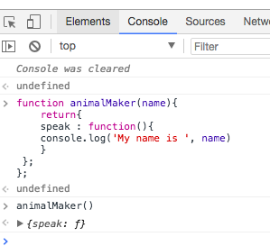
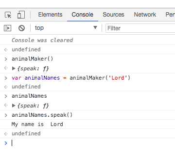
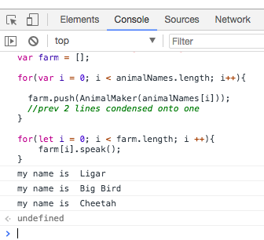

# Constructors

The idea is that the `function` is a `constructor`. Constructor at its core is - a `function` that returns an `object`.

```js
function animalMaker(name){
    return{
    speak : function(){
    console.log('My name is ', name)
    }
 };
};

var animalNames = ['Sheep', 'Liger', 'Big Bird'];
``` 
If we call `animalMaker` function. it'll return us an `object`.



And if we want to access the `property value` of this `object`, we should first pass an `argument` and access the property value. 



# Looping

If we want to `loop` throung animalNames `array` and to create an `object`

```js
function animalMaker(name){
    return{
    speak : function(){
    console.log('My name is ', name)
    }
 };
};

var animalNames = ['Sheep', 'Liger', 'Big Bird'];
var farm = [];

for (let i = 0; i < animalNames.length; i ++){
farm[i] = animalMaker(animalNames[i]);
}
```
**OR**

```js
function AnimalMaker(name) {
  return { 
    speak: function () { 
      console.log("my name is ", name); 
    } 
  };
};
    
var animalNames = ['Sheep', 'Liger', 'Big Bird'];  

var farm = [];

for(var i = 0; i < animalNames.length; i++){
  var animal = AnimalMaker(animalNames[i])
  farm.push(animal);
}
```

**OR**

```js
function AnimalMaker(name) {
  return { 
    speak: function () { 
      console.log("my name is ", name); 
    } 
  };
};

var animalNames = ['', '', ''];
var farm = [];

for(var i = 0; i < animalNames.length; i++){

  farm.push(AnimalMaker(animalNames[i]));
  //prev 2 lines condensed onto one
}
```
Now what if we want to `loop` through our `farm` and have all the animals say their names. 
        
```js
function AnimalMaker(name) {
  return { 
    speak: function () { 
      console.log("my name is ", name); 
    } 
  };
};

var animalNames = ['Ligar', 'Big Bird', 'Cheetah'];
var farm = [];

for(var i = 0; i < animalNames.length; i++){

  farm.push(AnimalMaker(animalNames[i]));
}

for(let i = 0; i < farm.length; i ++){
    farm[i].speak();
}
```

