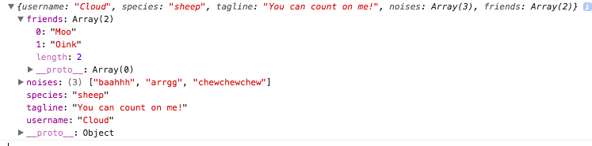

# Challenge Functions, Constructors

### Tasks 

1. Write a `function`, `AnimalTestUser`, that has one `string` parameter, `username`. It returns an `object` with a `username property`.

2. In your `AnimalTestUser` function, create a check that sees how many `arguments` are passed. If there is more than one `argument`, create a `property`, `otherArgs` that is an `array` of the remaining arguments. Note: the `arguments keyword` is not a true array. Remember, it is an `array-like object`.

3. Write a `constructor function`, `AnimalCreator` that returns a single animal `object`. The `constructor function` has 4 `parameters`: `username`, `species`, `tagline`, and `noises`. The `animal object` should have at least 5 `properties`: `username`,`species`, `noises`, `tagline`, and `friends`. The `values` should all be `strings` except `noises` and `friends`, which are `arrays`.

```js
var sheep = AnimalCreator('Cloud', 'sheep', 'You can count on me!', ['baahhh', 'arrgg', 'chewchewchew']);
console.log(sheep);
      // { username: 'Cloud', 
      //  species: 'sheep', 
      //  tagline: 'You can count on me!', 
      //  noises: ['baahhh', 'arrgg', 'chewchewchew'], 
      //  friends: []
      // }
```
4. Write a `function`, `addFriend` that takes an animal `object` (like the one returned from the `AnimalCreator` function) and adds another animal `object` as a friend.
  
```js
addFriend(sheep, cow);
  console.log(sheep);
        // { username: 'Cloud', 
        //  species: 'sheep', 
        //  tagline: 'You can count on me!', 
        //  noises: ['baahhh', 'arrgg', 'chewchewchew'], 
        //  friends: [{username: 'Moo', species: 'cow'...}]
        // }
  addFriend(sheep, llama);
  console.log(sheep);
        // { username: 'Cloud', 
        //  species: 'sheep', 
        //  tagline: 'You can count on me!', 
        //  noises: ['baahhh', 'arrgg', 'chewchewchew'], 
        //  friends: [{username: 'Moo', species: 'cow'...}, {username: 'Zeny', species: 'llama'...}]
        // }
```
5. Change your `addFriend` function to only add the `username` of the friend, not the whole `object`.

```js
addFriend(sheep, cow);
  console.log(sheep);
        // { username: 'Cloud', 
        //  species: 'sheep', 
        //  tagline: 'You can count on me!', 
        //  noises: ['baahhh', 'arrgg', 'chewchewchew'], 
        //  friends: ['Moo']
        // }
  addFriend(sheep, llama);
  console.log(sheep);
        // { username: 'Cloud', 
        //  species: 'sheep', 
        //  tagline: 'You can count on me!', 
        //  noises: ['baahhh', 'arrgg', 'chewchewchew'], 
        //  friends: ['Moo', 'Zeny']
        // }
```
6. Create a `myFarm` collection of at least 3 animal `objects`. Give them some friends using `addFriend`, too!
```js
console.log(myFarm) //[{username: 'Cloud'...},{username: 'Zeny'...},{username: 'CottonBall'...}]
```
7. Create a `function`, `addMatchesArray`, that takes a `farm` (array of animal objects) and adds a new `property` to each animal `object` called `matches` that is an empty `array`. Hint: you will need a `loop`.
```js
addMatchesArray(myFarm); 
console.log(myFarm[0]); // { username: 'Cloud', 
        //  species: 'sheep', 
        //  tagline: 'You can count on me!', 
        //  noises: ['baahhh', 'arrgg', 'chewchewchew'], 
        //  friends: ['Moo', 'Zeny'],
        //  matches: []
        // }
```
8. Create a `function`, `giveMatches`, that takes a `farm` collection (aka an `array` of animal `objects`) that already has a `matches` property. It selects a name from the `friends array` and adds it to the `matches array`. You can choose how the selection is made (random, the first element, etc). Make sure all your `animal objects` have `friends`.
```js
giveMatches(myFarm); 
console.log(myFarm[0]); // { username: 'Cloud', 
        //  species: 'sheep', 
        //  tagline: 'You can count on me!', 
        //  noises: ['baahhh', 'arrgg', 'chewchewchew'], 
        //  friends: ['Moo', 'Zeny'],
        //  matches: ['Zeny']
        // }
```

### Solutions

1. Answer 

```js
function AnimalTestUser(username){
return {
username : username
};
};
var testSheep = AnimalTestUser('CottonBall');
console.log(testSheep); //{ username: 'CottonBall' }
```


2. Answer

```js
function AnimalTestUser(username){
    var args  = arguments.length;
if (args > 1){
    var otherArgs = [];
    for(i = 0; i < args; i ++){
        otherArgs.push(arguments[i]);
    }
}
return {
username : username,
otherArgs : otherArgs
};
};
var testSheep = AnimalTestUser('CottonBall', {'loves dancing': true}, [1,2,3] );
console.log(testSheep); //{ username: 'CottonBall', otherArgs: [ {'loves dancing': true}, [1,2,3] ] }
```


3. Answer 

```js
function AnimalCreator (username, species, tagline, noises){
    var animal = {
    username : username,
    species : species,
    tagline : tagline,
    noises : noises,
    friends : [ ]
};
return animal;
}
var sheep = AnimalCreator('Cloud', 'sheep', 'You can count on me!', ['baahhh', 'arrgg', 'chewchewchew']);
console.log(sheep);
```


4. Answer

```js
function addFriend (animal, friend){
    animal.friends.push(friend)
  }; 

var sheep = AnimalCreator('Cloud', 'sheep', 'You can count on me!', ['baahhh', 'arrgg', 'chewchewchew']);
var cow = AnimalCreator('Moo', 'cow', 'hello there!', ['blah', 'murmurmur','gumgum'])

addFriend(sheep, cow);
console.log(sheep);
```


```js
function addFriend (animal, friend){
    animal.friends.push(friend)
  }; 

var sheep = AnimalCreator('Cloud', 'sheep', 'You can count on me!', ['baahhh', 'arrgg', 'chewchewchew']);
var cow = AnimalCreator('Moo', 'cow', 'hello there!', ['blah', 'murmurmur','gumgum'])
var llama = AnimalCreator('Oink', 'pig', 'hahaha', 'gagaga')

addFriend(sheep, cow);
console.log(sheep);

addFriend(sheep, llama);
console.log(sheep);
```


5. Answer

```js
function addFriend (animal, friend){
    animal.friends.push(friend['username'])
  }; 

var sheep = AnimalCreator('Cloud', 'sheep', 'You can count on me!', ['baahhh', 'arrgg', 'chewchewchew']);
var cow = AnimalCreator('Moo', 'cow', 'hello there!', ['blah', 'murmurmur','gumgum'])
var llama = AnimalCreator('Oink', 'pig', 'hahaha', 'gagaga')

addFriend(sheep, cow);
console.log(sheep);

addFriend(sheep, llama);
console.log(sheep);
```



6. Answer

```js
let myFarm = [sheep, cow, llama];
addFriend(cow,sheep);
addFriend(llama,cow);
console.log(myFarm);
```


7. Answer

```js
function addMatchesArray(farm){
for (i = 0; i < farm.length; i ++){
farm[i].matches = [];
}
}
addMatchesArray(myFarm); 
console.log(myFarm[0]);
```


8. Answer

```js
function giveMatches(farm){
    for( i = 0; i < farm.length; i ++){
       farm[i].matches.push(farm[i].friends[0])
    }
}

giveMatches(myFarm); 
console.log(myFarm[0]);
```


