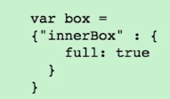

# Nesting Objects

`innerBox` is a property in `box` that contains a `value` that is also an `object`. So, this is a nested `object`.

```js
var box = {};
box['innerBox'] = {}; //we can have innerbox inside our box
```
 

```js
var box = {};
box['innerBox'] = {}; //we can have innerbox inside our box
box['innerBox']['full'] = true; //we can create for the innerbox, the property - full : true
```
 

**NOTE** Rules don't channge. We can also use `dot-notation`.

```js
var box = {};
box['innerBox'] = {}; 
box['innerBox'].full = true;
```
What if we assign `box` and `innerBox` to a `variable`?

```js
var box = {};
box['innerBox'] = {}; 
box['innerBox'].full = true;
var myInnerBox = box.innerBox;
myInnerBox; //{full : true} will be the result
```
What if we have triple nested `box`?

```js
var box = {};
box.innerBox = {}; 
box.innerBox.babyBox = {};
box.innerBox['babyBox']; // {}
box.innerBox['babyBox'].says = "What's up?" 
box.innerBox['babyBox']; // says : "What's up?" 
```
[nesting-objects3](../nesting-objects3.png) 


