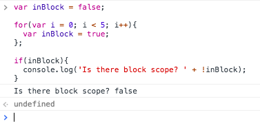

# Precedence

How do we know which one wins, if we have two `variables` with the same name?

```js
var g = "global";

function go() { 
  var l = "local";
  var g = "in here!";
  alert(g + " inside go"); //'in here inside go' - so it will take the most local 'g', i.e inside the function
}

go();
alert(g + " outside go"); //'global outside go'- it will take the most local 'g' - from the global 
```

# Block Scope

In this exapmple all operates in `global scope`. We don't have `block scope`. 

```js
var inBlock = false;

for(var i = 0; i < 5; i++){
  var inBlock = true;
};

if(inBlock){
  console.log('Is there block scope? ' + !inBlock);
}
```

