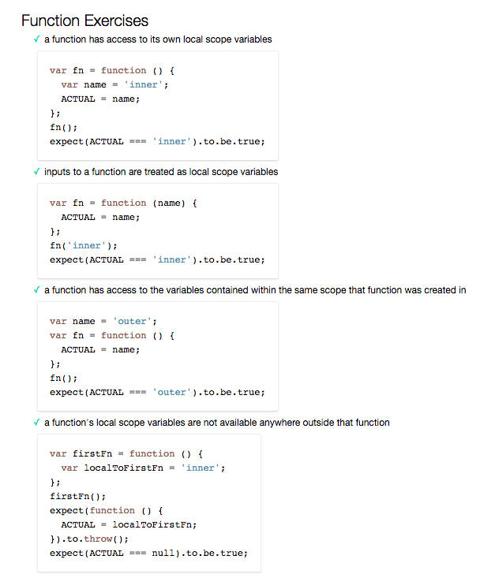
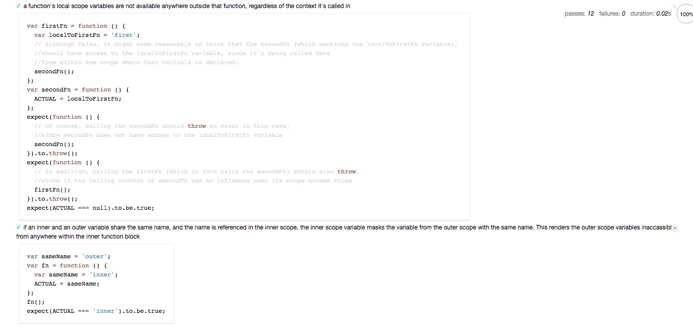
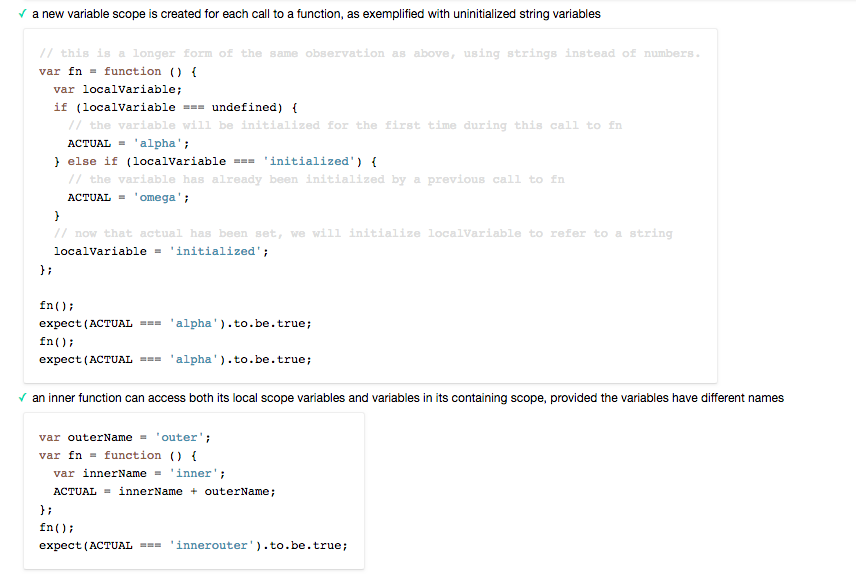
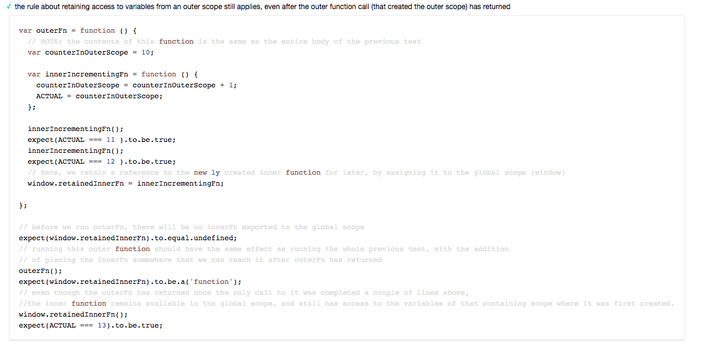

# Challenge

A test block starts with an `it` function. The `it` function takes two `arguments`. The first one is a statement describing the rule addressed by the test. The second is a `function` that will either evaluate to `true` or `false` using the `expect` function. The `expect` statement `(expect(ACTUAL === 'inner').to.be.true;)` will evaluate if the statement between the parens `ACTUAL === 'inner'` is true. You can almost read it like plain English. The expect statement below "expects that the variable ACTUAL equals the value 'inner' to be true".

```js
(function () {


  describe('Function Exercises', function () {

      var ACTUAL;

      // This resets the value of ACTUAL (to null) before each test is run
      beforeEach(function () {
        ACTUAL = null;
      });

      it('a function has access to its own local scope variables', function () {
        var fn = function () {
          var name = 'inner';
          ACTUAL = name;
        };
        fn();
        expect(ACTUAL === 'inner').to.be.true; //solution
      });

      it('inputs to a function are treated as local scope variables', function () {
        var fn = function (name) {
          ACTUAL = name;
        };
        fn('inner');
        expect(ACTUAL === 'inner').to.be.true; //solution
      });

      it('a function has access to the variables contained within the same scope that function was created in', function () {
        var name = 'outer';
        var fn = function () {
          ACTUAL = name;
        };
        fn();
        expect(ACTUAL === 'outer').to.be.true; //solution
      });

      it('a function\'s local scope variables are not available anywhere outside that function', function () {
        var firstFn = function () {
          var localToFirstFn = 'inner';
        };
        firstFn();
        expect(function () {
          ACTUAL = localToFirstFn;
        }).to.throw();
        expect(ACTUAL === null).to.be.true; //solution
      });

      it('a function\'s local scope variables are not available anywhere outside that function, regardless of the context it\'s called in', function () {
        var firstFn = function () {
          var localToFirstFn = 'first';
          // Although false, it might seem reasonable to think that the secondFn (which mentions the localToFirstFn variable), 
          //should have access to the localToFirstFn variable, since it's being called here 
          //from within the scope where that variable is declared.
          secondFn();
        };
        var secondFn = function () {
          ACTUAL = localToFirstFn;
        };
        expect(function () {
          // of course, calling the secondFn should throw an error in this case, 
          //since secondFn does not have access to the localToFirstFn variable
          secondFn();
        }).to.throw();
        expect(function () {
          // in addition, calling the firstFn (which in turn calls the secondFn) should also throw, 
          //since it the calling context of secondFn has no influence over its scope access rules
          firstFn();
        }).to.throw();
        expect(ACTUAL === null).to.be.true; //solution
      });

      it('if an inner and an outer variable share the same name, and the name is referenced in the inner scope, the inner scope variable masks the variable from the outer scope with the same name. This renders the outer scope variables inaccassible from anywhere within the inner function block', function () {
        var sameName = 'outer';
        var fn = function () {
          var sameName = 'inner';
          ACTUAL = sameName;
        };
        fn();
        expect(ACTUAL === 'inner').to.be.true; //solution
      });

      it('if an inner and an outer variable share the same name, and the name is referenced in the outer scope, the outer value binding will be used', function () {
        var sameName = 'outer';
        var fn = function () {
          var sameName = 'inner';
        };
        fn();
        ACTUAL = sameName;
        expect(ACTUAL === 'outer').to.be.true; //solution
      });

      it('a new variable scope is created for every call to a function, as exemplified with a counter', function () {
        var fn = function () {
          // the `||` symbol here is being used to set a default value for innerCounter. 
          //If innerCounter already contains a truthy value, then the value in that variable will be unchanged. 
          //If it is falsey however (such as if it were completely uninitialized), then this line will set it to the default value of 10.
          var innerCounter = innerCounter || 10;
          innerCounter = innerCounter + 1;
          ACTUAL = innerCounter;
        };

        fn();
        expect(ACTUAL === 11 ).to.be.true; //every time we call a function it creates a new scope, so innercounter won't change  //solution
        fn();
        expect(ACTUAL ===  11 ).to.be.true; //solution
      });

      it('a new variable scope is created for each call to a function, as exemplified with uninitialized string variables', function () {
        // this is a longer form of the same observation as above, using strings instead of numbers.
        var fn = function () {
          var localVariable;
          if (localVariable === undefined) {
            // the variable will be initialized for the first time during this call to fn
            ACTUAL = 'alpha';
          } else if (localVariable === 'initialized') {
            // the variable has already been initialized by a previous call to fn
            ACTUAL = 'omega';
          }
          // now that actual has been set, we will initialize localVariable to refer to a string
          localVariable = 'initialized';
        };

        fn();
        expect(ACTUAL === 'alpha').to.be.true; //solution
        fn();
        expect(ACTUAL === 'alpha').to.be.true; //solution
      });

      it('an inner function can access both its local scope variables and variables in its containing scope, provided the variables have different names', function () {
        var outerName = 'outer';
        var fn = function () {
          var innerName = 'inner';
          ACTUAL = innerName + outerName;
        };
        fn();
        expect(ACTUAL === 'innerouter').to.be.true; //solution
      });

      it('between calls to an inner function, that inner function retains access to a variable in an outer scope. Modifying those variables has a lasting effect between calls to the inner function.', function () {
        var outerCounter = 10;

        var fn = function () {
          outerCounter = outerCounter + 1;
          ACTUAL = outerCounter;
        };

        fn();
        expect(ACTUAL === 11 ).to.be.true; //solution
        fn();
        expect(ACTUAL === 12 ).to.be.true; //solution
      });

      it('the rule about retaining access to variables from an outer scope still applies, even after the outer function call (that created the outer scope) has returned', function () {
        var outerFn = function () {
          // NOTE: the contents of this function is the same as the entire body of the previous test
          var counterInOuterScope = 10;

          var innerIncrementingFn = function () {
            counterInOuterScope = counterInOuterScope + 1;
            ACTUAL = counterInOuterScope;
          };

          innerIncrementingFn();
          expect(ACTUAL === 11 ).to.be.true; //solution
          innerIncrementingFn();
          expect(ACTUAL === 12 ).to.be.true; //solution
          // Here, we retain a reference to the newly created inner function for later, by assigning it to the global scope (window)
          window.retainedInnerFn = innerIncrementingFn;

        };

        // before we run outerFn, there will be no innerFn exported to the global scope
        expect(window.retainedInnerFn).to.equal.undefined;
        // running this outer function should have the same effect as running the whole previous test, with the addition
        // of placing the innerFn somewhere that we can reach it after outerFn has returned
        outerFn();
        expect(window.retainedInnerFn).to.be.a('function');
        // even though the outerFn has returned once the only call to it was completed a couple of lines above, 
        //the inner function remains available in the global scope, and still has access to the variables of that containing scope where it was first created.
        window.retainedInnerFn(); 
        expect(ACTUAL === 13).to.be.true; //solution
      });

  });

})();
```
### Visual












