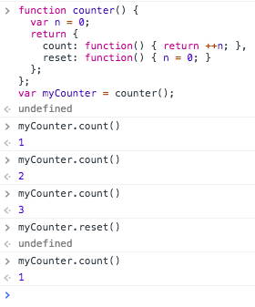

# Closure Objects

The other cool thing is that we also return an `object` with `methods`. The same rules apply. 

```js
function counter() {
  var n = 0;
  return {
    count: function() { return ++n; },
    reset: function() { n = 0; }
  };
};
var myCounter = counter();
myCounter.count(); //1
myCounter.count(); //2

```
### Step-by-step

* we call `counter` function and it goes to the `counter body`
* it sets the local variable `n` to `0`
* then we return an `object`
* `var myCounter` now assigns this `object`
* now if we want to increment - we need to get `property` in the `object` to count and call `myCounter`
* now if we want to reset - we need to get `property` in the `object` to reset and call `myCounter`

As we see, we can return our `functions` from inside of the `object`. And `n` inside the `functions` which are inside the `object` still gets access to the parent's `scope`. 


