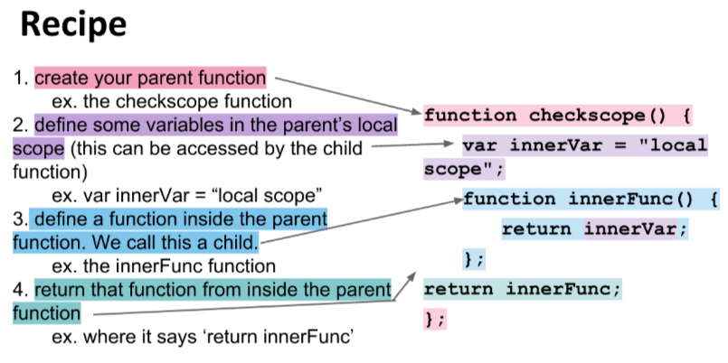
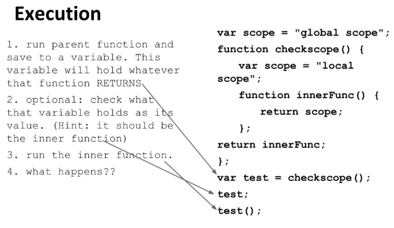

# Closure Recipe

Here is a `closure` creation recipe. 



And this is how you execute this



### One more example

```js
var sayAlice = function(){

  var makeLog = function() {
    console.log(alice);
  };

  var alice = 'Why hello there, Alice!';

  return makeLog;
};

var whatDoesSheSay = sayAlice();
whatDoesSheSay(); // 'Why hello there, Alice!'
```

So, we have the result despite that the local variable `alice`, which is in the `parent scope` was set after the `inner function`. It still works!

But if we return the `inner function` before we set the `alice` variable - it won't work. 

```js
var sayAlice = function(){

  var makeLog = function() {
    console.log(alice);
  };
  return makeLog;
  var alice = 'Why hello there, Alice!';

  return makeLog;
};

var whatDoesSheSay = sayAlice();
whatDoesSheSay(); // error
```
