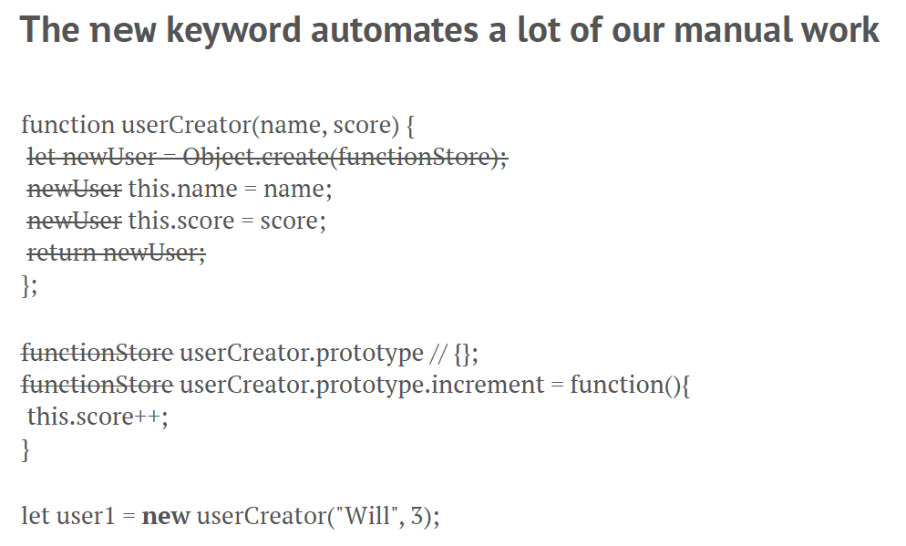

# `new` Operator

#### **Solution 3**
Introduce magic keyword `new`
`let user1 = new userCreator("Will", 3)`
What happens when we invoke `userCreator("Will", 3)` without the `new` keyword?

When we call the `constructor function` with new in front we automate 2 things
1. Create a new user object
2. return the new user object

