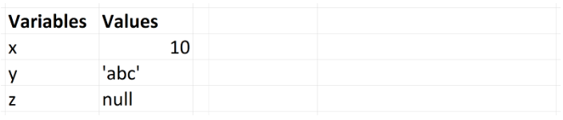
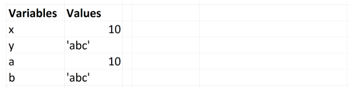
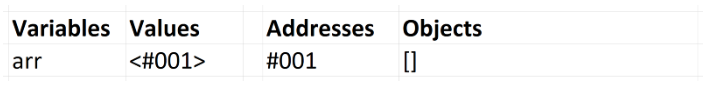
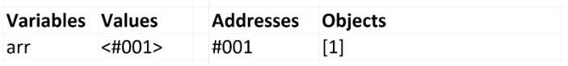
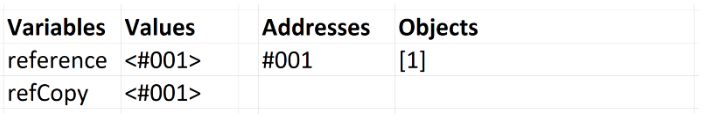
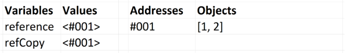

# Reference variables. Value variables

Javascript has 5 data types that are passed by **value**: `Boolean`, `null`, `undefined`, `String`, and `Number`. We’ll call these **primitive types**.

Javascript has 3 data types that are passed by **reference**: `Array`, `Function`, and `Object`. These are all technically Objects, so we’ll refer to them collectively as **Objects**.

### Primitives
If a primitive type is assigned to a `variable`, we can think of that `variable` as containing the `primitive value`.

```js
var x = 10;
var y = 'abc';
var z = null;
```

`x` contains `10`. `y` contains `'abc'`. To cement this idea, we’ll maintain an image of what these `variables` and their respective values look like in memory.



When we assign these `variables` to other variables using `=`, we copy the value to the new `variable`. They are copied `by value`.

```js
var x = 10;
var y = 'abc';
var a = x;
var b = y;
console.log(x, y, a, b); // -> 10, 'abc', 10, 'abc'
```
Both `a` and `x` now contain `10`. Both `b` and `y` now contain `'abc'`. They’re separate, as the `values` themselves were copied.



Changing one does not change the other. Think of the `variables` as having no relationship to each other.

```js
var x = 10;
var y = 'abc';
var a = x;
var b = y;
a = 5;
b = 'def';
console.log(x, y, a, b); // -> 10, 'abc', 5, 'def'
```

### Objects

`Variables` that are assigned a non-primitive value are given a `reference` to that `value`. That `reference` points to the object’s `location in memory`. The `variables` don’t actually contain the `value`.

Objects are created at some location in your computer’s memory. When we write `arr = []`, we’ve created an `array` in memory. What the `variable` `arr` receives is the address, the location, of that `array`.

Let’s pretend that address is a new `data type` that is passed by `value`, just like `number` or `string`. An `address` points to the location, in memory, of a `value` that is passed by `reference`. Just like a string is denoted by quotation marks (`''` or `""`), an `address` will be denoted by arrow brackets,`<>`.

When we assign and use a `reference-type variable`, what we write and see is:
```js
1) var arr = [];
2) arr.push(1);
```
A representation of lines 1 and 2 above in memory is:

1. 



2. 



Notice that the value, the address, contained by the `variable` `arr` is static. The `array` in memory is what changes. When we use `arr` to do something, such as pushing a `value`, the Javascript engine goes to the location of `arr` in memory and works with the information stored there.

### Assigning by Reference

When a `reference type value`, an `object`, is copied to another `variable` using `=`, the `address` of that `value` is what’s actually copied over as if it were a primitive. `Objects` are copied by `reference` instead of `by value`.

```js
var reference = [1];
var refCopy = reference;
```
The code above looks like this in memory.



Each `variable` now contains a `reference` to the **same array**. That means that if we alter `reference`, `refCopy` will see those changes:

```js
reference.push(2);
console.log(reference, refCopy); // -> [1, 2], [1, 2]
```


We’ve pushed `2` into the `array` in memory. When we use `reference` and `refCopy`, we’re pointing to that `same array`.

resourse [=> here](https://codeburst.io/explaining-value-vs-reference-in-javascript-647a975e12a0)

