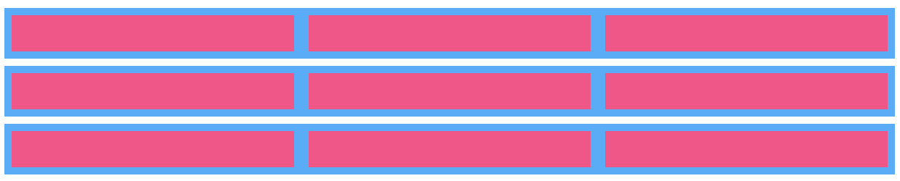

# Flex Containers

To use `Flexbox` in your application, you need to create/define a `flex container` using the **display** property.

```css
display: flex | inline-flex
```

This property accepts two values:

- `flex` − Generates a block level flex container. On passing this `value` to the `display` property, a `block level flex container` will be created. It occupies the full width of the parent container (`browser`).

##### Example 

Three `containers` in blue color with `display: flex`, containing three child `divs` in purple color with `flex: 1`.

Each `parent container` sits on its own line. The three `children` occupy an equal width.

```html
<!doctype html>
<html lang = "en">
   
   <body>
<div class="container--flex">
  <div class="flex-child"></div>
  <div class="flex-child"></div>
  <div class="flex-child"></div>
</div>
<div class="container--flex">
  <div class="flex-child"></div>
  <div class="flex-child"></div>
  <div class="flex-child"></div>
</div>
<div class="container--flex">
  <div class="flex-child"></div>
  <div class="flex-child"></div>
  <div class="flex-child"></div>
</div>
   </body>
</html>
```

```css
$flexColor: #64B5F6;
$inlineColor: #F06292;

.container--flex {
  background-color: $flexColor;
  margin-bottom: 10px; /* just for aesthetics */
}
.container--flex {
  display: flex;
}

.flex-child {
  flex: 1;
  min-width: 50px;
  min-height: 50px;
  margin: 10px;
  background-color: $inlineColor;
}

.flex-color {
  color: $flexColor;
}
.inline-color {
  color: $inlineColor;
}

/* Remaining styles are just to make the demo look nice */
body {
  font-family: 'Open Sans', sans-serif;
}
```




- `inline-flex` − Generates an inline flex container box. On passing this `value` to the `display` property, `an inline level flex container` will be created. It just **takes the place required for the content**.

##### Example

Three `containers` in blue color with `display: inline-flex`, containing three child `divs` in purple color with `flex: 1` and `min-width: 50px`.

Each `parent container` sits next to the other one, since they can all fit on the same row. The width of the `parent container` is dependent on the size of the children, which here have been given a `min-width of 50px`.

```html
<!doctype html>
<html lang = "en">
   
   <body>
<div class="container--inline-flex">
  <div class="flex-child"></div>
  <div class="flex-child"></div>
  <div class="flex-child"></div>
</div>
<div class="container--inline-flex">
  <div class="flex-child"></div>
  <div class="flex-child"></div>
  <div class="flex-child"></div>
</div>
<div class="container--inline-flex">
  <div class="flex-child"></div>
  <div class="flex-child"></div>
  <div class="flex-child"></div>
</div>
   </body>
</html>
```

```css
$flexColor: #64B5F6;
$inlineColor: #F06292;

.container--inline-flex {
  background-color: $flexColor;
  margin-bottom: 10px; /* just for aesthetics */
}

.container--inline-flex {
  display: inline-flex;
}
.flex-child {
  flex: 1;
  min-width: 50px;
  min-height: 50px;
  margin: 10px;
  background-color: $inlineColor;
}

.inline-color {
  color: $inlineColor;
}

/* Remaining styles are just to make the demo look nice */
body {
  font-family: 'Open Sans', sans-serif;
}
```


**Explanation**

An element with `display: flex` is similar to an element with `display: block`, whereby it occupies the whole `row`. However, its `child elements` can be positioned `flexibly` and dynamically, compared to previously-available layout properties.

If we change this to `display: inline-flex`, it:

- makes the `parent container` `display inline`
- still applies all `flex` properties to the `children`, no differently form `display: flex`

This means that if the `child elements` aren't too big, two containers with `display: inline-flex` can sit side-by-side.