# Basics

## Flexbox Layout 

The first thing is the concept of `container` and its `items`  - that;s always how you build your `flexbox layout`: they don't have to be `divs` or `nav` this could be any elements - as song as they are `direct children` of `flexbox container` they turn intp `flex items`. 

**html**

```html
    <body>
        
     <nav class="container">
         <div>Home</div>
         <div>Search</div>
         <div>Logout</div>
     </nav>

    </body>
```
So, to make our items `flex` we give a `container` - `display flex` rule in the css. **It ligns up the element horizontally**. By default `flexbox` will distribute the `items` going from left-to-right and `flexbox container` is by default **a block element** as it takes all available space in the width except for the little `margin` we've added for the left and right sides. 

**index. css**

```css
.container{
    border: 5px solid #ffcc5c;
    display: flex; 
}
```


## Main Axis and Cross Axis

`Flexbox container` always has a **direction**. By default this direction is `horizontal` -  so, our `main axis` goes from left to right along the row. We also have a `cross axis` which goes from top to bottom. 

> We are using different `css properties` in order to position our `content` along the `main axis` and `cross axis`.

However, that's not always the case. We can flip the direction of the `flexbox container` - if we change the `flex-direction` to **column** - that will result in stucking the `items` from top to bottom, going downwards. **And now the main axis actually goes from top to bottom**, and teh `cross axis` goes from left to right. 

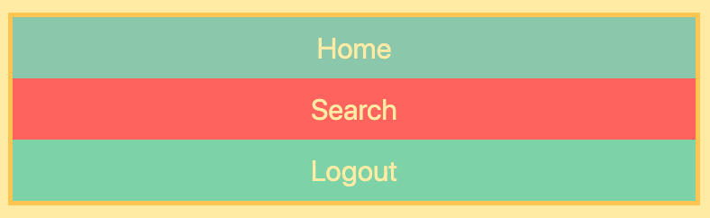

Well, in our case we switch back to the `row direction`, cos this direction is mostly used when building websites. 

## Justify Content

Now we'll know how to position the `items` along the `main axis` which goes from left to right. And that's because we don't want all our `items` to be squeezed together at the left-hand side, because we might e.g. have a little bit spacing between them or maybe move the `logout item` over to the right-hand side. We are goint to use the property `justify-content` - it actually contains a range of different items. By default `justify-content` is set to `flex-start` - meaning that all the items are squeezed together at the start of `main axis`. 

- So, we e.g can center it - `justify-content: center;` 


- Or, we e.g can move them to the right - `justify-content: flex-end;` 


- Or, e.g we wanna have space between the `items` - `justify-content: space-around;` - this will give the `items` equal amount of space on its left-hand side and its right-hand side. If two `items` are besides each other the `space between` is **twice as wide** as if it's only an `item` and the start of the `container` or the end of the `container`. 


- `space-evenly`


- `space-between`


## Pisitioning Items

How we can adjust the `position` of `single items` along the using the technique of `margin auto`, cos `justify-content` doesn't always do what you want it to do. E.g we don't want out `items` spread around the `container` but perhaps we want two items on the left-hand side and one item on the right-hand side. Let's start from the default position, and that forces us to target the item, we wanna move to the right, itself. So, we'll give the items `class names`. 

**html**

```html
<!doctype html>
<html lang="en">
    <head>
        <meta charset="utf-8">
        <meta http-equiv="X-UA-Compatible" content="IE=edge">
        <meta name="viewport" content="width=device-width, initial-scale=1">

        <title>Flexbox Example</title>

        <link rel="stylesheet" href="https://cdnjs.cloudflare.com/ajax/libs/font-awesome/4.7.0/css/font-awesome.min.css" />
        <link href="https://unpkg.com/tailwindcss@^1.0/dist/tailwind.min.css" rel="stylesheet">
        <link rel="stylesheet" href="basic.css">
        <link rel="stylesheet" href="index.css">


    </head>
    <body>
        
     <nav class="container">
         <div class="home">Home</div>
         <div class="search">Search</div>
         <div class="logout">Logout</div>
     </nav>
    


    </body>
</html>
```

Now, we can target the `logout item`, and set the `margin of the left-hand side` to `auto` - that pushes the `logo item` to the right, and the space from the left side of `logout item` is `margin left` of the `logout item`. 

**css**

```css
.container{
    border: 5px solid #ffcc5c;
    display: flex;
}

.logout{
    margin-left: auto;
}
```


If we wanna both items be moved to the right, we can simply target the `search item` instead. As the `search item` is before the `logout item` in the markup it'll push the `logout item` to the right as well, whan it's add a `margin` to its own left-hand side. 

**css**

```css
.container{
    border: 5px solid #ffcc5c;
    display: flex;
}

.search{
    margin-left: auto;
}
```


## The flex property

The `flex` property allows to give a `responsive width` to the `items` themselves - namely the `width` of the `items` according o the `width` of the entire `container`.  If we wanna all the `items` to `strech` across the entire `container` and `grow` and `shrink` with it,  we'll target the `items` and give them the `flex` property of `1`. They now take equal amount of space, the third each, and they grow and shrink with the `container`. 

**css**

```css
.container{
    border: 5px solid #ffcc5c;
    display: flex;
    justify-content: flex-end;
}

.container > div{
    flex: 1
}
```


There is a little bit of magic here, as `flex` is a shorthand of  the three other properties: `flex-grow`, `flex-shrink` and `flex-basis`. You can add as many `items` to the `container` as you want and `flex` will make them all responsive. 

We can also target specific items, let's say we wanna `search item` to be twice as wide as the rest of the `items` - we'll set `flex` to `2`. 

**css**

```css
.container{
    border: 5px solid #ffcc5c;
    display: flex;
    justify-content: flex-end;
}

.container > div{
    flex: 1
}

.container > .search{
    flex:2;
}
```


However, a more realistic use case is o have one of the `items` doing all the `flexing` while stay at `fixed width`, and we can achieve this by removing `flex-1` on all the `items` except the `search item`. Now the `search item` is growing and shrinking with the `container` and the rest items have fixed `width`.

**css**

```css
.container{
    border: 5px solid #ffcc5c;
    display: flex;
    justify-content: flex-end;
}

.search{
    flex:2;
}
```


## Align Items

How to control the `conten` along the `cross axis`. By default the `items` strech themselves across the `cross axis`. To make this a little bit more apparent let's set the `height` of the `container` to `100%`. Now the items strech from top to bottom regardless to how tall is the `container`. 

**index.css**

```css
.container{
    border: 5px solid #ffcc5c;
    display: flex;
    height: 100%;
}
```

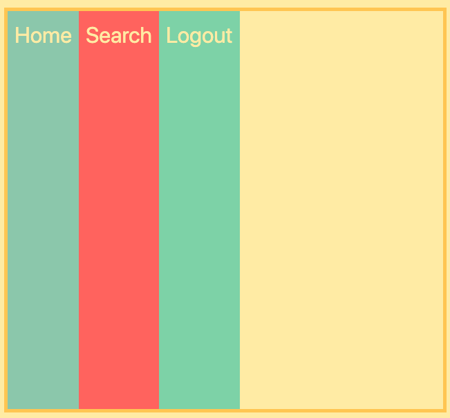

> Note. This only works cos we set the `100% height` of `html` and `body` as well. If we haven't done that the `html` and the `body` would just be the size whatever size the `main container` forces it to be, meaning whatever `height` the `container` needs in order to display its `content`. **So, this is a nice technique to have a `container` responsive in the height**. 

**basic.css**

```css
html,body{
    box-sizing: border-box;
    height: 100%;
    padding: 10px;
    background-color: #ffeead;
}
```

By default `align-items` property is set to `stretch`.  

- e.g `align-items: flex-start`. Items are pushed all the way to the top the start of the `cross axis`, and they only take as much space as they need in order to display their content. 

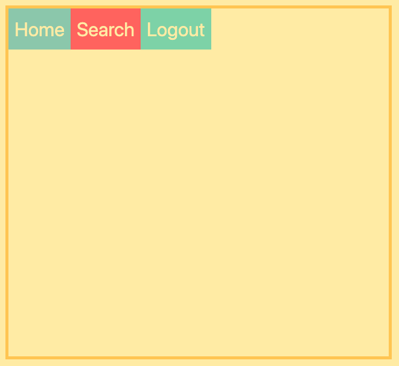

- e.g `align-items: flex-end`

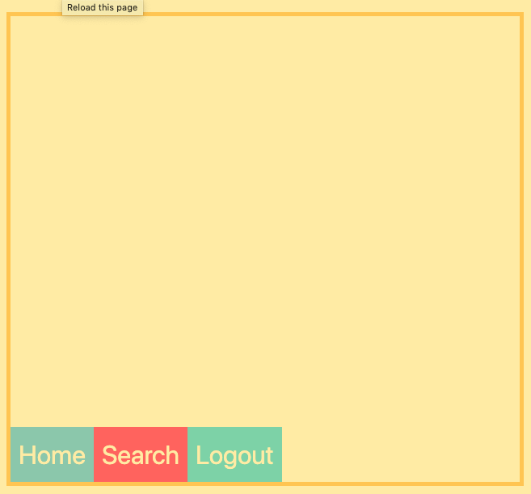

- e.g `align-items: center; `

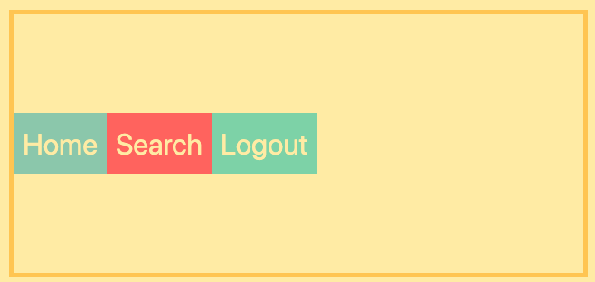

> `Flexbox` is great for centering an `item` inside of a `container`. E.g lets say we have a `button` and wanna center it, we can use `align-items: center` and combine it with `justify-content: center`. Now the `button` is centered no matter how the `container` is changed. 


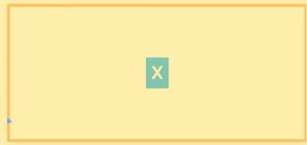

We surely can `align` a single item at a time - to achive this we should use `align-self` property. 


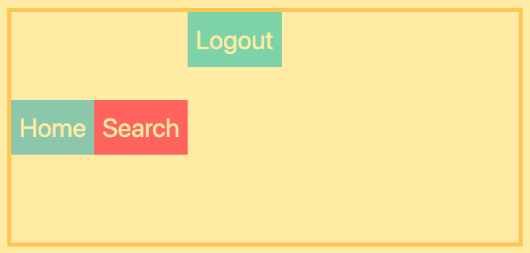


## Flex Direction - Column

`Flex-direction: column` change the `items` to go from top to bottom. And this again means that `justify-content` no longer controls how the `items` are stucked across the horisontal line, but rather **how they are stucked across the vertical line**, that's because the main axis now is vertical.    

**css** 

```css
.container{
    border: 5px solid #ffcc5c;
    display: flex;
    flex-direction: column;
}
```

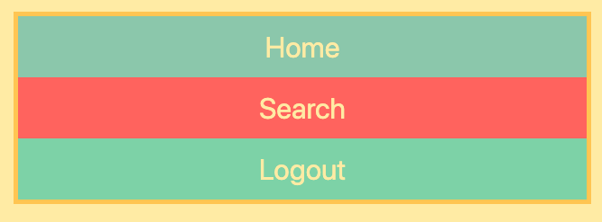

If we now use `jsutify-content: flex-end` - that will result in any change actually. That's because the `height` of the `container` isn't set explicitly, it's just as tall as the `content` inside of it forces it to be, meaning it has no extra space when it's trying to push all the `content` to the bottom of the `container`. All we have to do is explicitly set the `height` of the `container` to `100%` and 

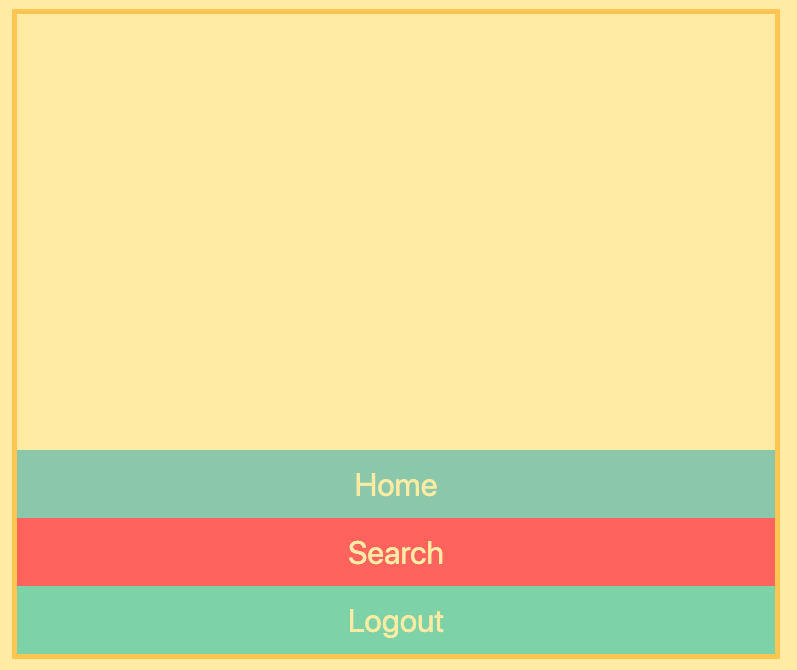

So, as well we can `align-items` (horizontally in the container). 

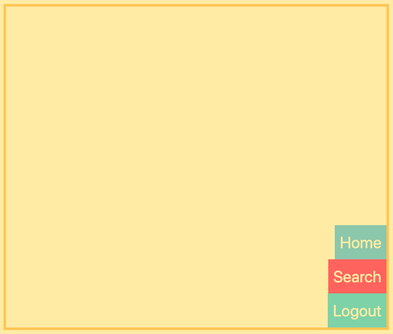


## Wrapping

For the example we have our standart `navbar` with three `items` inside, and each of them is just as wide as the `content` inside. 


Now, we'll target each of the `items` and give them `width` of `300px` - they now fill the entire width of the `container`. 

**css** 

```css
.container{
    border: 5px solid #ffcc5c;
    display: flex;
   
}

.container > div{
    width: 300px;
}
```


However they are clearly not 300px wide each, they are scaled downwards as the `container` is less than 900px wide in total. But if we widen the `container` the `items` become 300px wide. 


> So, what happns there is `flexbox` **won't allow you to set the `width` explicitly if there is not enough `width` in the `container` itself** to fill that content, it'll automatically scale it down and by default won't allow e.g. push any of the `items` down to the next `row`. And that's because `flexbox` has `wrap property` set by default to `no-wrap`, meaning you can only have one `row` or one `column`.  
If we change it to `wrap` it now allows us to wrap the `content`. 


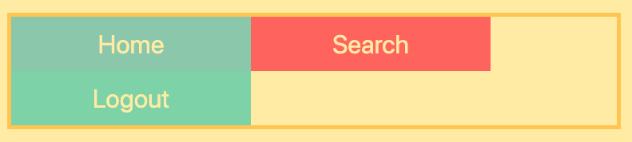

If we shrink the `container` even more, it'll wrap to only one `item` in each `row`. Now the total `container` `width` is less that 600px, meaning it can only fit `300px item` on ech row.

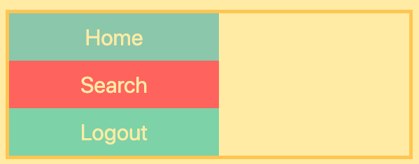

## Flex, grow, shrink, basis

Deep dive into the `flex property`. `Flex` is a shorthand for the three other properties: `flex-grow`, `flex-shrink` and `flex-basis`. 

Setting `flex` equal to `1` we actually setting all the three of these. Actually `flex: 1` is also a shorthand, what we are actually saying is: `flex: 1 1 0` - the first is the `grow value`, the second is the `shrink value` and the last is the `flex-basis value`. 

- setting `flex-basis`

e.g we are setting `basis` to 200px for both items. 

**css**

```css
.container{
    border: 5px solid #ffcc5c;
    display: flex;
    
}

.home{
    flex-basis: 200px;
}

.logout{
    flex-basis: 200px;
}
```


> `Flex-basis` is a way of setting the `base width` of the element. So, our two items stay at 200px regardless of how much extra space there is in the `container`. If the `container` is less than 400px, `items` start to shrink.

- `flex-grow`. The `items` actually grow with the `width` of the `container`. So, `flex-grow` basically desides how much of the extra space should be destributed to the various `items` (**evenly across the two items**).

**css**

```css
.container{
    border: 5px solid #ffcc5c;
    display: flex;
    
}

.home{
    flex-basis: 200px;
    flex-grow:1;
}

.logout{
    flex-basis: 200px;
    flex-grow:1;
}
```
If we'll set `flex-grow` to `0` then the extra space of the `container` not distributed to either `home item` or the `logout item` 


If e.g `logout item` will get the `flex-grow: 1`  - it'll take up all of the remaining space 


 So these two numbers ("flex-grow-1" for both items) also work in relation to each other. 

 If we set `flex-grow: 2` for the `logout item` - we'll see that `logout item` grows twice as quick as `home item` 

 **css**

 ```css
 .container{
    border: 5px solid #ffcc5c;
    display: flex;
    
}

.home{
    flex-basis: 200px;
    flex-grow: 1;
}

.logout{
    flex-basis: 200px;
    flex-grow: 2;
}
```


- `flex-shrink`

As we remember if w set `flex-basis` for the both `items` to 200px the `flex container` will force them to be less than 200px if the `container` itself is less than 400px. And that is cos we set `flex-shrink` to `1` meaning that both `items` shrink at equal rate. And `flex-shrink: 1` is actually the default value. 

```css
.container{
    border: 5px solid #ffcc5c;
    display: flex;
    
}

.home{
    flex-basis: 200px;
    flex-grow: 0;
    flex-shrink: 1;
}

.logout{
    flex-basis: 200px;
    flex-grow: 0;
    flex-shrink: 1;
}
```

If we set `flex-shrink` to `0` only for the `home item` then `logout item` will do all the shrinking and the `home item` will stay the same. If we set `flex-shrink` to `5`  for the `home item` and `flex-shrink` to `1` for the `logout item` then the `home item` will shrink 5 times faster. 

so, the shorthand for the basic variant will be:

```css
.container{
    border: 5px solid #ffcc5c;
    display: flex;
    
}

.home{
    flex: 1 1 200px;
}

.logout{
    flex: 1 1 200px;
}
```

## Order

`Flexbox` has `source-order independence` - meaning w you can move around on the `items` regardless on how they layed out in the markup. And example of this is the `order property`. 

For example let's give the item #2 `order: 1`. 

**html**

```html
<!doctype html>
<html lang="en">
    <head>
        <meta charset="utf-8">
        <meta http-equiv="X-UA-Compatible" content="IE=edge">
        <meta name="viewport" content="width=device-width, initial-scale=1">

        <title>Flexbox Example</title>

        <link rel="stylesheet" href="https://cdnjs.cloudflare.com/ajax/libs/font-awesome/4.7.0/css/font-awesome.min.css" />
        <link href="https://unpkg.com/tailwindcss@^1.0/dist/tailwind.min.css" rel="stylesheet">
        <link rel="stylesheet" href="basic.css">
        <link rel="stylesheet" href="index.css">


    </head>
    <body>
        
     <nav class="container">
         <div class="item1">1 Home</div>
         <div class="item2">2 Search</div>
         <div class="item3">3 Logout</div>
       
     </nav>
    


    </body>
</html>
```

**css**

```css
.container{
    border: 5px solid #ffcc5c;
    display: flex;
    
}

.item2{
    order: 1;
}
```


What happens here - the `search item` jumps out to the spot where the `logout item` used to be. That is cos by default `order` is set to `0`, so whatever `items` are at the order that above `0` will be placed by the end. However, if we give it negative order - `order: -1` - it'll be placed at the beginning. 

## Responcive Navbar

Let's create a fully responsive navbar which adapts itself to various screen sizes. So, the basic code looks like: 

**html**

```html
<!doctype html>
<html lang="en">
    <head>
        <meta charset="utf-8">
        <meta http-equiv="X-UA-Compatible" content="IE=edge">
        <meta name="viewport" content="width=device-width, initial-scale=1">

        <title>Flexbox Example</title>

        <link rel="stylesheet" href="https://cdnjs.cloudflare.com/ajax/libs/font-awesome/4.7.0/css/font-awesome.min.css" />
        <link href="https://unpkg.com/tailwindcss@^1.0/dist/tailwind.min.css" rel="stylesheet">
        <link rel="stylesheet" href="basic.css">
        <link rel="stylesheet" href="index.css">


    </head>
    <body>
        
     <nav>
         <ul class="container">
           <li>Home</li>
           <li>Profile</li>
           <li class="search">
               <input type="text" class="search-input" placeholder="Search"/>
            </li>
            <li>Logout</li>
         </ul>
     </nav>
    


    </body>
</html>
```

**index.css**

```css
.container{
    border: 5px solid #ffcc5c;
    display: flex;
    
}

.search{
    flex: 1
}
```
**basic.css**
```css
.container li{
    padding: 10px;
    text-align: center;
    font-size: 2rem;
    color: #ffeead;
    background-color: #88d8b0;
}

body{
    margin:0;
}

html,body{
    box-sizing: border-box;
    height: 100%;
    padding: 10px;
    background-color: #ffeead;
}

.search-input{
    background-color: #88d8b0;
    color: #ffeead;
    border-bottom: 1px solid white;
}
```

Now the nav works not ok for the smalll screens. First to fix it we need to allow the `container` to `wrap` items, and place two `items` instead of the four on each of the two rows. Let's create the `media query`. 

```css
.container{
    border: 5px solid #ffcc5c;
    display: flex;
    
}

.search{
    flex: 1
}

@media all and (max-width: 600px){
    .container{
        flex-wrap: wrap;
    }
}
```

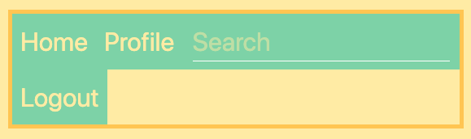

Also, let's target the items and set: `flex-grow: 1`, `flex-shrink:1` and `flex-basis: 50%`, cos **that will make each row fit two items**. 

```css
.container{
    border: 5px solid #ffcc5c;
    display: flex;
    
}

.search{
    flex: 1
}

@media all and (max-width: 600px){
    .container{
        flex-wrap: wrap;
    }
    .container > li{
        flex: 1 1 50%;
    }
    .search input{
        text-align: center;
    }
}
```


However, in the middle screens we have the following situation: 


Actually, we don't wanna this happen, we want either the two-rowed nav for the bigger screens, of one row for the each `item` for the mobile version. So, let's fix this. First let's add another `media query`, and give ach of the `item` 100% of the `width`. 

```css
.container{
    border: 5px solid #ffcc5c;
    display: flex;
    
}

.search{
    flex: 1
}

@media all and (max-width: 600px){
    .container{
        flex-wrap: wrap;
    }
    .container > li{
        flex: 1 1 50%;

    }
    .search > input{
        text-align: center;
    }
}

@media all and (max-width: 400px){
    .container > li{
        flex: 1 1 100%; 
    }
    
}
```


What else we wanna do - is to move `search` all the way to the bottom.

```css
@media all and (max-width: 400px){
    .container > li{
        flex: 1 1 100%; 
    }
    .search{
        order: 1;
    }
}
```


## Flexbox Image Grid

The initial code we have is the following: 

**html**

```html
<!doctype html>
<html lang="en">
    <head>
        <meta charset="utf-8">
        <meta http-equiv="X-UA-Compatible" content="IE=edge">
        <meta name="viewport" content="width=device-width, initial-scale=1">

        <title>Flexbox Image Grid Example</title>

        <link rel="stylesheet" href="https://cdnjs.cloudflare.com/ajax/libs/font-awesome/4.7.0/css/font-awesome.min.css" />
        <link href="https://unpkg.com/tailwindcss@^1.0/dist/tailwind.min.css" rel="stylesheet">
        <link rel="stylesheet" href="image.css">
        <link rel="stylesheet" href="basic-image.css">


    </head>
    <body>
        
    <div class="container">
       <div class="normal"></div>
       <div class="big"></div>
       <div class="big"></div>
       <div class="normal"></div>
       <div class="big"></div>
       <div class="normal"></div>
       <div class="big"></div>
       <div class="normal"></div>
       <div class="big"></div>
       <div class="big"></div>
       <div class="normal"></div>
    </div>
    

    </body>
</html>
```


**basic-image.css**

```css
.container div{
    padding: 10px;
}

body{
    margin:0;
}

html,body{
    box-sizing: border-box;
    height: 100%;
    padding: 10px;
    background-color: #ffeead;
}
```

**image.css**

```css
.container{
    display: flex;
    flex-wrap: wrap;
}

.container > div > img{
    width: 150px;
    height: 100px;

}
```


And for our case it's better to `justify-content: center`. 


**image.css**

```css
.container{
    display: flex;
    flex-wrap: wrap;
    justify-content: center;
}

.container > div > img{
    width: 150px;
    height: 100px;

}
```


