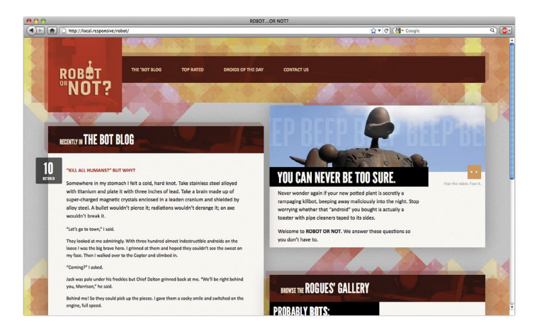

# Responsive Design

## The Ingredients

There are three core ingredients:

- a flexible, grid-based layout,
- flexible images and media
- media queries, a module from the CSS3 specification

## The Flexible Grid

Our canvas, the browser window, can bend and flex to any shape or size. Often the first layer of our grid-based layouts looks like this:

```css
.page{
    width: 960px;
    margin: auto;
}
```

We create an element in our markup, give it a fixed width in our CSS, and center it in the page. But when we are thinking flexibly, we need to transform it into something more fluid, something more propotional. 
How do we begin?

#### Flexible Typesetting

```html
<h1>Achieve sentense with Skynet! <a href='#'>Read more &raquo;</a></h1>
```

A headline with a link embedded in it - a fine foundation of `semantic markup`. With our foundation in place, we can begin adding a layer of `style`. Let's start by applying some basic rules to the `body` element. 

```css
body{
    background-color: #DCDBD9;
    color: #2C2C2C;
    font: normal 100% Cambria, Georgia, serif;
}
```

> The `font-size` has been set to **100%**. In doing so, we've simply set our `base type size` to the **browser's default**, which is in most cases **16 pixels**. We can then use **ems** to size text up or down to the related baseline. 

At any rate, our `h1` looks too small: it's inheriting the `font-size` of `100%` we set on the `body element`, and rendering at the `browser's default type size` of `16 pixels`. For the purpose of our typesetting experiment, let's start to think proportionally, and express pixel based `font-size values` in relative terms. So, instead of `pixels` we'll use the **em**.  

```css

h1{
    font-size: 1.5 em;
    font-style: italic;
    font-weight: normal;
}

h1 a{
    color: #747474;
    font: bold 0.458333333333333em Calibti, Optima, Arial, sans-serif;
    letter-spacing: 0.15em;
    text-transform: uppercase;
    text-decoration: none;
```

#### Contextual healing

To do so, we need a bit of math: we'll take the `*target*` font-size and devide it by the font-size of its `containing element`. The result will be our desired font-size expressed with flexible **ems**. 

In other words, `relative type sizes` can be calculated with this simple formula:

`target / context = result `

So, what's then with our `h1`? Assuming that our base font-size: 100% on the body element equates to 16 pixels, we can express out `h1's` target font-size (24px) relative to its context (16px), so we get:

`24 / 16 = 1.5 `

And there we are: 24px is 1.5 times grater than 16px, so our `font-size` is **1.5 em**.

Let's continue with our `read more` link. Note that it also inherits the font-size: 1.5em set on its containing element, the `h1`. **Important** here is that all `elements` inside the `headline` need to be expressed in relation to that value. In other words *our context has changed*. 

So, to set the `font-size` of our `link` in **ems**, we'll devide our target of 11 px by 24px - the font-size of the headline, our new context. 

`11 / 24 = 0.458333333333333`

> Note, we won't round this number! Actually, it petfectly represents our desired font-size in proportional terms. 


#### From flexible fonts to flexible grid

Every aspect of our **grid** - the `rows` and `columns`, and the `modules` draped over them - can be expressed as *proportions* of their `containing element`.

Let's say we have `basic markup structure`. 

```html
<div class='page'>
  <div class='blog section'>

     <h1 class='lede'>Recently in <a href='#'>The Bot Blog</a></h1>

     <div class='main'>
     ...
     </div><!--/end .main-->
     
      <div class='other'>
     ...
     </div><!--/end .other-->

  
  </div><!--/end .blog section-->
</div><!--/end .page-->
```


We’ve created a `generic container` for the entire `page` (*.page*), which in turn contains our `.blog module`. And within `.blog` we’ve created two more `containers`: a `div` classed as `.main` for our main `article content`, and another `div` classed as `.other` for other stuff. 

So how exactly do we turn those `.main` and `.other` blocks into proper columns? Reviewing the design tells us a few things: first, that the `grid` itself is divided into `12 columns`, each measuring `69 pixels` across and separated by regular `12px-wide gutters`. Taken together, those columns and gutters give us a `total width` of `960 pixels`. However, the `blog` itself is only `900 pixels` wide, centered horizontally within that `960px-wide canvas`.


So those are the high-level details. And if we take a closer look at the two columns inside of the `blog`, we can see that the `left-hand content column` (**.main** in our markup) is `566 pixels` wide, while the `right-hand`, secondary column (**.other**) is only `331 pixels` across.


So, our css code will look like 

```css
.page {
 margin: 36px auto;
 width: 960px;
}
.blog {
 margin: 0 auto 53px;
 width: 900px;
}
.blog .main {
 float: left;
 width: 566px;
}
.blog .other {
 float: right;
 width: 331px;
}
```

we’ve set the width of **.page** to `960` pixels, centered the 900px-wide **.blog** module within that container, set
the widths of **.main** and **.other** to `566px` and `331px`, respectively, and finally floated the two columns opposite each other.


But the problem here is that the result is downright `inflexible`. Fixed at a width of `960px`, our page is indifferent to changes in `viewport size`, forcing a `horizontal scrollbar` upon the reader if the window drops even slightly below `1024 pixels`.

#### From pixels to percentages

Instead of pasting the `pixel values` from our comp directly into our `CSS`, we need to express those `widths` in relative, *proportional* terms. Once we’ve done so, we’ll have a `grid` that can resize itself as the `viewport` does, but without compromising `the design’s original proportions`.

Remember, there’s absolutely nothing wrong with `fixed-width layouts`! But to move toward a more `flexible grid`, let’s start with a percentage value to replace that `960px`:

```css
.page {
 margin: 36px auto;
 width: 90%;
}
```

I’ll confess that I arrived at `90%` somewhat arbitrarily, doing a bit of trial and error in the browser window to see what looked best. By setting our **.page** element to a percentage of the `browser window`, we’ve created a `container` that will expand and contract as the `viewport does`.

Since **.blog** is nested within the **.page** element, we’ve got our context—namely, `960 pixels`, the width of **.page** as it was designed in the mockup. So let’s divide our `target width` for **.blog** (900) by its `context` (960):

`900 ÷ 960 = 0.9375`

By moving the decimal over two places we’re left with 93.75%, a percentage we can drop directly into our CSS:

```css
.blog {
 margin: 0 auto 53px;
 width: 93.75%; /* 900px / 960px */
}
```

Our `left-hand content column` is floated to the left, and set at `566px`; the `additional content` is floated opposite, sized at a width of `331px`. Once again, let’s replace those pixel-based target widths with percentages. 
> But before we drop those values into our **target ÷ context = result** formula, it’s important to note that our *context has changed*.

Since they’re nested inside **.blog**, we need to express our `columns’ widths` in relation to 900px—the width of the blog. So we’ll divide our two `target values` (566px and 331px) by 900px, our new `context`:

`566 ÷ 900 = .628888889   ;   331 ÷ 900 = .367777778`

Once we move our decimal points we’re left with 62.8888889%  and 36.7777778%, the proportional widths of **.main** and **.other**:

```css
.blog .main {
 float: left;
 width: 62.8888889%; /* 566px / 900px */
}
.blog .other {
 float: right;
 width: 36.7777778%; /* 331px / 900px */
}
```

Just like that, we’re left with a `flexible`, `grid-based layout`.

## Flexible Margins and Padding

#### Can't get no ventilation

Still we need to finish very important parts: the `title` now is flush left within it's container, and our `two columns` currently abut each other, with no `margins` or `gutters`. In our comp, there’s `48 pixels` of space between our `headline` and the `left edge of its container`. 


Now, we could use `pixels` to set a `fixed padding-left` on our `headline` in either `pixels` or `ems`, like so:

```css
.lede {
 padding: 0.8em 48px;
}
```
This is a decent solution. **But** a fixed `value` for that `padding left` would create a `gutter` that doesn’t line up with the rest of our `fluid grid`. As our `flexible columns` expand or contract, that `gutter` would simply ignore the rest of our design’s proportions, sitting stubbornly at `48px` no matter how small or wide the design became.

We can also create `percentage-based margins` and `padding` to preserve the integrity of our flexible grid. And we can reuse the **target ÷ context = result** formula to do so.

>  it’s important to note that whether you’re setting a `flexible margin` or `padding` on an element, the `context` is always the same: it’s **the width of the element’s container**.

Since we want to set some `padding` on our **.lede** headline, our `context` is the `width` of its container—that is, our 900px-wide **.blog module**. So out comes the calculator, and we’re left with:

`48 ÷ 900 = 0.0533333333`

which translates to:

```css
.lede {
 padding: 0.8em 5.33333333%; /* 48px / 900px */
}
```

And there we have it: our `48px padding` has been expressed in `relative terms`, as a `proportion` of our `headline’s width`.

We also need a bit of `white space` to our compacted `content`. To do so, it’s worth remembering that `each column` actually has a `smaller module` contained within it: the left-hand **.blog column** contains an **.article**, while the **.other** column contains our **.recent-entries listing** . We start with the `recent entries module`. Since we know the `width` of the `element` (231px) and the `width` of its `containing column` (331px), we can simply center our module horizontally:


```css
.recent-entries {
 margin: 0 auto;
 width: 69.7885196%; /* 231px / 331px */
}
```

Now, we could take the same approach with our `article`. But instead, let’s make it a bit more interesting. Remember the `48px padding` we set on our `headline`? Well, our `article` falls along the same `column`.
 


So rather than just centering our `article` within its `container`, let’s create another `proportional gutter`. Our `target value` is `48px`. And since we’re working with `relative padding`, our `context` should be the `width` of the `article` itself. 

> But once again, since there’s no explicit width set on **.article**, we can simply use `566px`, the width of its parent (**.blog**), for our `context`:

```css
.article {
 padding: 40px 8.48056537%; /* 48px / 566px */
}
```

#### Getting negative

Now we have 


The comp tells us our `date` should be floated to the left, and that it occupies one `69px column`. Since the `date` sits within the `470px-wide article`, we have our `context`.


Armed with that information, let’s write some quick `CSS`:

```css
.date {
 float: left;
 width: 14.68085106%; /* 69px / 470px */
}
```

**But** there’s one key `component` missing: our `date` is currently floating neatly against the left edge of
the `article`, with the `title` and `copy` floating around it.


What we need to do is to pull that `date` out of its `container`, and move it across the `left-hand edge` of the entire `module`. **And with `negative margins`, we can do exactly that**. And we don’t have to change our approach because the `margin` is `negative`: just as before, we simply need to express that `margin` in relation to the `width` of the element’s `container`.


If we look at the `mockup`, we can see that there are `81 pixels` from the left edge of the `date` over to the left edge of the `article`.  


We want to express our `target value` — that `81px-wide margin` — as a percentage of `470px`, the `width` of the `date’s containing element`: `81 ÷ 470 = .17234042553191`. Do the decimal shift and slap a minus sign on there, and we’ve got our proportional, negative margin: 

```css
date {
 float: left;
 margin-left: -17.2340425531%; /* 81px / 470px */
 width: 14.68085106%; /* 69px / 470px */
}
```

#### Moving forward, flexibility

> **we need to break our habit of translating pixels from Photoshop directly into our CSS, and focus our attention on the proportions behind our designs.**

It’s about becoming *context-aware*: better understanding the `ratio-based relationships` between `element` and `container`.


## Flexible Images

What if we could write a rule that prevents `images` from exceeding the `width` of their `container`? Well, here’s the good news: that’s very easy to do.

```css
img {
 max-width: 100%;
}
```

>  Now, our `img element` will render at whatever `size` it wants, as long as it’s narrower than its containing `element`. But if it happens to be wider than its `container`, then the `max-width: 100% directive` forces the `image’s width` to match the `width of its container`.

What’s more, modern `browsers` have evolved to the point where they resize the `images` proportionally: as our `flexible container` resizes itself, shrinking or enlarging our `image`, the image’s aspect ratio remains intact.

**The max-width: 100% rule** can also apply to most `fixed-width elements`, like video and other rich media. In fact,
we can beef up our selector to cover other media-ready elements, like so:

```css
img,
embed,
object,
video {
 max-width: 100%;
}
```

####  Max-width in Internet Explorer

The cold, hard truth is that `Internet Explorer 6` and below don’t support the `max-width` property. 

`CSS-driven approach`

Namely, all modern browsers get our `max-width` constraint:

```css
img,
embed,
object,
video {
 max-width: 100%;
}
```

But in a **separate** `IE6-specific stylesheet`, I’ll include the following:

```css
img,
embed,
object,
video {
 width: 100%;
}
```

IE6 and lower get `width: 100`%, rather than the `max-width: 100%` rule.

> tread carefully here, for these are drastically different rules. Whereas `max-width: 100%` instructs our `images` to *never exceed* the width of their `containers`, `width: 100%` forces our `images` to *always match* the `width` of their `containing elements`. 

Most of the time, this approach will work just fine.

For example, it’s safe to assume that our oversized `robot.jpg` image will always be larger than its containing element, so the `width: 100% rule` works beautifully. But for `smaller images` like thumbnails, or most embedded
movies, it might not be appropriate to blindly up-scale them with `CSS`. If that’s the case, then a bit more `specificity` might be warranted for `IE`:

```css
img.full,
object.full,
.main img,
.main object {
 width: 100%;
}
```

If you don’t want the `width: 100%` rule to apply to every piece of `fixed-width media` in your page, we can simply write a list of `selectors` that target certain kinds of `images` or `video` (**img.full**), or certain areas of your `document` where you know you’ll be dealing with `oversized media` (**.main img**, **.main object**). Think of this like a whitelist: if `images` or other `media` appear on this `list`, then they’ll be `flexible`; otherwise, they’ll be `fixed` in their stodgy old pixel-y ways. So if you’re still supporting legacy versions of Internet Explorer, a carefully applied `width: 100% rule` can get those `flexible images` working beautifully. 

#### FLEXIBLY TILED BACKGROUND IMAGES

Let’s say our dearly esteemed designer sends over `a revised mockup` of our `blog module`. The `design` has been modified slightly, adding a `two-toned background` to the `blog entry` to provide more contrast between the left- and righthand `columns`. What’s more, there’s actually a subtle level of noise added to the `background`, adding an extra level of texture to our `design`. So: how do we actually add this `new background image` to our `template`?


First, we’ll begin by taking a look at our `mockup`, to find the `transition point` in our `background` graphic, the exact `pixel` at which our white column transitions into the gray. And from the look of things, that switch happens at the `568 pixel mark`.


First, we’ll convert that `transition point` into a `percentage-based value` relative to our `blog module’s width`. And to do so, our **target ÷ context = result** formula comes into play yet again. We have our `target` value of `568px`, and the `width` of the design—our `context` — is `900px`. And if we plug those two values into our stalwart formula:

`568 ÷ 900 = 0.631111111111111`

Now, let’s open up your favorite `image editor`, and create a foolishly wide document — say, one that’s `3000 pixels` across. And since we’re going to tile this `image` vertically, its height is only `160px` tall.
In a moment, we’re going to turn this blank `document` into our `background graphic`. But why is it so large? Well, this `image` needs to be larger than we can reasonably assume the `browser` window will ever be. 

To create the `columns` themselves, we’ll need to apply the `transition point percentage` (**63.1111111111111%**) to our new, wider `canvas`. So if we’re working with a graphic that’s `3000px across`, we simply need to multiply that `width` by the `percentage`, like so:

`3000 x 0.631111111111111 = 1893.333333333333`


We’re left with `1893.333333333333` as our result. And since `Photoshop` doesn’t deal in anything less than whole `pixels`, let’s round that down to `1893 pixels`. Armed with that number, we’ll recreate our `textures` in our `blank image`, switching from white to gray at the `1893rd pixel`. 

How does that help us? Well, what we’ve just done is to `proportionally scale` our `transition point` up to this new, wider `canvas`. So we can take that new `pixel value`, and use it to create our `columns`: the `white column` will be `1893px` wide, with the `gray column` filling up the remainder. So now there’s only one thing left to do: drop our newly minted graphic into our `stylesheet`.

```css
.blog {
 background: #F8F5F2 url("blog-bg.png") repeat-y »
 63.1111111111111% 0; /* 568px / 900px */
}
```

As in Dan’s original technique, we’re still positioning the `graphic` at the very top of our `blog`, and then repeating it `vertically` down the `width` of the module (repeat-y). But the `background-position value` reuses our transition point percentage (63.1111111111111% 0), keeping the `columns` firmly in place as our design resizes itself.

#### Fully flexible background images?

Of course, our flexible faux `column` isn’t *really* flexible: we’re simply using `percentages` to position a `background image` in such a way that the `columns` appear to resize with their `container`. The image’s dimensions haven’t changed at all. But what about a `background image` that actually does need to resize with the `layout`? Perhaps you’ve placed a `logo` on an `h1 element’s background`, or used sprites to create rollovers for your site’s navigation. Can we resize `images` that need to live in the `background`? Well, sort of. There is a `CSS3 property` called **background size**, which would allow us to create truly `flexible background images`.  **CSS3 media queries** could also be used to apply different `background images` tailored to different `resolution ranges`.


#### NEGOTIATE THAT CONTENT

But what about especially complex `graphics`? If your `image` is especially information-rich, simply scaling or cropping it might be less than desirable — in fact. If that’s the case, it might be worth investigating ways of delivering `different versions` of the same `image` to different `resolution ranges`. In other words, you could create multiple versions of your `infographic` — say, one ideal for `desktop browsers`, as well as another, more linearized version for `small-screen devices`. With those options established, a server-side solution could intelligently serve the most appropriate image for that resolution range.

Creating such a solution is beyond the scope of this book, but there’s good news: a `picture element` is in the process of coming to `HTML`, one that would allow us to load `images` `responsively`, switching in different graphics depending on certain conditions in the browser — say, the width of the `viewport`:

```html
<picture>
 <source srcset="img/large.jpg" media="(min-width: »
 800px)">
 <source srcset="img/default.jpg">
 
</picture>
```
In the above code, we’re using `picture` to `conditionally` serve different `images` via two `source elements` inside it: specifically, a small-screen-friendly `default.jpg` is shown unless the screen is at least `800px wide`, at which point `large.jpg` is shown instead. 

Now, the `picture element` is still in the process of being standardized, with `browser` implementations expected to arrive soon, but the [Picturefill JavaScript library](http://bkaprt.com/rwd2/25/) allows you to use `picture` today.

## Media Queries

#### Enter the media query

Realizing some of the failings of `media types`, the W3C used their work on `CSS3` to take another crack at the problem. The result was **media queries** (http://bkaprt.com/rwd2/29/), an incredibly robust mechanism for identifying not only types of media, but for actually inspecting the physical characteristics of the devices and browsers that render our content.

Let’s take a look:
```css
@media screen and (min-width: 1024px) {
 body {
 font-size: 100%;
 }
}
```

Every `media query` — including the one above—has two components:

1. Each `query` still begins with a `media type` (**screen**), drawn
from the CSS2.1 specification’s list of approved media types
(http://bkaprt.com/rwd2/28/).
2. Immediately after comes the `query itself`, wrapped in parentheses: (**min-width: 1024px**). And our `query` can, in turn, be split into two components: `the name of a feature` (min-width) and a corresponding `value` (1024px).

Think of a `media query` like a test for your `browser`. When a `browser` reads your `stylesheet`, the **screen and (min-width: 1024px)** query asks two questions: 
- first, if it belongs to the `screen media type`; and if it does, 
- if the `browser’s viewport` is at least 1024 pixels wide. 

If the `browser` meets both of those criteria, then the `styles` enclosed within the `query` are rendered; if not, the `browser` happily disregards the `styles`, and continues on its merry way.

#### Meet the features

It’s not just about testing for `width` and `height`. There are a host of `features` listed in the `specification` our `queries` can test. But before we dive in, it’s worth noting that the language used to describe the features can be a bit...dense. Here are two quick guidelines that helped me sort it out:

1. In the spec’s language, every device has a **“display area”** and **“rendering surface.”** Think of it this
way: the `browser’s viewport` is the display area; the `entire display` is the rendering surface. So on your laptop, the display area would be your browser window; the rendering surface would be your screen. 
2. To test `values` above or `below` a certain threshold, some `features` accept **min-** and **max-** prefixes. A fine example is `width`: you can serve `CSS` conditionally to `viewports` `above 1024 pixels` by writing (**min-width: 1024px**), or `below 1024 pixels` with (**max-width: 1024px**).

What’s really exciting is that we can chain multiple `queries` together with the **and** keyword: 

```css
@media screen and (min-device-width: 480px) and »
 (orientation: landscape) { … }
```

This allows us to test for multiple `features` in a single `query`, creating more complex `tests` for the devices viewing our designs.

>  **By combining flexible layouts and media queries, we’ll finally be able to make our sites responsive.**

We can use `media queries` to optimize the `display` of our `content` to best meet the needs of the `device`, creating `alternate layouts` tailored to different `resolution ranges`. By conditionally loading `style rules` that target these ranges, `media queries` allow us to create pages that are more sensitive to the needs of the `devices` that render them. In other words, by combining `flexible layouts` and `media queries`, we’ll finally be able to make our sites responsive.

#### A room with a viewport

When Apple launched the iPhone in 2007, they created a new attribute value for Mobile Safari’s meta element: **viewport**. Why? Well, the dimensions of the iPhone’s display is 320×480, but Mobile Safari actually displays web pages at a width of 980 pixels. Using the `viewport tag` allows us to control the size of that `canvas`, and override that default behavior: we can dictate exactly how wide the `browser’s viewport` should be. For example, we could set our pages at a fixed width of 320px:

```html
<meta name="viewport" content="width=320" />
```

Mobile `browser` makers have adopted the `viewport` mechanic, creating something of a *de facto* standard. So let’s incorporate it into our soon-to-be `responsive design`. 

In the head of our HTML, let’s drop in this meta element:

```html
<meta name="viewport" content="initial-scale=1.0, 
 width=device-width" />
```

The initial-scale property sets the `zoom level` of the page to 1.0, or 100%, and helps ensure some consistency across `smallscreen`, `viewport-aware browsers`. How scaling works on different displays, look [Mozilla’s
explanation](https://developer.mozilla.org/en-US/docs/Mozilla/Mobile/Viewport_meta_tag#Viewport_basics).

The important bit for us is the **width=device-width** setting, which makes the `width` of the `browser’s viewport` equal to the `width` of the `device’s screen`. 
With this `value` in place, we can use `max-width` and `min-width` to look for resolution ranges below or above certain resolution thresholds, and conditionally load in `CSS` designed for those ranges. What’s more, this allows all `query-aware browsers` to take advantage of our `media queries`, making the design `responsive` for all users — whether they’re using `phones`, `tablets`, `desktop` computers, or `laptops`.

#### Media Queries in Action

First, we’ll create an **@media** block somewhere after our initial **.main-title** rule, one that queries for a narrower resolution range: 

```css
@media screen and (max-width: 768px) { … }
```

In this `query`, we’ve asked that the `browser` render the enclosed `CSS` only if its `viewport` is no wider than `768 pixels`. Why `768px`? Well, `media query-aware phones`, as well as most recent `tablets`, fall well beneath this threshold. Or at least, they do when held a certain way: for example, the iPad’s resolution is **768px** across when held in `portrait mode`, but **1024px** when held in `landscape mode`.

But since we’re using **max-width**, not **max-device-width**, narrower `browser` windows on your `desktop` or `laptop` will apply this `small-screen-friendly` range as well. (Remember: `width` and `height` measure the `viewport` or `browser window`, whereas `device-width` and `device-height` measure the dimensions of the entire `screen`.)

With this `query` in place, we can start targeting the `elements` of our `design` that don’t scale down that well.  To do so, we’ll place a **.main-title** rule inside our `media query` overwriting the `CSS properties` that are causing us headaches:

```css
@media screen and (max-width: 768px) {
 .main-title {
 font: normal 1.5em Calibri, Candara, Segoe, »
 "Segoe UI", Optima, Arial, Helvetica, »
 sans-serif; /* 24px / 16px */
 }
}
```
Our first **.main-title** rule is still applied by all `browsers` reading our `CSS`. But for narrower `browser` windows and `devices` — specifically, those no wider than `768 pixels` — the `second rule` is applied as well, overriding its predecessor.

We’ve made two changes of note here: 

- first, we’ve set a smaller font size on the **.main-title** element, changing it from `3.625em (roughly 58px)` to a much smaller` 1.5em, or 24px`, that feels more appropriate on smaller `displays`.
- Secondly, the `typeface` we were initially using for our headlines — our beloved League Gothic — doesn’t scale down very well to that size. So I’ve decided to change the fontfamily stack itself (Calibri, Candara, Segoe, "Segoe UI",
Optima, Arial, Helvetica, sans-serif), which feels a bit more readable.

We didn’t have to rewrite the other `properties` from the first **.main-title** rule. As a result, the black background color, all-caps text-transform, and white color still apply to our miniaturized headlines. **Our query only overwrites the features we don’t want**.


#### Thinking in miniature

In fact, let’s begin by building on our new `media query`, and make a slight change to our `page’s layout`. 

```css
.page {
 margin: 36px auto;
 width: 90%;
}
```

Our `container`’s currently set to` 90%` of the `browser window`, and centered horizontally (`margin: 36px auto`). Works great, but let’s add a rule inside our existing `media query` to tweak its behavior once we start falling below our initial resolution:

```css
@media screen and (max-width: 768px) {
 .page {
 position: relative;
 margin: 20px;
 width: auto;
 }
}
```

Below **768px**, we’re instructing the **.page** element to occupy the full `width` of the `browser` window, save for a fixed `20px-wide margin` around its edges. A minor change, but this will afford us a bit more space at smaller screen resolutions. With our container sorted, we can turn our attention to the content area.

```css
@media screen and (max-width: 768px) {
 .page {
 margin: 20px;
 width: auto;
 }
 .welcome,
 .blog,
 .gallery {
 margin: 0 0 30px;
 width: auto;
 }
}
```

This new rule selects the three top-level `content modules` — our introduction (`.welcome`), the blog (`.blog`), and photo gallery (`.gallery`) — and disables their `horizontal margins`, making them occupy the full `width` of **.page**.


* *further steps look in the book* **pages 89-97**
....

#### This layout goes to eleven


We’ll begin by introducing another media query to do just that:

```css
@media screen and (max-width: 768px) {
 …
}
@media screen and (max-width: 520px) {
 …
}
@media screen and (min-width: 1200px) {
 …
}
```
Our first` media query` set a resolution ceiling of `768 pixels`: in other words, devices and browser windows wider than that **max-width limit** would simply ignore the enclosed `CSS`. We quickly followed that up with another `query` for an even narrower range of `520px`, once again using **max-width** to do so. For our next `query`, we’re instead using **min-width** to set `1200px` as a baseline width requirement for all incoming browsers and devices. If they’re wider than `1200 pixels`, then they’ll apply the enclosed styles; otherwise, they’ll simply ignore the `CSS`, and go blithely about their business.

```css
@media screen and (min-width: 1200px) {
 .welcome,
 .blog,
 .gallery {
 width: 49.375%;
 }
 .welcome,
 .gallery {
 float: right;
 margin: 0 0 40px;
 }
 .blog {
 float: left;
 margin: 0 0 20px;
 }
}
```
In the live Robot site (http://responsivewebdesign.com/robot/), see a bunch of other changes that occur on this `widescreen layout`. But these three rules are really the critical ones. We’re taking our three main content modules (`.welcome, .blog, and .gallery`), and setting them to roughly half (`49.375%`) the `width` of the `entire page.` Then, we’re floating the `.welcome` and `.gallery` modules off to the right, and the `blog` to the left. The result? A design that’s perfectly primed for reading on larger displays.



#### A Note about Compatibility

So things are far from perfect. But that doesn’t mean that `responsive layouts` are a pipe dream. First and foremost, there are a number of `JavaScript-based solutions` that patch `older browsers`’ lack of support. Personally, I’ve been using a script called **respond.js** (http://bkaprt.com/rwd2/39/), a nimble little library developed by Scott Jehl. Where **css3-mediaqueries. js** is incredibly feature-rich, almost exhaustively so. Respond simply patches support for `min-width and max-width queries` in older `browsers`. And that works perfectly for most of the `queries` I write these days. In fact, by dropping the **respond.js library** into the `head` of our `page`, we’ve now got a `responsive layout` working beautifully in older, `query-blind browsers` like Internet Explorer 7.

> but there’s simply no guarantee that a user will have `JavaScript` available in their browser. Their `desktop` or `laptop` might be locked down by draconian `IT security measures`. And once we start looking beyond the `desktop`, to `mobile phones`, popular proxy browsers, and other devices, `JavaScript` support is notoriously scant, bordering on nonexistent in many devices. 

## A MATTER OF CONTEXT

Relying upon all-too-convenient terms like `“mobile”` and `“desktop”` is no substitute for conducting the proper research into how your `audience` accesses your site: not only the devices and browsers they use, but how, where, and why they use them.

How do you know if `responsive design` is right for you? 

- know thy users’ goals
- mobile first

It’s all too easy to fill a `desktop browser window` with social media toolbars, links to related articles, battalions of RSS links, and tag clouds galore. (This process is called “adding value,” I believe.) But when we’re forced to work with a screen that’s 80% smaller than our usual canvas, nonessential content and cruft quickly fall away, `allowing us to focus on the truly critical aspects of our designs`. In other words, designing for mobile devices first can enrich the experience for all users, by providing the element often missing from modern web design: **focus**. 

- responsive workflow
- iterative, collaborative design


#### “Mobile first” meets media queries

Speaking broadly, `responsive design` is about starting from a reference resolution, and using `media queries` to adapt it to other `contexts`. **A more responsible approach to responsive design would mean building our stylesheet with “mobile first” in mind, rather than defaulting to a desktop layout.** So we’d begin by defining a `layout` appropriate to `smaller screens`, and then use `media queries` to progressively enhance our design as the resolution increases.

In fact, we took this approach on the responsive site for The Boston Globe (http://www.bostonglobe.com/). By default, the `content` is arranged in a very `linear manner`, one friendly to `mobile devices` and `narrow browser windows` (fig 5.12) . 


But as the `viewport` widens, the `grid` becomes more complex (fig 5.13).


 And at the highest end of the spectrum, the “full” design finally reveals itself: the `layout` becomes even more complex, making for a truly `widescreen display` (fig 5.14).


The `design` is still `responsive`, using all of the techniques we’ve discussed thus far in this book: 
- the `layout` is based on a `fluid grid`, and 
- the `images` still work well within that `flexible context`. 
- But in contrast to the Robot or Not site, we’re applying `min-width media queries` to scale our design up through the resolution spectrum. 

The basic `structure` of the `stylesheet` looks something like this:

```css
/* Default, linear layout */
.page {
 margin: 0 auto;
 max-width: 700px;
 background: #fff;
 position: relative;
}
/* Small screen! */
@media screen and (min-width: 480px) { … }
@media screen and (min-width: 620px) { … }
@media screen and (min-width: 810px) { … }
@media screen and (min-width: 1400px) { … }
```

The bulk of the `stylesheet` contains little else but color- and type-related rules, providing a basic (but hopefully still attractive) design to all users. In other words: **outside of the media queries, the stylesheet begins with a linear, small-screen-friendly design by default**, one that doesn’t have much of a layout to speak of. But then, breakpoints are set in a series of `min-width media queries`, for `minimum viewport widths` of `480px, 620px, 810px, and 1400px`. And as the `viewport` scales up beyond those thresholds, the appropriate layout rules are applied. The benefit to this approach? If a `browser` without `media query` support accesses the Globe, they’re given an attractive, single-column layout if our JavaScript patch isn’t available to them (fig 5.15).

## REVISITING PROGRESSIVE ENHANCEMENT


