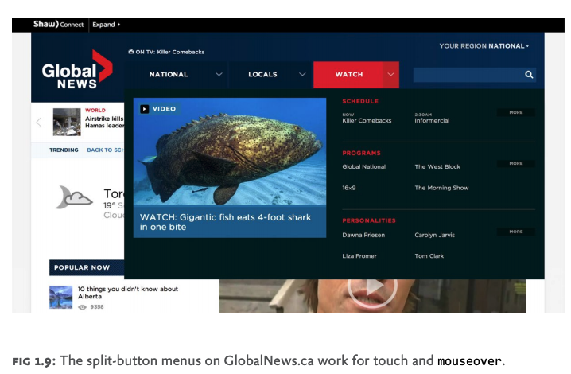

# Responsibe Responsive Design


## Responsive and responsible

To deliver on the promise of a broadly accessible, delightful, and sustainable `web`, we need to combine `responsive design` with additional `responsible practices`. A **responsible responsive design** equally considers the following throughout a project:

- **Usability**: The way a `website’s user interface` is presented to the user, and how that `UI `responds to `browsing conditions` and `user interactions`.
- **Access**: The ability for `users` of all `devices`, `browsers`, and `assistive technologies` to access and understand a `site’s features` and `content`.
- **Sustainability**: The ability for the `technology` driving a site or application to work for `devices` that exist today and to continue to be usable and accessible to users, `devices`, and `browsers` in the future.
- **Performance**: The `speed` at which a `site’s features` and `content` are perceived to be delivered to the `user` and the `efficiency` with which they operate within the `user interface`.

## DESIGNING FOR USABILITY

### Find your breakpoints

The `viewport sizes` at which we change from one `fluid layout` to another using `media queries` are called **breakpoints**. Here are two examples:

```css
/* first breakpoint */
@media (min-width: 520px){
 ...styles for 520px widths and up go here!
}
/* second breakpoint */
@media (min-width: 735px){
 ...styles for 735px widths and up go here!
}
```

While it’s tempting to choose `breakpoints` early in the `design process`, perhaps based on the dimensions of popular `devices` we know we need to support, the truth is that we shouldn’t choose `breakpoints` at all. Instead, **we should find them, using our content as a guide.**

> “Start with the small screen first, then expand until it looks like shit. TIME FOR A BREAKPOINT!”
> — Stephen Hay, http://bkaprt.com/rrd/1-03/

A` layout’s design and content` should shape and inform a `layout’s breakpoints`.The easiest way to find `breakpoints` is simply to resize the `browser viewport` until the `content` becomes awkward (that’s the technical term) to use or read — and presto, a `breakpoint`. 

In addition to a gut check, you might opt for a slightly more `objective guideline`. Per Richard Rutter’s homage to Robert Bringhurst, The Elements of Typographic Style Applied to the Web (http://bkaprt.com/rrd/1-05/), **an optimal measure — the number of characters per line in a column of text** — for immersive reading is widely thought to fall **between 45 and 75 characters**, including spaces. If you’re resizing a `layout` outward, watch for when a `column` of `text` approaches that range: it’s probably a good place to adjust your `layout`.


As you work with `complex responsive designs`, you’ll find that `breakpoints` often occur at different times for different portions of a `layout`, and that some are more significant than others. 

*Major* breakpoints mark big shifts, usually to add `columns` or dramatically change the `presentation` of more than one `component`; *minor* breakpoints involve smaller design tweaks (such as changing a component’s font-size to prevent text wrapping) that take full advantage of the spaces between the major breakpoints. In general, I find that `major layout breakpoints` are decided early in development, while `minor` ones act as finishing touches. The fewer `breakpoints` we use, the easier a `responsive design` will be to maintain.

### Design modularly

As in the masthead example, I find it helpful to compile the multiple `configurations` of each `modular component` in isolation; that way, I can test its usability and document its variations in one place. 
We should build and document our `components` from the inside out, as standalone pieces that play nicely with others.


### Same content, reduced noise

You’ve figured out how to find `horizontal breakpoints` across a range of `viewport sizes`. How do you fit all that `content` on `small screens` without making things noisy? `Responsive design` has (undeservedly) received a bad rap because of sites that attempt to avoid messy situations by hiding parts of the `content` from users — denying access to `content` that was ostensibly important enough to include in the first place. Remember, if it’s useful to some people, it’s likely useful to everyone. As Luke Wroblewski’s book *Mobile First* instructs, rather than hide `content` that’s inconvenient to display, it’s best to reorganize the `design` to retain  usability on `smaller viewports.`

### Progressive disclosure

One such pattern is *progressive disclosure*, a fancy term for showing `content` on demand. To be clear, not all hiding is bad; it’s only bad if the user has no way to access the hidden `content`. The idea behind progressive disclosure is simple: **hide portions of content, but provide interface cues so that users can view it when they wish.**


*Off-canvas layout*, a term coined by Luke Wroblewski in his article “Off-Canvas Multi-Device Layouts,” describes another notable approach to minimizing complexity on `small screens` (http://bkaprt.com/rrd/1-08/). Wroblewski documents several patterns for positioning `lower-priority interface components` **offscreen** until users cue them by tapping a `menu icon` or similar item; the formerly `offscreen content` then enters the `viewport`, overlapping or pushing aside the `primary content`. This on-demand approach is becoming common in `small-screen layouts`.


### Responsive tables

Tabular data is one of the toughest content types to present on a small screen. It’s often essential that the user see column and row headers associated with a table cell, and yet we can only fit so many rows and columns on screen.


At Filament, we experimented a lot and found a *couple of pattern*s that worked well enough to include in the **jQuery Mobile framework**. The first pattern, **Reflow** (http://bkaprt.com/ rrd/1-09/), reformats the `table` from a `multi-column view` to a `list view`; each `cell` becomes its own `row`, with a `row header` to its left. 


To pull this off, `Reflow` uses `CSS` to set each `cell` in the `table` to **display: block**, creating a new `row`, and `JavaScript` to grab each of the `table’s column headers` and insert them in each `cell` to serve as the `labels` (while hiding the additional labels from screen readers). Reflow suits simple `tables` that act like `formatted lists`, but its `small-screen presentation` falls short when you need to compare `data points` across rows.

**The Column Toggle** (http://bkaprt.com/rrd/1-10/) pattern picks up that slack. It works by selectively showing `columns` in a `table` as horizontal space allows. If there isn’t room, `CSS` hides the `column data`, but a `menu` offers users the chance to override the `CSS` and display the `column` anyway, eventually causing the `table` to expand wide enough to warrant `horizontal scrolling`.


## DESIGNING FOR TOUCH (AND EVERYTHING ELSE)

A `responsive layout` is but one step. Even if your site flows beautifully from one `screen size` to the next, you’re not doing your job if someone *can’t use it*.

Two `basic measures` pack a wallop on the usability of an existing, `mouse-based interface`:

- Make sure any `content` that offers `mouse-centric interactivity` (like *hover*) is also accessible in `browsers` where a `mouse pointer` may not exist.
-  Don’t assume `touch` will be used, but `design` as if it will be. 

### Save hover for shortcuts

You can’t rely on mouseover for `vital design interactions`, but you can use it as a nice-to-have alternate way to reach otherwise `accessible content`.

*Example*

One example is the `navigation` for the Global News Canada website, designed by Upstatement and developed by the Filament Group team. The `global navigation` links users to National, Locals, and Watch `section homepages` when `clicked` or `tapped`. These links also feature `split-button drop menus` that toggle between `sections` on `hover`. On a `touch screen`, one `tap` directly sends users to that `section’s homepage`, so we came up with an alternative mechanism to toggle between menus and account for all breakpoints. The `split buttons with arrows` next to each `navigation link` do just that, offering `tap` or `click` access to the drop menus.



### Keep in touch

One rule of thumb(s): **the devices accessing your site may or may not have touch screens, but always design as if they will.** Fingers aren’t precise, so we need to enlarge `button` and `link target areas` to make them easier to tap. How much bigger is an open discussion, though Apple’s guidelines suggest `44 × 44 pixels` as the minimum size for usable `buttons`. Based on findings from MIT’s Touch Lab (http://bkaprt.com/rrd/1-12/), the Smashing Magazine article “Finger-Friendly Design: Ideal Mobile Touchscreen Target Sizes” by author Anthony T suggests slightly larger targets at `45–57 pixels`, and `72 pixels` for `buttons` for thumb use, like the ones located near the `bottom` of a handheld device’s screen (FIG 1.10). 

**Don’t forget your white space**! Equally important as the `size` of `touchable elements` is the `space around those elements`. A smaller `button` surrounded by dead space can be as easy to use as a larger `element`, so the `size` of the `button` within its `tappable footprint` becomes a question of visual emphasis.

### The usual gestures

`Touch screens` offer the potential for richer `interactions` than `tap` alone — many touch `gestures` have become commonplace, particularly in **native apps**.  


 
While `browsers` do let us use `touch events` like **touchstart**, **touchmove**, and **touchend** (or the new standard pointer events **pointerdown**, **pointermove**, **pointerup**, etc.) to specify `gestures` with `JavaScript`, how can we do so without conflicting with `native touch behavior`? 

#### Web-safe gestures: do they exist?

Let’s compile a list of `web-safe gestures` we can use in our `sites`. Based on the `native gestures` in today’s popular `devices`, we have **tap**, **two-finger tap**, **horizontal drag**, and **horizontal flick**. Yet within this small list, we still have `potential for conflict`. 

This doesn’t mean we should avoid building `custom gestures`, but it highlights the importance of developing for many `input modes`. If one fails for any reason, we’ll have alternate ways to access our `content`. In practice, this means **ensuring there’s always a click-andkeyboard-based interface** for interaction.

For example, the carousel of magazine covers on the Boston Globe site has several `interactive options`. You can `click the arrows` beneath the carousel, `click the covers` to the right or left of the featured `image`, use the `right and left arrow keys on your keyboard`, or `touch-drag the carousel` on a touch device. Think of `touch gestures` as a nice-to-have enhancement on top of broadly supported `input modes`.


### Scripting touch interactivity

Whatever `touch-screen optimizations` we make, it’s crucial not to hinder people’s ability to `interact` with `content` using `non-touch input mechanisms` like the `mouse` and `keyboard`. 

> **A common, responsible approach to ensure that touch interactions work as fast as possible is to set up event listeners for both mouse and touch events**. 

During a particular interaction, the logic would handle whichever event type happens first and ignore the other to prevent the possibility of running any scripting twice. Sounds straightforward, but it’s not. That’s why I recommend using a well-tested, `open-source JavaScript library` to do the hard work for you. I use `Tappy.js` (http://bkaprt.com/ rrd/1-15/), a script I created to allow you to listen for a custom tap event when writing `jQuery code`. Here’s Tappy in play:

```js
$( ".myBtn" ).bind( "tap", function(){
 alert( "tap!" );
}); 
```
Behind the scenes, that tap event is listening for touch, keyboard, or mouse clicks to perform a specific behavior. (In this case, it throws an alert that says, “tap!” For a library that offers a more advanced set of touch features,
check out **FastClick** (http://bkaprt.com/rrd/1-16/).

## DESIGNING FOR ACCESS

For `components` to be usable across `devices`, we must make sure that they’re accessible in `browsers` that don’t support our ideal presentation or behavior, and for `users` who browse the web with `assistive` technology.  **For these reasons and more, you can’t do a better service to your users than to start with plain old HTML.** A major strength of `HTML` is its innate **backward compatibility**, which means pages built with even the latest iterations can still be accessed from almost any `HTML-capable device`. 

### Ensure access with progressive enhancement

The concept of progressive enhancement advocates starting with **functional**, **meaningful HTML** and then unobtrusively layering **presentation (CSS)** and **behavior (JS)** on top for a richer, more dynamic user experience. 

With power comes responsibility. Any time you venture beyond standard `browser` rendering of `HTML` into building your own `presentation` and `interactivity`, **you’re responsible for accessibility**. This requires some planning. As developers, we must “see through” our visual interface designs to discover their underlying meaning in HTML. 

In Filament Group’s book *Designing with Progressive Enhancement*, we describe this process as the *x-ray perspective*: 


> *The x-ray perspective is a methodology we’ve developed to evaluate a complex site design, break it down to its most basic modular parts, and build it back up in such a way that a single coded page will work for modern browsers with full functional capabilities as well as other browsers and devices that may understand only basic HTML.*

The process of `x-raying` a design’s parts may require a certain amount of `creative thinking`; it depends on how closely a custom control resembles a native equivalent. Some are fairly transparent: say, a `button` that acts as a `checkbox input`. In this case, a bit of `CSS` alone could render some `label` and input `markup` from a `standard text` and box presentation into the `button-like`
component shown below.


```html
<label class="check">
 <input type="checkbox">Bold
</label>
```

A `CSS-alone` approach has triple benefits. It’s simple, lightweight, and, most important, using `native HTML form elements` almost guarantees that the control will be accessible to `users` with disabilities. In other words, `assistive technology` like
Apple’s `built-in VoiceOver screen reader` will read the `native control` aloud as if the visual enhancements aren’t even there: “bold, unchecked checkbox” by default and “bold, checked checkbox” when checked.
Easy, right? However, it can be difficult to maintain this level of accessibility with more complex custom `components`. => 

#### Responsibly enhance a complex control (pages 35-40)

#### Make data visualizations accessible (pages 40-44)


