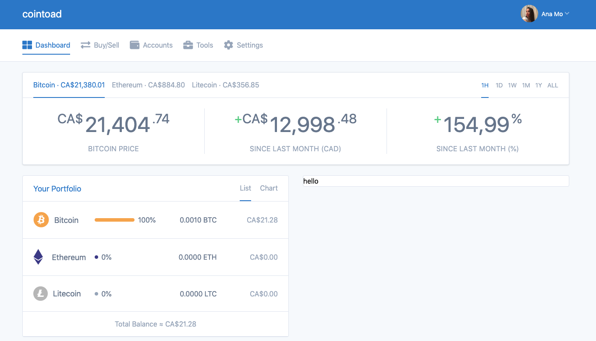

# Coinbase clone

So, we are trying to clone `coinbase` with `tailwind`. Firt we have the `div` which holds the `background color`, within this `div` we have another `div` which is a container, and within the `container` we have a `div` which holds `flex items` inside. 

For the `mobile version` we have our `nav hamburger menu`, but we hide it for the bigger sizes. 

**mobile version**


**bigger screens**


To make it more responsive we do the following: 

- we add `width-auto` for the `div` with the `avatar` and for the `div` with `cointode name`, as well as we need to justify items with `space between`, so we add this for the `div` which holds all this flex items: avatar, menu, name  - we do this cos when we hide the `hamburger menu` for the bigger sizes the `divs` with avatar and name don't have then space between, and it looks wierd. The fact is that when the `menu` is used for mobile version sized - it takes actually its part of the `div`, and without the menu this part of the `div` is free and all other items move there. 

```html
<!doctype html>
<html lang="en">
    <head>
        <meta charset="utf-8">
        <meta http-equiv="X-UA-Compatible" content="IE=edge">
        <meta name="viewport" content="width=device-width, initial-scale=1">

        <title>Tailwind Example - Twitter</title>

        <link rel="stylesheet" href="https://cdnjs.cloudflare.com/ajax/libs/font-awesome/4.7.0/css/font-awesome.min.css" />
        <link href="https://unpkg.com/tailwindcss@^1.0/dist/tailwind.min.css" rel="stylesheet">

    </head>
    <body class="font-sans bg-gray-100">
        
<div>
    <div class="bg-blue-600">
        <div class="container mx-auto px-4 ">
                <div class="flex items-center py-4 sm:justify-between">  
                        <div class="w-1/4 sm:hidden">
                            <a href="#"><i class="fa fa-navicon text-white " style="font-size:36px"></i></a>
                        </div>
                        
                        <div class="w-1/2 sm:w-auto text-center text-white text-2xl">
                            cointoad
                        </div>
                        <div class="w-1/4 sm:w-auto text-right">
                            
                        </div>
                    </div>
        </div>
           
    </div>
        
</div>
    


    </body>
</html>
```

Let's add the `name` for the `avatar` and the `chevron`. We'll need actually to hide this for the smaller screens, so we should put this in a `div`. This is gonna be hidden by default and displayed block, as well as `flex` for the small screens - `hidden sm:block`. Let's also display `chavron` `block` - it kind of removes the line height. 


```html
<!doctype html>
<html lang="en">
    <head>
        <meta charset="utf-8">
        <meta http-equiv="X-UA-Compatible" content="IE=edge">
        <meta name="viewport" content="width=device-width, initial-scale=1">

        <title>Tailwind Example - Twitter</title>

        <link rel="stylesheet" href="https://cdnjs.cloudflare.com/ajax/libs/font-awesome/4.7.0/css/font-awesome.min.css" />
        <link href="https://unpkg.com/tailwindcss@^1.0/dist/tailwind.min.css" rel="stylesheet">

    </head>
    <body class="font-sans bg-gray-100">
        
<div>
    <div class="bg-blue-600">
        <div class="container mx-auto px-4 ">
                <div class="flex items-center py-4 sm:justify-between">  
                        <div class="w-1/4 sm:hidden">
                            <a href="#"><i class="fa fa-navicon text-white " style="font-size:36px"></i></a>
                        </div>
                        
                        <div class="w-1/2 sm:w-auto text-center text-white text-2xl">
                            cointoad
                        </div>
                        <div class="w-1/4 sm:w-auto sm:flex text-right">
                            <div>
                                    
                            </div>
                           
                            <div class="hidden sm:block sm:flex sm:items-center">
                                    <span class="text-white text-sm px-1">Ana Mo</span>
                                    <a href="#"><i class="fa fa-chevron-down text-xs text-white block opacity-50"></i></a>
                            </div>
                           
                        </div>
                    </div>
        </div>
           
    </div>
        
</div>
    


    </body>
</html>
```


Let's continue with the second nav. So, we'll have `div` with the color and the border set; then the `div` which is a container for the items, and we'll need `padding` but better to have this `padding` for individual items inside the `div` cos the container itself has a `border` and it needs to be active later. 
Inside the general container we'll have `flex container` - it will make it easier to make individual items inside aligned. 

On the items that are gray colored and have the border only on hover, we actually do the following: we stil save the `border` cos it saves the pixel of padding, but we make it `transparent` and add colored border only on hover. 

```html
<!doctype html>
<html lang="en">
    <head>
        <meta charset="utf-8">
        <meta http-equiv="X-UA-Compatible" content="IE=edge">
        <meta name="viewport" content="width=device-width, initial-scale=1">

        <title>Tailwind Example - Twitter</title>

        <link rel="stylesheet" href="https://cdnjs.cloudflare.com/ajax/libs/font-awesome/4.7.0/css/font-awesome.min.css" />
        <link rel="stylesheet" href="https://use.fontawesome.com/releases/v5.9.0/css/all.css" integrity="sha384-i1LQnF23gykqWXg6jxC2ZbCbUMxyw5gLZY6UiUS98LYV5unm8GWmfkIS6jqJfb4E" crossorigin="anonymous">


        <link href="https://unpkg.com/tailwindcss@^1.0/dist/tailwind.min.css" rel="stylesheet">

    </head>
    <body class="font-sans bg-gray-100">
        <!--Navigation-->
<div>
    <!--Top Nav-->
    <div class="bg-blue-600">
        <div class="container mx-auto px-4 ">
                <div class="flex items-center py-4 sm:justify-between">  
                        <div class="w-1/4 sm:hidden">
                            <a href="#"><i class="fa fa-navicon text-white " style="font-size:36px"></i></a>
                        </div>
                        
                        <div class="w-1/2 sm:w-auto text-center text-white text-2xl">
                            cointoad
                        </div>
                        <div class="w-1/4 sm:w-auto sm:flex text-right">
                            <div>
                                    
                            </div>
                           
                            <div class="hidden sm:block sm:flex sm:items-center ml-2">
                                    <span class="text-white text-sm mr-1">Ana Mo</span>
                                    <a href="#"><i class="fa fa-chevron-down text-xs text-white block opacity-50"></i></a>
                            </div>
                           
                        </div>
                    </div>
        </div>
           
    </div><!--end top nav-->

    <!--Secondary Nav-->
    <div class="bg-white border-b"> 
       <div class="container mx-auto px-4">

        <div class="flex">
                   <div class="flex -mb-px mr-6">
                        <a href="#" class="flex items-center text-blue-600 text-normal py-2 border-b-2 border-blue-600 no-underline"><i class="fa fa-th-large mr-2" style="font-size:24px"></i>Dashboard</a>
                   </div>
        
                   <div class="flex -mb-px mr-6">
                        <a href="#" class="flex items-center text-gray-500 text-normal py-2 border-b-2 border-transparent hover:border-gray-500 no-underline"><i class="fa fa-exchange-alt mr-2" style="font-size:24px"></i>Buy/Sell</a>
                   </div>
                   
                   <div class="flex -mb-px mr-6">
                        <a href="#" class="flex items-center text-gray-500 text-normal py-2 border-b-2 border-transparent hover:border-gray-500 no-underline"><i  class="fas fa-wallet mr-2" style="font-size:24px"></i>Accounts</a>
                   </div>
        
                   <div class="flex -mb-px mr-6">
                        <a href="#" class="flex items-center text-gray-500 text-normal py-2 border-b-2 border-transparent hover:border-gray-500 no-underline"><i  class="fa fa-briefcase mr-2" style="font-size:24px"></i>Tools</a>
                   </div>
        
                   <div class="flex -mb-px mr-6">
                        <a href="#" class="flex items-center text-gray-500 text-normal py-2 border-b-2 border-transparent hover:border-gray-500 no-underline"><i  class="fa fa-gear mr-2" style="font-size:24px"></i>Settings</a>
                   </div>
        </div>
           
       </div>
    </div>
        <!--end secondary nav-->
</div> <!--end Navigation-->


    


    </body>
</html>
```

Now we wanna imitate the `nav` shrink for the mobile size. Let's add: 

- change background color for the small screens 
`<div class="bg-blue-600 sm:bg-white sm:border-b"> `

- stay flex for the small screens ` <div class="sm:flex">`

- change text color for the small screens `text-white opacity-50  sm:text-gray-600 sm:opacity-100`

- border on hover for smalles screens `hover:opacity-100 sm:hover:border-gray-500`

- secondary menu will be hidden by default on smaller screens 
` <div class="hidden bg-blue-600 sm:block sm:bg-white sm:border-b"> `


```html
<!doctype html>
<html lang="en">
    <head>
        <meta charset="utf-8">
        <meta http-equiv="X-UA-Compatible" content="IE=edge">
        <meta name="viewport" content="width=device-width, initial-scale=1">

        <title>Tailwind Example - Twitter</title>

        <link rel="stylesheet" href="https://cdnjs.cloudflare.com/ajax/libs/font-awesome/4.7.0/css/font-awesome.min.css" />
        <link rel="stylesheet" href="https://use.fontawesome.com/releases/v5.9.0/css/all.css" integrity="sha384-i1LQnF23gykqWXg6jxC2ZbCbUMxyw5gLZY6UiUS98LYV5unm8GWmfkIS6jqJfb4E" crossorigin="anonymous">


        <link href="https://unpkg.com/tailwindcss@^1.0/dist/tailwind.min.css" rel="stylesheet">

    </head>
    <body class="font-sans bg-gray-200">
        <!--Navigation-->
<div>
    <!--Top Nav-->
    <div class="bg-blue-600">
        <div class="container mx-auto px-4 ">
                <div class="flex items-center py-4 sm:justify-between">  
                        <div class="w-1/4 sm:hidden">
                            <a href="#"><i class="fa fa-navicon text-white " style="font-size:36px"></i></a>
                        </div>
                        
                        <div class="w-1/2 sm:w-auto text-center text-white text-2xl">
                            cointoad
                        </div>
                        <div class="w-1/4 sm:w-auto sm:flex text-right">
                            <div>
                                    
                            </div>
                           
                            <div class="hidden sm:block sm:flex sm:items-center ml-2">
                                    <span class="text-white text-sm mr-1">Ana Mo</span>
                                    <a href="#"><i class="fa fa-chevron-down text-xs text-white block opacity-50"></i></a>
                            </div>
                           
                        </div>
                    </div>
        </div>
           
    </div><!--end top nav-->

    <!--Secondary Nav-->
    <div class="hidden bg-blue-600 sm:block sm:bg-gray-100 sm:border-b"> 
       <div class="container mx-auto px-4">

        <div class="sm:flex">
                   <div class="sm:flex -mb-px mr-6">
                        <a href="#" class="flex items-center text-white sm:text-blue-600 text-normal py-2 border-b-2 border-blue-600 no-underline"><i class="fa fa-th-large mr-2" style="font-size:22px"></i>Dashboard</a>
                   </div>
        
                   <div class="flex -mb-px mr-6">
                        <a href="#" class="flex items-center text-white opacity-50  sm:text-gray-600 sm:opacity-100  text-normal py-2 border-b-2 border-transparent hover:opacity-100 sm:hover:border-gray-500 no-underline"><i class="fa fa-exchange-alt mr-2" style="font-size:22px"></i>Buy/Sell</a>
                   </div>
                   
                   <div class="flex -mb-px mr-6">
                        <a href="#" class="flex items-center text-white opacity-50  sm:text-gray-600 sm:opacity-100 text-normal py-2 border-b-2 border-transparent hover:opacity-100 sm:hover:border-gray-500 no-underline"><i  class="fas fa-wallet mr-2" style="font-size:22px"></i>Accounts</a>
                   </div>
        
                   <div class="flex -mb-px mr-6">
                        <a href="#" class="flex items-center text-white opacity-50  sm:text-gray-600 sm:opacity-100 text-normal py-2 border-b-2 border-transparent hover:opacity-100 sm:hover:border-gray-500 no-underline"><i  class="fa fa-briefcase mr-2" style="font-size:22px"></i>Tools</a>
                   </div>
        
                   <div class="flex -mb-px mr-6">
                        <a href="#" class="flex items-center text-white opacity-50  sm:text-gray-600 sm:opacity-100 text-normal py-2 border-b-2 border-transparent hover:opacity-100 sm:hover:border-gray-500 no-underline"><i  class="fa fa-gear mr-2" style="font-size:22px"></i>Settings</a>
                   </div>
        </div>
           
       </div>
    </div>
        <!--end secondary nav-->
</div> <!--end Navigation-->

    </body>
</html>
```

**mobile**


**small sizes and bigger**


Let's work on the next currency section. In the first part it has two `divs` and we'll use `justify-between` to have them on the both sides. 

```html
<!doctype html>
<html lang="en">
    <head>
        <meta charset="utf-8">
        <meta http-equiv="X-UA-Compatible" content="IE=edge">
        <meta name="viewport" content="width=device-width, initial-scale=1">

        <title>Tailwind Example - Twitter</title>

        <link rel="stylesheet" href="https://cdnjs.cloudflare.com/ajax/libs/font-awesome/4.7.0/css/font-awesome.min.css" />
        <link rel="stylesheet" href="https://use.fontawesome.com/releases/v5.9.0/css/all.css" integrity="sha384-i1LQnF23gykqWXg6jxC2ZbCbUMxyw5gLZY6UiUS98LYV5unm8GWmfkIS6jqJfb4E" crossorigin="anonymous">


        <link href="https://unpkg.com/tailwindcss@^1.0/dist/tailwind.min.css" rel="stylesheet">

    </head>
    <body class="font-sans bg-gray-100">
        <!--Navigation-->
<div>
   ....
</div> <!--end Navigation-->


<!--Section-->

<div class="container mx-auto px-4 pt-6 pb-8">
 <div class="bg-white border rounded shadow ">
     <div class="border-b px-6">
            <div class="flex justify-between -mb-px">
                    <div class="flex">
                        <button type="button" class="py-4 text-blue-600 border-b-2 border-blue-600 mr-4 appearance-none ">
                            Bitcoin &middot; CA$21,380.01
                        </button>
                        <button type="button" class="py-4 text-gray-500 border-b-2 border-transparent hover:border-gray-500 mr-4 appearance-none ">
                            Ethereum &middot; CA$884.80
                        </button>
                        <button type="button" class="py-4 text-gray-500 border-b-2 border-transparent hover:border-gray-500 mr-4 appearance-none ">
                            Litecoin &middot; CA$356.85
                        </button>
                        
                    </div>
                    <div class="flex text-sm">
                            <button type="button" class="py-4 text-blue-600 border-b-2 border-blue-600 mr-4 appearance-none ">
                                1H
                            </button>
                            <button type="button" class="py-4 text-gray-500 border-b-2 border-transparent hover:border-gray-500 mr-4 appearance-none ">
                                1D
                            </button>
                            <button type="button" class="py-4 text-gray-500 border-b-2 border-transparent hover:border-gray-500 mr-4 appearance-none ">
                                1W
                            </button>
                            <button type="button" class="py-4 text-gray-500 border-b-2 border-transparent hover:border-gray-500 mr-4 appearance-none ">
                                1M
                            </button>
                                <button type="button" class="py-4 text-gray-500 border-b-2 border-transparent hover:border-gray-500 mr-4 appearance-none ">
                                1Y
                             </button>
                            </button>
                            <button type="button" class="py-4 text-gray-500 border-b-2 border-transparent hover:border-gray-500 appearance-none ">
                                ALL
                           </button>
                            
                        </div>
                </div>
     </div>
     
 </div>


</div><!--end section-->
    


    </body>
</html>
```


Next part inside this section  - actual currency price

```html
<!doctype html>
<html lang="en">
    <head>
        <meta charset="utf-8">
        <meta http-equiv="X-UA-Compatible" content="IE=edge">
        <meta name="viewport" content="width=device-width, initial-scale=1">

        <title>Tailwind Example - Twitter</title>

        <link rel="stylesheet" href="https://cdnjs.cloudflare.com/ajax/libs/font-awesome/4.7.0/css/font-awesome.min.css" />
        <link rel="stylesheet" href="https://use.fontawesome.com/releases/v5.9.0/css/all.css" integrity="sha384-i1LQnF23gykqWXg6jxC2ZbCbUMxyw5gLZY6UiUS98LYV5unm8GWmfkIS6jqJfb4E" crossorigin="anonymous">


        <link href="https://unpkg.com/tailwindcss@^1.0/dist/tailwind.min.css" rel="stylesheet">

    </head>
    <body class="font-sans bg-gray-100">
        <!--Navigation-->
          ....

     <div class="flex">
            <div class="w-1/3 text-center py-6 ">
                <div class="border-r">
                        <div class="text-gray-600 mb-2">
                                <span class="text-3xl align-top">CA$</span>
                                <span class="text-5xl">21,404</span>
                                <span class="text-3xl align-top">.74</span>
                        </div>
                        <div class="uppercase text-gray-500 tracking-wide">
                            Bitcoin Price
                        </div>        
                </div>
                
            </div>
            <div class="w-1/3 text-center py-6 ">
                <div class="border-r">
                        <div class="text-gray-600 mb-2">
                                <span class="text-3xl align-top"><span class="text-green-400 align-top">+</span>CA$</span>
                                <span class="text-5xl">12,998</span>
                                <span class="text-3xl align-top">.48</span>
                        </div>
                        <div class="uppercase text-gray-500 tracking-wide">
                            Since Last Month (CAD)
                        </div>    
                </div>
        
            </div>
            <div class="w-1/3 text-center py-6">
                <div >
                        <div class="text-gray-600 mb-2">
                                <span class="text-3xl align-top"><span class="text-green-400 align-top">+</span></span>
                                <span class="text-5xl">154,99</span>
                                <span class="text-3xl align-top">%</span>
                        </div>
                        <div class="uppercase text-gray-500 tracking-wide">
                                Since Last Month (%)
                        </div>    
                </div>
            </div>
        
     </div>


 </div>

</div><!--end section-->
    


    </body>
</html>
```


Now let's do the responsive version of this. In our cas it would be tricky, so, maybe it'll be easier for us to create a tottaly different element for the mobile version and then just switch between them. 

Firs in the `div` which holds our `buttons` : bitcoin, ethereum, litecoin - we'll add a new `div` which will hold the name "Price"; and we'll have this been hidden on screens smaller or larger. But the `div` with our `buttons` we'll make hidden by default, but showup flex for the small size screens or larger. 

```html
               <div class="sm:hidden text-blue-600 py-4">
                    Price Charts
                </div>
                    <div class="hidden sm:flex">
                        <button type="button" class="py-4 text-blue-600 border-b-2 border-blue-600 mr-4 appearance-none ">
                            Bitcoin &middot; CA$21,380.01
                        </button>
                        <button type="button" class="py-4 text-gray-500 border-b-2 border-transparent hover:border-gray-500 mr-4 appearance-none ">
                            Ethereum &middot; CA$884.80
                        </button>
                        <button type="button" class="py-4 text-gray-500 border-b-2 border-transparent hover:border-gray-500 mr-4 appearance-none ">
                            Litecoin &middot; CA$356.85
                        </button>
                        
                    </div>
```

**mobile version**


**bigger screens**


Let's make also some changes with:
- the `text` size, 
- and with the `container` that holds the whole `section`: 
  - padding(for sm and up - `<div class="container mx-auto sm:px-4 pt-6 pb-8">`) 
  - and rounded corners(for sm and up - `sm:rounded shadow`), 
  - change the borders for the small screens - `<div class="bg-white border-t border-b sm:border-l sm:border-r sm:rounded shadow ">`. 

  ```html
  <div class="container mx-auto sm:px-4 pt-6 pb-8">
 <div class="bg-white border-t border-b sm:border-l sm:border-r sm:rounded shadow ">
     <div class="border-b px-6">
            <div class="flex justify-between -mb-px">
                <div class="sm:hidden text-blue-600 text-lg font-semibold py-4">
                    Price Charts
                </div>
                    <div class="hidden sm:flex">
                        <button type="button" class="py-4 text-blue-600 border-b-2 border-blue-600 mr-4 appearance-none ">
                            Bitcoin &middot; CA$21,380.01
                        </button>
                        <button type="button" class="py-4 text-gray-500 border-b-2 border-transparent hover:border-gray-500 mr-4 appearance-none ">
                            Ethereum &middot; CA$884.80
                        </button>
                        <button type="button" class="py-4 text-gray-500 border-b-2 border-transparent hover:border-gray-500 mr-4 appearance-none ">
                            Litecoin &middot; CA$356.85
                        </button>
                          </div>
```

The next part with the actuall price. First we'll make it responsive. First, part with the price will by hidden for the mobile version; and we'll have another alternative one that is displayed for the mobile version. 


```html
       <div class="flex px-6 items-center md:hidden"> <!--alternative for the mobile version-->
            <div class="flex-grow flex-shrink-0  py-6 ">
                        <div class="text-gray-600 mb-2">
                                <span class="text-3xl align-top">CA$</span>
                                <span class="text-5xl">21,404</span>
                                <span class="text-3xl align-top">.74</span>
                        </div>
                        <div class="text-green-300 text-sm flex items-center">
                            <i class="fa fa-arrow-up mr-1 h-4 w-4" ></i>
                            <span>CA$12,955.35(154.16%)</span>
                        </div>
            </div>
            
                <div class="flex-shrink w-32 inline-block relative">
                          
                                <select class="block appearance-none w-full bg-white border border-gray-200 px-4 py-2 pr-8 rounded">
                                        <option>BTC</option>
                                        <option>ETH</option>
                                        <option>LTC</option>
                                    </select>
                           
                            <div class="pointer-event-none absolute top-0 right-0 flex items-center px-2 py-3 text-gray-500"> 
                                <svg class="fill-current h-4 w-4" xmlns="http://www.w3.org/2000/svg" viewBox="0 0 20 20"><path d="M9.293 12.95l.707.707L15.657 8l-1.414-1.414L10 10.828 5.757 6.586 4.343 8z"></path></svg>
                            </div>
                </div>
                
            
     </div><!--end alternative section-->

     <div class="hidden md:flex">
            <div class="w-1/3 text-center py-6 ">
                <div class="border-r">
                        <div class="text-gray-600 mb-2">
                                <span class="text-3xl align-top">CA$</span>
                                <span class="text-5xl">21,404</span>
                                <span class="text-3xl align-top">.74</span>
                        </div>
                        <div class="uppercase text-gray-500 tracking-wide">
                            Bitcoin Price
                        </div>        
                </div>
                
            </div>
            .................
```

**mobile version**


**medium and bigger screens**


Let's continue with two more sections: "Your portfolio" card and "Recent activity" card. Let's create a `div` for "Your portfolio" - we wanna it to be `flex`, and `wrap` for the smaller screens. Inside this `div` we gonna have two `columns`. 

```html
<!--Section-->

<div class="flex flex-wrap -mx-4">
  <div class="w-1/2 px-4">

  </div>
  <div class="w-1/2 px-4">

  </div>
</div>
    <!--end section-->
```


We need to add a bit of a `margin` for the section, but we better add `margin bottom` for the previous `section` above. 

`<div class="bg-white border-t border-b sm:border-l sm:border-r sm:rounded shadow mb-6">`

```html
<!--Section-->

<div class="flex flex-wrap -mx-4">
        <div class="w-1/2 px-4">
           <div class="bg-white rounded border">
             
             <div class="border-b">
                 <div class="flex justify-between px-6 -mb-px">
                      <h3 class="text-blue-600 text-lg  py-4">Your Portfolio</h3>
                      <div>
                              <button type="button" class="py-4 text-gray-500 border-b-2 border-blue-600 mr-4 appearance-none ">
                                      List
                                  </button>
                                  <button type="button" class="py-4 text-gray-500 border-b-2 border-transparent hover:border-gray-500 appearance-none ">
                                      Chart
                                  </button>
                      </div>
                 </div>
             </div> 
      
             <div class="border-b">
                    <div class="flex px-6 py-6 items-center border-b">
                            <div class="w-1/4 flex items-center">
                               <i class="fab fa-bitcoin text-4xl text-orange-400 mr-3"></i>
                               <span class="text-gray-600 text-lg">Bitcoin</span>
                            </div>
                            <div class="w-1/4 flex items-center">
                              <div class="bg-orange-400 h-2 rounded-full flex-grow mr-2"></div>
                              <span class="text-gray-600 ">100%</span>
                            </div>
                            <div class="w-1/4">
                                <div class="text-gray-600 text-right">
                                        0.0010 BTC
                                </div>
                               
                            </div>
                            <div class="w-1/4">
                                <div class="text-gray-500 text-right">
                                    CA$21.28
                                </div>
                 
                            </div>
                           </div><!--1-->
                           <div class="flex px-6 py-6  items-center border-b">
                                <div class="w-1/4 flex items-center">
                                   <i class="fab fa-ethereum text-4xl text-indigo-800 mr-3"></i>
                                   <span class="text-gray-600 text-lg ml-2">Ethereum</span>
                                </div>
                                <div class="w-1/4 flex items-center">
                                  <div class="bg-indigo-800 h-2 w-2 rounded-full  mr-2"></div>
                                  <span class="text-gray-600 ">0%</span>
                                </div>
                                <div class="w-1/4">
                                    <div class="text-gray-600 text-right">
                                            0.0000 ETH
                                    </div>
                                   
                                </div>
                                <div class="w-1/4">
                                    <div class="text-gray-500 text-right">
                                        CA$0.00
                                    </div>
                     
                                </div>
                               </div><!--2-->
                               <div class="flex px-6 py-6 items-center">
                                    <div class="w-1/4 flex items-center">
                                        <div class="mr-3 inline-flex">
                                                <svg height="33px" version="1.1" viewBox="0 0 256 256" width="33px" xmlns="http://www.w3.org/2000/svg" xmlns:xlink="http://www.w3.org/1999/xlink"><title/><desc/><defs/><g fill-rule="evenodd" id="Classic" stroke="none" stroke-width="1"><g fill="#BEBEBE" id="Litecoin" transform="translate(-2782.000000, -410.000000)"><g transform="translate(2782.000000, 410.000000)"><path d="M128,256 C198.692448,256 256,198.692448 256,128 C256,57.307552 198.692448,0 128,0 C57.307552,0 0,57.307552 0,128 C0,198.692448 57.307552,256 128,256 Z M89.4279411,127.207919 L73.2474731,133.201915 L68.6743869,150.992591 L84.6814291,145.325479 L74.1575286,186.368 L180.843133,186.368 L187.392,162.038802 L121.676011,162.038802 L129.84487,128.974739 L147.854118,122.442369 L152.086805,104.398769 L135.153038,110.580529 L148.475856,58.368 L107.754176,58.368 L89.4279411,127.207919 Z" id="Logo"/></g></g></g></svg>
                                        </div>
                                       
                                       <span class="text-gray-600 text-lg">Litecoin</span>
                                    </div>
                                    <div class="w-1/4 flex items-center">
                                      <div class="bg-gray-500 h-2 w-2 rounded-full  mr-2"></div>
                                      <span class="text-gray-600 ">0%</span>
                                    </div>
                                    <div class="w-1/4">
                                        <div class="text-gray-600 text-right">
                                                0.0000 LTC
                                        </div>
                                       
                                    </div>
                                    <div class="w-1/4">
                                        <div class="text-gray-500 text-right">
                                            CA$0.00
                                        </div>
                         
                                    </div>
                                   </div><!--3-->
                                   <div class="px-6 py-4 border-t">
                                        <div class="text-center text-gray-500">
                                              Total Balance &asymp; CA$21.28
                                        </div>
                                   </div>
             </div>
            
      
             
           </div>
        </div>
        <div class="w-1/2 px-4">
          <div class="bg-white rounded border">
               hello
              </div>
        </div>
      </div> <!--end section-->

```




And the last section. 

```html
<!doctype html>
<html lang="en">
    <head>
        <meta charset="utf-8">
        <meta http-equiv="X-UA-Compatible" content="IE=edge">
        <meta name="viewport" content="width=device-width, initial-scale=1">

        <title>Tailwind Example - Twitter</title>

        <link rel="stylesheet" href="https://cdnjs.cloudflare.com/ajax/libs/font-awesome/4.7.0/css/font-awesome.min.css" />
        <link rel="stylesheet" href="https://use.fontawesome.com/releases/v5.9.0/css/all.css" integrity="sha384-i1LQnF23gykqWXg6jxC2ZbCbUMxyw5gLZY6UiUS98LYV5unm8GWmfkIS6jqJfb4E" crossorigin="anonymous">


        <link href="https://unpkg.com/tailwindcss@^1.0/dist/tailwind.min.css" rel="stylesheet">

    </head>
    <body class="font-sans bg-gray-100">
        
<div><!--Navigation-->
    <!--Top Nav-->
    <div class="bg-blue-600">
        <div class="container mx-auto px-4 ">
                <div class="flex items-center py-4 sm:justify-between">  
                        <div class="w-1/4 sm:hidden">
                            <a href="#"><i class="fa fa-navicon text-white " style="font-size:36px"></i></a>
                        </div>
                        
                        <div class="w-1/2 sm:w-auto text-center text-white text-2xl">
                            cointoad
                        </div>
                        <div class="w-1/4 sm:w-auto sm:flex text-right">
                            <div>
                                    
                            </div>
                           
                            <div class="hidden sm:block sm:flex sm:items-center ml-2">
                                    <span class="text-white text-sm mr-1">Ana Mo</span>
                                    <a href="#"><i class="fa fa-chevron-down text-xs text-white block opacity-50"></i></a>
                            </div>
                           
                        </div>
                    </div>
        </div>
           
    </div><!--end top nav-->

    <!--Secondary Nav-->
    <div class="hidden bg-blue-600 sm:block sm:bg-white sm:border-b"> 
       <div class="container mx-auto px-4">

        <div class="sm:py-4 sm:flex">
                   <div class="sm:flex -mb-px mr-6 ">
                        <a href="#" class="flex items-center text-white sm:text-blue-600 text-normal py-2 border-b-2 border-blue-600 no-underline"><i class="fa fa-th-large mr-2" style="font-size:22px"></i>Dashboard</a>
                   </div>
        
                   <div class="flex -mb-px mr-6">
                        <a href="#" class="flex items-center text-white opacity-50  sm:text-gray-500 sm:opacity-100  text-normal py-2 border-b-2 border-transparent hover:opacity-100 sm:hover:border-gray-500 no-underline"><i class="fa fa-exchange-alt mr-2" style="font-size:22px"></i>Buy/Sell</a>
                   </div>
                   
                   <div class="flex -mb-px mr-6">
                        <a href="#" class="flex items-center text-white opacity-50  sm:text-gray-500 sm:opacity-100 text-normal py-2 border-b-2 border-transparent hover:opacity-100 sm:hover:border-gray-500 no-underline"><i  class="fas fa-wallet mr-2" style="font-size:22px"></i>Accounts</a>
                   </div>
        
                   <div class="flex -mb-px mr-6">
                        <a href="#" class="flex items-center text-white opacity-50  sm:text-gray-500 sm:opacity-100 text-normal py-2 border-b-2 border-transparent hover:opacity-100 sm:hover:border-gray-500 no-underline"><i  class="fa fa-briefcase mr-2" style="font-size:22px"></i>Tools</a>
                   </div>
        
                   <div class="flex -mb-px mr-6">
                        <a href="#" class="flex items-center text-white opacity-50  sm:text-gray-500 sm:opacity-100 text-normal py-2 border-b-2 border-transparent hover:opacity-100 sm:hover:border-gray-500 no-underline"><i  class="fa fa-gear mr-2" style="font-size:22px"></i>Settings</a>
                   </div>
        </div>
           
       </div>
    </div>
        <!--end secondary nav-->
</div> <!--end Navigation-->


<!--Section-->

<div class="container mx-auto sm:px-4 pt-6 pb-8">
 <div class="bg-white border-t border-b sm:border-l sm:border-r sm:rounded shadow mb-6">
     <div class="border-b px-6">
            <div class="flex justify-between -mb-px">
                <div class="md:hidden text-blue-600 text-lg font-semibold py-4"><!--alternative part-->
                    Price Charts
                </div><!--end alternative part-->
                    <div class="hidden md:flex">
                        <button type="button" class="py-4 text-blue-600 border-b-2 border-blue-600 mr-4 appearance-none ">
                            Bitcoin &middot; CA$21,380.01
                        </button>
                        <button type="button" class="py-4 text-gray-500 border-b-2 border-transparent hover:border-gray-500 mr-4 appearance-none ">
                            Ethereum &middot; CA$884.80
                        </button>
                        <button type="button" class="py-4 text-gray-500 border-b-2 border-transparent hover:border-gray-500 mr-4 appearance-none ">
                            Litecoin &middot; CA$356.85
                        </button>
                        
                    </div>
                    <div class="flex text-sm">
                            <button type="button" class="py-4 text-blue-600 border-b-2 border-blue-600 mr-4 appearance-none ">
                                1H
                            </button>
                            <button type="button" class="py-4 text-gray-500 border-b-2 border-transparent hover:border-gray-500 mr-3 appearance-none ">
                                1D
                            </button>
                            <button type="button" class="py-4 text-gray-500 border-b-2 border-transparent hover:border-gray-500 mr-3 appearance-none ">
                                1W
                            </button>
                            <button type="button" class="py-4 text-gray-500 border-b-2 border-transparent hover:border-gray-500 mr-3 appearance-none ">
                                1M
                            </button>
                                <button type="button" class="py-4 text-gray-500 border-b-2 border-transparent hover:border-gray-500 mr-3 appearance-none ">
                                1Y
                             </button>
                            </button>
                            <button type="button" class="py-4 text-gray-500 border-b-2 border-transparent hover:border-gray-500 appearance-none ">
                                ALL
                           </button>
                            
                        </div>
                </div>
     </div>
     
     <div class="flex px-6 items-center md:hidden"> <!--alternative for the mobile version-->
            <div class="flex-grow flex-shrink-0  py-6 ">
                        <div class="text-gray-600 mb-2">
                                <span class="text-3xl align-top">CA$</span>
                                <span class="text-5xl">21,404</span>
                                <span class="text-3xl align-top">.74</span>
                        </div>
                        <div class="text-green-300 text-sm flex items-center">
                            <i class="fa fa-arrow-up mr-1 h-4 w-4" ></i>
                            <span>CA$12,955.35(154.16%)</span>
                        </div>
            </div>
            
                <div class="flex-shrink w-32 inline-block relative">
                          
                                <select class="block appearance-none w-full bg-white border border-gray-200 px-4 py-2 pr-8 rounded">
                                        <option>BTC</option>
                                        <option>ETH</option>
                                        <option>LTC</option>
                                    </select>
                           
                            <div class="pointer-event-none absolute top-0 right-0 flex items-center px-2 py-3 text-gray-500"> 
                                <svg class="fill-current h-4 w-4" xmlns="http://www.w3.org/2000/svg" viewBox="0 0 20 20"><path d="M9.293 12.95l.707.707L15.657 8l-1.414-1.414L10 10.828 5.757 6.586 4.343 8z"></path></svg>
                            </div>
                </div>
                
            
     </div><!--end alternative section-->

     <div class="hidden md:flex">
            <div class="w-1/3 text-center py-6 ">
                <div class="border-r">
                        <div class="text-gray-600 mb-2">
                                <span class="text-3xl align-top">CA$</span>
                                <span class="text-5xl">21,404</span>
                                <span class="text-3xl align-top">.74</span>
                        </div>
                        <div class="uppercase text-gray-500 tracking-wide">
                            Bitcoin Price
                        </div>        
                </div>
                
            </div>
            <div class="w-1/3 text-center py-6 ">
                <div class="border-r">
                        <div class="text-gray-600 mb-2">
                                <span class="text-3xl align-top"><span class="text-green-400 align-top">+</span>CA$</span>
                                <span class="text-5xl">12,998</span>
                                <span class="text-3xl align-top">.48</span>
                        </div>
                        <div class="uppercase text-gray-500 tracking-wide">
                            Since Last Month (CAD)
                        </div>    
                </div>
        
            </div>
            <div class="w-1/3 text-center py-6">
                <div >
                        <div class="text-gray-600 mb-2">
                                <span class="text-3xl align-top"><span class="text-green-400 align-top">+</span></span>
                                <span class="text-5xl">154,99</span>
                                <span class="text-3xl align-top">%</span>
                        </div>
                        <div class="uppercase text-gray-500 tracking-wide">
                                Since Last Month (%)
                        </div>    
                </div>
            </div>
        
     </div>


 </div><!--end section-->

<!--Section-->

<div class="flex flex-wrap -mx-4">
        <div class="w-full mb-6 md:mb-0 md:w-1/2 px-4 flex flex-col ">
           <div class="flex-grow flex flex-col bg-white  border-t border-b sm:border-l sm:border-r sm:rounded shadow">
             
             <div class="border-b">
                 <div class="flex justify-between px-6 -mb-px">
                      <h3 class="text-blue-600 text-lg  py-4">Your Portfolio</h3>
                      <div>
                              <button type="button" class="py-4 text-gray-500 border-b-2 border-blue-600 mr-4 appearance-none ">
                                      List
                                  </button>
                                  <button type="button" class="py-4 text-gray-500 border-b-2 border-transparent hover:border-gray-500 appearance-none ">
                                      Chart
                                  </button>
                      </div>
                 </div>
             </div> 
      
            
                    <div class="flex-grow flex px-6 py-6 items-center border-b">
                            <div class="w-1/4 flex items-center">
                               <i class="fab fa-bitcoin text-4xl text-orange-400 mr-3"></i>
                               <span class="text-gray-600 text-lg">Bitcoin</span>
                            </div>
                            <div class="w-1/4 flex items-center">
                              <div class="bg-orange-400 h-2 rounded-full flex-grow mr-2"></div>
                              <span class="text-gray-600 ">100%</span>
                            </div>
                            <div class="w-1/4">
                                <div class="text-gray-600 text-right">
                                        0.0010 BTC
                                </div>
                               
                            </div>
                            <div class="w-1/4">
                                <div class="text-gray-500 text-right">
                                    CA$21.28
                                </div>
                 
                            </div>
                           </div><!--1-->
                           <div class="flex-grow flex px-6 py-6  items-center border-b">
                                <div class="w-1/4 flex items-center">
                                   <i class="fab fa-ethereum text-4xl text-indigo-800 mr-3"></i>
                                   <span class="text-gray-600 text-lg ml-2">Ethereum</span>
                                </div>
                                <div class="w-1/4 flex items-center">
                                  <div class="bg-indigo-800 h-2 w-2 rounded-full  mr-2"></div>
                                  <span class="text-gray-600 ">0%</span>
                                </div>
                                <div class="w-1/4">
                                    <div class="text-gray-600 text-right">
                                            0.0000 ETH
                                    </div>
                                   
                                </div>
                                <div class="w-1/4">
                                    <div class="text-gray-500 text-right">
                                        CA$0.00
                                    </div>
                     
                                </div>
                               </div><!--2-->
                               <div class="flex-grow flex px-6 py-6 items-center">
                                    <div class="w-1/4 flex items-center">
                                        <div class="mr-3 inline-flex">
                                                <svg height="33px" version="1.1" viewBox="0 0 256 256" width="33px" xmlns="http://www.w3.org/2000/svg" xmlns:xlink="http://www.w3.org/1999/xlink"><title/><desc/><defs/><g fill-rule="evenodd" id="Classic" stroke="none" stroke-width="1"><g fill="#BEBEBE" id="Litecoin" transform="translate(-2782.000000, -410.000000)"><g transform="translate(2782.000000, 410.000000)"><path d="M128,256 C198.692448,256 256,198.692448 256,128 C256,57.307552 198.692448,0 128,0 C57.307552,0 0,57.307552 0,128 C0,198.692448 57.307552,256 128,256 Z M89.4279411,127.207919 L73.2474731,133.201915 L68.6743869,150.992591 L84.6814291,145.325479 L74.1575286,186.368 L180.843133,186.368 L187.392,162.038802 L121.676011,162.038802 L129.84487,128.974739 L147.854118,122.442369 L152.086805,104.398769 L135.153038,110.580529 L148.475856,58.368 L107.754176,58.368 L89.4279411,127.207919 Z" id="Logo"/></g></g></g></svg>
                                        </div>
                                       
                                       <span class="text-gray-600 text-lg">Litecoin</span>
                                    </div>
                                    <div class="w-1/4 flex items-center">
                                      <div class="bg-gray-500 h-2 w-2 rounded-full  mr-2"></div>
                                      <span class="text-gray-600 ">0%</span>
                                    </div>
                                    <div class="w-1/4">
                                        <div class="text-gray-600 text-right">
                                                0.0000 LTC
                                        </div>
                                       
                                    </div>
                                    <div class="w-1/4">
                                        <div class="text-gray-500 text-right">
                                            CA$0.00
                                        </div>
                         
                                    </div>
                                   </div><!--3-->
                                   <div class="px-6 py-4 border-t">
                                        <div class="text-center text-gray-500">
                                              Total Balance &asymp; CA$21.28
                                        </div>
                                   </div>
             
            
      
             
           </div>
        </div><!--end portfolio-->


        <div class="w-full md:w-1/2 px-4">
            <div class="bg-white  border-t border-b sm:border-l sm:border-r sm:rounded shadow">
              
              <div class="border-b">
                  <div class="flex justify-between px-6 -mb-px">
                       <h3 class="text-blue-600 text-lg  py-4">Recent Activity</h3>
                  </div>
              </div> 
       
              <div >
                    <div class="text-center px-6 py-4">
                        <div class="py-8">
                                <div class="mb-4">
                                        <i class="fas fa-rocket text-gray-500 inline-block" style="font-size:56px"></i>
                                </div>
                                       
                                        <p class="text-2xl text-gray-700 mb-4 font-medium">No buys or sells yet</p>
                                        <p class="text-gray-500 max-w-xs mx-auto mb-6">You've succesfully linked a payment method and can start buying digital currency</p>
                                        <div>
                                                <button class="bg-blue-500 border border-blue-600 rounded text-white px-6 py-4" type="button">Buy now</button>
                                        </div>
                                        
                        </div>
                       
                    </div>
                       
              </div>
             
       
              
            </div>
         </div>
      </div> <!--end section-->


</div>


    </body>
</html>
```

