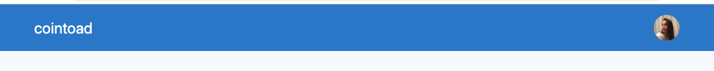

# Coinbase clone

So, we are trying to clone `coinbase` with `tailwind`. Firt we have the `div` which holds the `background color`, within this `div` we have another `div` which is a container, and within the `container` we have a `div` which holds `flex items` inside. 

For the `mobile version` we have our `nav hamburger menu`, but we hide it for the bigger sizes. 

**mobile version**


**bigger screens**



To make it more responsive we do the following: 

- we add `width-auto` for the `div` with the `avatar` and for the `div` with `cointode name`, as well as we need to justify items with `space between`, so we add this for the `div` which holds all this flex items: avatar, menu, name  - we do this cos when we hide the `hamburger menu` for the bigger sizes the `divs` with avatar and name don't have then space between, and it looks wierd. The fact is that when the `menu` is used for mobile version sized - it takes actually its part of the `div`, and without the menu this part of the `div` is free and all other items move there. 

```html
<!doctype html>
<html lang="en">
    <head>
        <meta charset="utf-8">
        <meta http-equiv="X-UA-Compatible" content="IE=edge">
        <meta name="viewport" content="width=device-width, initial-scale=1">

        <title>Tailwind Example - Twitter</title>

        <link rel="stylesheet" href="https://cdnjs.cloudflare.com/ajax/libs/font-awesome/4.7.0/css/font-awesome.min.css" />
        <link href="https://unpkg.com/tailwindcss@^1.0/dist/tailwind.min.css" rel="stylesheet">

    </head>
    <body class="font-sans bg-gray-100">
        
<div>
    <div class="bg-blue-600">
        <div class="container mx-auto px-4 ">
                <div class="flex items-center py-4 sm:justify-between">  
                        <div class="w-1/4 sm:hidden">
                            <a href="#"><i class="fa fa-navicon text-white " style="font-size:36px"></i></a>
                        </div>
                        
                        <div class="w-1/2 sm:w-auto text-center text-white text-2xl">
                            cointoad
                        </div>
                        <div class="w-1/4 sm:w-auto text-right">
                            
                        </div>
                    </div>
        </div>
           
    </div>
        
</div>
    


    </body>
</html>
```

Let's add the `name` for the `avatar` and the `chevron`. We'll need actually to hide this for the smaller screens, so we should put this in a `div`. This is gonna be hidden by default and displayed block, as well as `flex` for the small screens - `hidden sm:block`. Let's also display `chavron` `block` - it kind of removes the line height. 


```html
<!doctype html>
<html lang="en">
    <head>
        <meta charset="utf-8">
        <meta http-equiv="X-UA-Compatible" content="IE=edge">
        <meta name="viewport" content="width=device-width, initial-scale=1">

        <title>Tailwind Example - Twitter</title>

        <link rel="stylesheet" href="https://cdnjs.cloudflare.com/ajax/libs/font-awesome/4.7.0/css/font-awesome.min.css" />
        <link href="https://unpkg.com/tailwindcss@^1.0/dist/tailwind.min.css" rel="stylesheet">

    </head>
    <body class="font-sans bg-gray-100">
        
<div>
    <div class="bg-blue-600">
        <div class="container mx-auto px-4 ">
                <div class="flex items-center py-4 sm:justify-between">  
                        <div class="w-1/4 sm:hidden">
                            <a href="#"><i class="fa fa-navicon text-white " style="font-size:36px"></i></a>
                        </div>
                        
                        <div class="w-1/2 sm:w-auto text-center text-white text-2xl">
                            cointoad
                        </div>
                        <div class="w-1/4 sm:w-auto sm:flex text-right">
                            <div>
                                    
                            </div>
                           
                            <div class="hidden sm:block sm:flex sm:items-center">
                                    <span class="text-white text-sm px-1">Ana Mo</span>
                                    <a href="#"><i class="fa fa-chevron-down text-xs text-white block opacity-50"></i></a>
                            </div>
                           
                        </div>
                    </div>
        </div>
           
    </div>
        
</div>
    


    </body>
</html>
```


Let's continue with the second nav. So, we'll have `div` with the color and the border set; then the `div` which is a container for the items, and we'll need `padding` but better to have this `padding` for individual items inside the `div` cos the container itself has a `border` and it needs to be active later. 
Inside the general container we'll have `flex container` - it will make it easier to make individual items inside aligned. 

On the items that are gray colored and have the border only on hover, we actually do the following: we stil save the `border` cos it saves the pixel of padding, but we make it `transparent` and add colored border only on hover. 

```html
<!doctype html>
<html lang="en">
    <head>
        <meta charset="utf-8">
        <meta http-equiv="X-UA-Compatible" content="IE=edge">
        <meta name="viewport" content="width=device-width, initial-scale=1">

        <title>Tailwind Example - Twitter</title>

        <link rel="stylesheet" href="https://cdnjs.cloudflare.com/ajax/libs/font-awesome/4.7.0/css/font-awesome.min.css" />
        <link rel="stylesheet" href="https://use.fontawesome.com/releases/v5.9.0/css/all.css" integrity="sha384-i1LQnF23gykqWXg6jxC2ZbCbUMxyw5gLZY6UiUS98LYV5unm8GWmfkIS6jqJfb4E" crossorigin="anonymous">


        <link href="https://unpkg.com/tailwindcss@^1.0/dist/tailwind.min.css" rel="stylesheet">

    </head>
    <body class="font-sans bg-gray-100">
        <!--Navigation-->
<div>
    <!--Top Nav-->
    <div class="bg-blue-600">
        <div class="container mx-auto px-4 ">
                <div class="flex items-center py-4 sm:justify-between">  
                        <div class="w-1/4 sm:hidden">
                            <a href="#"><i class="fa fa-navicon text-white " style="font-size:36px"></i></a>
                        </div>
                        
                        <div class="w-1/2 sm:w-auto text-center text-white text-2xl">
                            cointoad
                        </div>
                        <div class="w-1/4 sm:w-auto sm:flex text-right">
                            <div>
                                    
                            </div>
                           
                            <div class="hidden sm:block sm:flex sm:items-center ml-2">
                                    <span class="text-white text-sm mr-1">Ana Mo</span>
                                    <a href="#"><i class="fa fa-chevron-down text-xs text-white block opacity-50"></i></a>
                            </div>
                           
                        </div>
                    </div>
        </div>
           
    </div><!--end top nav-->

    <!--Secondary Nav-->
    <div class="bg-white border-b"> 
       <div class="container mx-auto px-4">

        <div class="flex">
                   <div class="flex -mb-px mr-6">
                        <a href="#" class="flex items-center text-blue-600 text-normal py-2 border-b-2 border-blue-600 no-underline"><i class="fa fa-th-large mr-2" style="font-size:24px"></i>Dashboard</a>
                   </div>
        
                   <div class="flex -mb-px mr-6">
                        <a href="#" class="flex items-center text-gray-500 text-normal py-2 border-b-2 border-transparent hover:border-gray-500 no-underline"><i class="fa fa-exchange-alt mr-2" style="font-size:24px"></i>Buy/Sell</a>
                   </div>
                   
                   <div class="flex -mb-px mr-6">
                        <a href="#" class="flex items-center text-gray-500 text-normal py-2 border-b-2 border-transparent hover:border-gray-500 no-underline"><i  class="fas fa-wallet mr-2" style="font-size:24px"></i>Accounts</a>
                   </div>
        
                   <div class="flex -mb-px mr-6">
                        <a href="#" class="flex items-center text-gray-500 text-normal py-2 border-b-2 border-transparent hover:border-gray-500 no-underline"><i  class="fa fa-briefcase mr-2" style="font-size:24px"></i>Tools</a>
                   </div>
        
                   <div class="flex -mb-px mr-6">
                        <a href="#" class="flex items-center text-gray-500 text-normal py-2 border-b-2 border-transparent hover:border-gray-500 no-underline"><i  class="fa fa-gear mr-2" style="font-size:24px"></i>Settings</a>
                   </div>
        </div>
           
       </div>
    </div>
        <!--end secondary nav-->
</div> <!--end Navigation-->


    


    </body>
</html>
```

Now we wanna imitate the `nav` shrink for the mobile size. Let's add: 

- change background color for the small screens 
`<div class="bg-blue-600 sm:bg-white sm:border-b"> `

- stay flex for the small screens ` <div class="sm:flex">`

- change text color for the small screens `text-white opacity-50  sm:text-gray-600 sm:opacity-100`

- border on hover for smalles screens `hover:opacity-100 sm:hover:border-gray-500`

- secondary menu will be hidden by default on smaller screens 
` <div class="hidden bg-blue-600 sm:block sm:bg-white sm:border-b"> `


```html
<!doctype html>
<html lang="en">
    <head>
        <meta charset="utf-8">
        <meta http-equiv="X-UA-Compatible" content="IE=edge">
        <meta name="viewport" content="width=device-width, initial-scale=1">

        <title>Tailwind Example - Twitter</title>

        <link rel="stylesheet" href="https://cdnjs.cloudflare.com/ajax/libs/font-awesome/4.7.0/css/font-awesome.min.css" />
        <link rel="stylesheet" href="https://use.fontawesome.com/releases/v5.9.0/css/all.css" integrity="sha384-i1LQnF23gykqWXg6jxC2ZbCbUMxyw5gLZY6UiUS98LYV5unm8GWmfkIS6jqJfb4E" crossorigin="anonymous">


        <link href="https://unpkg.com/tailwindcss@^1.0/dist/tailwind.min.css" rel="stylesheet">

    </head>
    <body class="font-sans bg-gray-200">
        <!--Navigation-->
<div>
    <!--Top Nav-->
    <div class="bg-blue-600">
        <div class="container mx-auto px-4 ">
                <div class="flex items-center py-4 sm:justify-between">  
                        <div class="w-1/4 sm:hidden">
                            <a href="#"><i class="fa fa-navicon text-white " style="font-size:36px"></i></a>
                        </div>
                        
                        <div class="w-1/2 sm:w-auto text-center text-white text-2xl">
                            cointoad
                        </div>
                        <div class="w-1/4 sm:w-auto sm:flex text-right">
                            <div>
                                    
                            </div>
                           
                            <div class="hidden sm:block sm:flex sm:items-center ml-2">
                                    <span class="text-white text-sm mr-1">Ana Mo</span>
                                    <a href="#"><i class="fa fa-chevron-down text-xs text-white block opacity-50"></i></a>
                            </div>
                           
                        </div>
                    </div>
        </div>
           
    </div><!--end top nav-->

    <!--Secondary Nav-->
    <div class="hidden bg-blue-600 sm:block sm:bg-gray-100 sm:border-b"> 
       <div class="container mx-auto px-4">

        <div class="sm:flex">
                   <div class="sm:flex -mb-px mr-6">
                        <a href="#" class="flex items-center text-white sm:text-blue-600 text-normal py-2 border-b-2 border-blue-600 no-underline"><i class="fa fa-th-large mr-2" style="font-size:22px"></i>Dashboard</a>
                   </div>
        
                   <div class="flex -mb-px mr-6">
                        <a href="#" class="flex items-center text-white opacity-50  sm:text-gray-600 sm:opacity-100  text-normal py-2 border-b-2 border-transparent hover:opacity-100 sm:hover:border-gray-500 no-underline"><i class="fa fa-exchange-alt mr-2" style="font-size:22px"></i>Buy/Sell</a>
                   </div>
                   
                   <div class="flex -mb-px mr-6">
                        <a href="#" class="flex items-center text-white opacity-50  sm:text-gray-600 sm:opacity-100 text-normal py-2 border-b-2 border-transparent hover:opacity-100 sm:hover:border-gray-500 no-underline"><i  class="fas fa-wallet mr-2" style="font-size:22px"></i>Accounts</a>
                   </div>
        
                   <div class="flex -mb-px mr-6">
                        <a href="#" class="flex items-center text-white opacity-50  sm:text-gray-600 sm:opacity-100 text-normal py-2 border-b-2 border-transparent hover:opacity-100 sm:hover:border-gray-500 no-underline"><i  class="fa fa-briefcase mr-2" style="font-size:22px"></i>Tools</a>
                   </div>
        
                   <div class="flex -mb-px mr-6">
                        <a href="#" class="flex items-center text-white opacity-50  sm:text-gray-600 sm:opacity-100 text-normal py-2 border-b-2 border-transparent hover:opacity-100 sm:hover:border-gray-500 no-underline"><i  class="fa fa-gear mr-2" style="font-size:22px"></i>Settings</a>
                   </div>
        </div>
           
       </div>
    </div>
        <!--end secondary nav-->
</div> <!--end Navigation-->

    </body>
</html>
```

**mobile**


**small sizes and bigger**


Let's work on the next currency section. In the first part it has two `divs` and we'll use `justify-between` to have them on the both sides. 

```html
<!doctype html>
<html lang="en">
    <head>
        <meta charset="utf-8">
        <meta http-equiv="X-UA-Compatible" content="IE=edge">
        <meta name="viewport" content="width=device-width, initial-scale=1">

        <title>Tailwind Example - Twitter</title>

        <link rel="stylesheet" href="https://cdnjs.cloudflare.com/ajax/libs/font-awesome/4.7.0/css/font-awesome.min.css" />
        <link rel="stylesheet" href="https://use.fontawesome.com/releases/v5.9.0/css/all.css" integrity="sha384-i1LQnF23gykqWXg6jxC2ZbCbUMxyw5gLZY6UiUS98LYV5unm8GWmfkIS6jqJfb4E" crossorigin="anonymous">


        <link href="https://unpkg.com/tailwindcss@^1.0/dist/tailwind.min.css" rel="stylesheet">

    </head>
    <body class="font-sans bg-gray-100">
        <!--Navigation-->
<div>
   ....
</div> <!--end Navigation-->


<!--Section-->

<div class="container mx-auto px-4 pt-6 pb-8">
 <div class="bg-white border rounded shadow ">
     <div class="border-b px-6">
            <div class="flex justify-between -mb-px">
                    <div class="flex">
                        <button type="button" class="py-4 text-blue-600 border-b-2 border-blue-600 mr-4 appearance-none ">
                            Bitcoin &middot; CA$21,380.01
                        </button>
                        <button type="button" class="py-4 text-gray-500 border-b-2 border-transparent hover:border-gray-500 mr-4 appearance-none ">
                            Ethereum &middot; CA$884.80
                        </button>
                        <button type="button" class="py-4 text-gray-500 border-b-2 border-transparent hover:border-gray-500 mr-4 appearance-none ">
                            Litecoin &middot; CA$356.85
                        </button>
                        
                    </div>
                    <div class="flex text-sm">
                            <button type="button" class="py-4 text-blue-600 border-b-2 border-blue-600 mr-4 appearance-none ">
                                1H
                            </button>
                            <button type="button" class="py-4 text-gray-500 border-b-2 border-transparent hover:border-gray-500 mr-4 appearance-none ">
                                1D
                            </button>
                            <button type="button" class="py-4 text-gray-500 border-b-2 border-transparent hover:border-gray-500 mr-4 appearance-none ">
                                1W
                            </button>
                            <button type="button" class="py-4 text-gray-500 border-b-2 border-transparent hover:border-gray-500 mr-4 appearance-none ">
                                1M
                            </button>
                                <button type="button" class="py-4 text-gray-500 border-b-2 border-transparent hover:border-gray-500 mr-4 appearance-none ">
                                1Y
                             </button>
                            </button>
                            <button type="button" class="py-4 text-gray-500 border-b-2 border-transparent hover:border-gray-500 appearance-none ">
                                ALL
                           </button>
                            
                        </div>
                </div>
     </div>
     
 </div>


</div><!--end section-->
    


    </body>
</html>
```


Next part inside this section  - actual currency price

```html
<!doctype html>
<html lang="en">
    <head>
        <meta charset="utf-8">
        <meta http-equiv="X-UA-Compatible" content="IE=edge">
        <meta name="viewport" content="width=device-width, initial-scale=1">

        <title>Tailwind Example - Twitter</title>

        <link rel="stylesheet" href="https://cdnjs.cloudflare.com/ajax/libs/font-awesome/4.7.0/css/font-awesome.min.css" />
        <link rel="stylesheet" href="https://use.fontawesome.com/releases/v5.9.0/css/all.css" integrity="sha384-i1LQnF23gykqWXg6jxC2ZbCbUMxyw5gLZY6UiUS98LYV5unm8GWmfkIS6jqJfb4E" crossorigin="anonymous">


        <link href="https://unpkg.com/tailwindcss@^1.0/dist/tailwind.min.css" rel="stylesheet">

    </head>
    <body class="font-sans bg-gray-100">
        <!--Navigation-->
          ....

     <div class="flex">
            <div class="w-1/3 text-center py-6 ">
                <div class="border-r">
                        <div class="text-gray-600 mb-2">
                                <span class="text-3xl align-top">CA$</span>
                                <span class="text-5xl">21,404</span>
                                <span class="text-3xl align-top">.74</span>
                        </div>
                        <div class="uppercase text-gray-500 tracking-wide">
                            Bitcoin Price
                        </div>        
                </div>
                
            </div>
            <div class="w-1/3 text-center py-6 ">
                <div class="border-r">
                        <div class="text-gray-600 mb-2">
                                <span class="text-3xl align-top"><span class="text-green-400 align-top">+</span>CA$</span>
                                <span class="text-5xl">12,998</span>
                                <span class="text-3xl align-top">.48</span>
                        </div>
                        <div class="uppercase text-gray-500 tracking-wide">
                            Since Last Month (CAD)
                        </div>    
                </div>
        
            </div>
            <div class="w-1/3 text-center py-6">
                <div >
                        <div class="text-gray-600 mb-2">
                                <span class="text-3xl align-top"><span class="text-green-400 align-top">+</span></span>
                                <span class="text-5xl">154,99</span>
                                <span class="text-3xl align-top">%</span>
                        </div>
                        <div class="uppercase text-gray-500 tracking-wide">
                                Since Last Month (%)
                        </div>    
                </div>
            </div>
        
     </div>


 </div>

</div><!--end section-->
    


    </body>
</html>
```


Now let's do the responcive version of this. 

