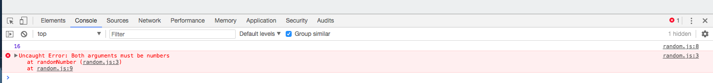

# Generate a random number between two numbers

* the `function` needs to accept 2 `values`, the lower and the upper value. 
* in orther words create a `function` that produces a random number between `X` and `Y`
* call a function by passing different values 

```js
function randomNumber(lowernum, uppernum){
  if( isNaN(lowernum) || isNaN(uppernum) ){
   throw new Error("Both arguments must be numbers");
  }
  return Math.floor(Math.random() * (uppernum - lowernum + 1)) + lowernum; 
}

console.log(randomNumber(10,100));
console.log(randomNumber('nine',24));
console.log(randomNumber(8,32));
console.log(randomNumber(10,'one-hundred'));
```


