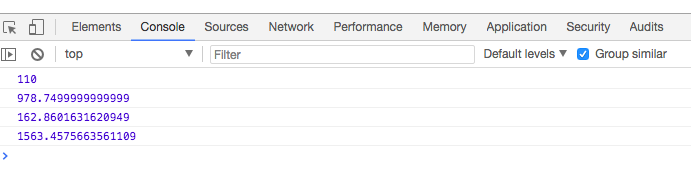

# Functions challenge

 1. Create a function that calculates the area of a rectangle.
* The function should accept the width and height as arguments
* and return the area of that rectangle.
* The area of a rectangle is the width * height

```js
function rectangleArea ( width, height ){
  var area = width * height;
  return area;
}
  console.log( rectangleArea( 5, 22) );
  ```


2. Create a function that calculates the volume of a rectangular prism.
*  The function should accept the width, height and length as arguments
*  and return the volume of that rectangular prism.
*  The volume of a rectangular prism is the width * height * length

* let rectangularPrismVolume = (width, height, length) => {volume = width*height*length};

```js
function getRectangularPrismVolume ( width, height, lenght ){
  var prismVolume =  width * height * lenght;
      return  prismVolume;
}

console.log( getRectangularPrismVolume( 4.5, 12.5, 17.4 ) );
```

3. Create a function that calculates the area of a circle.
* The function should accept the radius of the circle as an argument
* and return the area of that circle.
* The area of a circle is the value of π * radius^2

* let circleArea = (circle radius) =>{area=π * radius^2};

```js
function getCircleArea(radius){
  return  Math.PI * ( radius * radius ); // or Math.PI * Math.pow( radius, 2 )
}

console.log( getCircleArea( 7.2 ) );
```

4. Create a function that calculates the volume of a sphere.
* The function should accept the radius of the sphere as an argument
*  and return the volume.
* The volume of a circle is: 4/3 *  π * radius^3
* let sphereVolume = (sphere radius)=>{volume=4/3 *  π * radius^3};

```js
function getSphereVolume (radius){
  return (4/3) * Math.PI * ( radius * radius * radius ); // or ( 4/3 ) * Math.PI * Math.pow( radius, 3 )
}

console.log ( getSphereVolume (7.2) ); 
```

5. Here are the values to test and the expected results
* Area of rectangle that is 5 wide and 22 tall: 110
* Volume of a rectangular prism that is 4.5 x 12.5 x 17.4: 978.7499999999999
* Area of a circle that with a radius of 7.2: 162.8601631620949
* Volume of a spehere with a radius of 7.2: 1563.4575663561109



