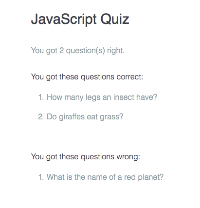

# Two-dimwnsional Array Challenge

We need to create a quizz.

Asks a user several questions. Counts the right answeres. Tells to the user which questions were answered right and which were whong. 

**First Part**
* we need an array to keep questions and answeres
* we need a loop to cicle through each question
* ask a question and compare the response from the player to the answer in the array
* then use a conditional statement to see if the player's answer matches the real answer
* when the loop is done you should know how many questions were correctly answered and
* print that to the screen

**Second Part**

* 2 new arrays:
* one to keep track of the correctly answered questions
* and one to keep track of the wrongly answered questions
* use methods for adding to an array
* after the user answeres question to pin an array whether the answer is correctly, add the question to one of the arrays
* in addition you need the way to print these questions as bulleted lists
* you need to build a slightly different version of printList function

### Solution

```js
var questions = [
['How many legs an insect have?', '6'],
['What is the name of a red planet?', 'mars' ],
['Do giraffes eat grass?', 'yes']
]; 
var correctAnswers = 0;
var question;
var answer; 
var response;
var html;
var wrongAnsweredQuestion = [];
var correctAnsweredQuestion = [];


function print(message) {
  var outputDiv = document.getElementById("output");
  outputDiv.innerHTML = message;
}

function buildlist(array){
  var listHTML = '<ol>';
  for (var arrayIndex = 0; arrayIndex < array.length; arrayIndex += 1){
    listHTML += '<li>' + array[arrayIndex] + '</li>';
  }
  listHTML += '</ol>';
  return listHTML;
}

for (var questionsIndex = 0; questionsIndex < questions.length; questionsIndex ++){
question = questions[questionsIndex][0];
answer = questions[questionsIndex][1];
response = prompt(question);  
  if (response === answer){
    correctAnswers +=1;
    correctAnsweredQuestion.push(question);
  }else{
    wrongAnsweredQuestion.push(question);
  }
}
  
html = "You got " + correctAnswers + " question(s) right."
html += '<h2>You got these questions correct: </h2>';
html += buildlist(correctAnsweredQuestion);
html += '<h2>You got these questions wrong: </h2>';
html += buildlist(wrongAnsweredQuestion);
print(html);
```
### Result


