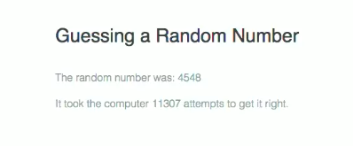
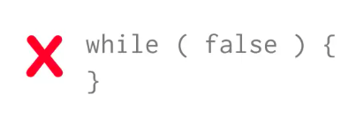

# Loop Conditions

```js
function randomNumber(upper) {
  return Math.floor( Math.random() * upper ) + 1;
}

var counter = 0;
while ( counter < 10 ){
  var randNum = randomNumber(6);
  document.write(randNum + ' ' );
  counter +=1;
  }
  ```
You don't always need to use a `counter` like in an example or specify the `exact number of times` that a loop must run. All you need is a `condition` that at some points evaluates to `false`, so the `loop` can end. 

### Example "Guessing a random number"



1.  First we need to gererate a random number from `1` to `10000`. This is the number the computer needs to guess.
2.  Enter a `while` loop - inside this `loop` the computer will 'guess' the random number. If the number the computer guesses matches the number generated at the beginning of the program, the `loop` ends, if not, the `loop` continues untill the correct number is guessed. 
3. Exit the `loop` and print the random number and the number of times it took the computer to get it. 

```js
var upper = 10000;
var randomNumber = getRandomNumber(upper); //the number the computer has to guess
var guess; //holds  the computer guess
var attempts = 0;


function getRandomNumber(upper) {
  return Math.floor( Math.random() * upper ) + 1;
}

while( guess !== randomNumber ){
  guess = getRandomNumber( upper );
  attempts +=1;
}
document.write("<p>The random number was" + randomNumber + "</p>");
document.write("<p>It took the computer " + attempts + " attempts to get it right.</p>");
```
* when a program first runs the script generates a random number from `1` to `10000` and stores it in the `randomNumber variable`
* the `guess` variable doesn't have any `value`, so when we fisrt get to the `loop` JavaScript Interpreter evaluates the `condition` `while( guess !== randomNumber )`. Does `guess` not equal to `randomNumber`? Yes, cos `guess` has no `value`, and it doesn't match `randomNumber`. 
* so we enter the `loop` and we guess and increase the number of attempts. 
* the JavaScript Interpreter then goes back to the `loop` and asks the `condition` again. 
* it happens over and over untill the `guess` matches the original `randomNummber`.

### Keep in mind about a `while` loop

* the `condition` is evaluated before the `loop`. That is if the test `condition` is not true at the beginning then the `loop` will never run



* you always need a way to break out of the `loop`. In orther words something has to change inside the `loop` to stop it from running. The most common way - is to change some `variable` inside the `loop` that causes the test condition to evaluate to `false`. If the test `condition` is always true - the `loop` runs forever. 


