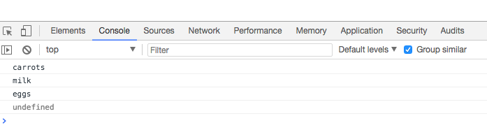

# Accessing Items in an Array
```js
var scores = [100, 99, 99, 72, 60];
var names = ['Joan', 'Amit', 'Sarah', 'Ricardo', 'Piers'];
var values = [1, -100, true, false, 'JavaScript'];
```
Resources:

[JavaScript Arrays on the Mozilla Developer Network](https://developer.mozilla.org/en-US/docs/Web/JavaScript/Reference/Global_Objects/Array)

To access the item inside the array we use the following

```js
var shopping = [ 'carrots', 'milk', 'eggs' ];
console.log(shopping[0]);
console.log(shopping[1]);
console.log(shopping[2]);
console.log(shopping[3]);
```


The last item is undefined, cos JS array counts starting from `0`. Other words JS talls us that there isn't anything at index `3` in this array. 


