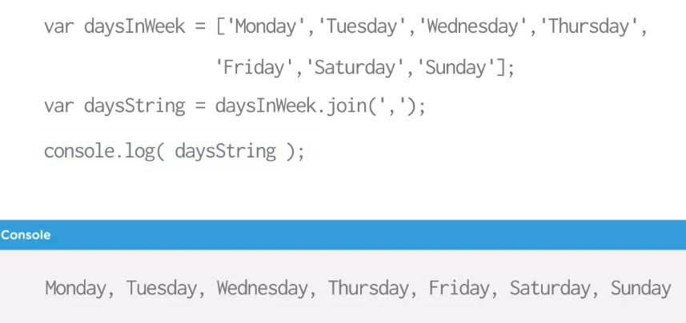
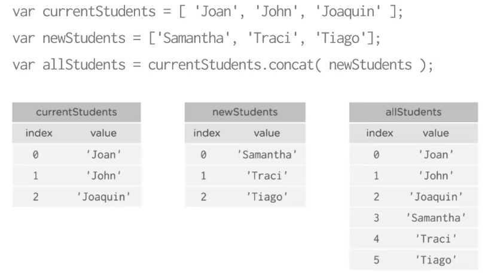
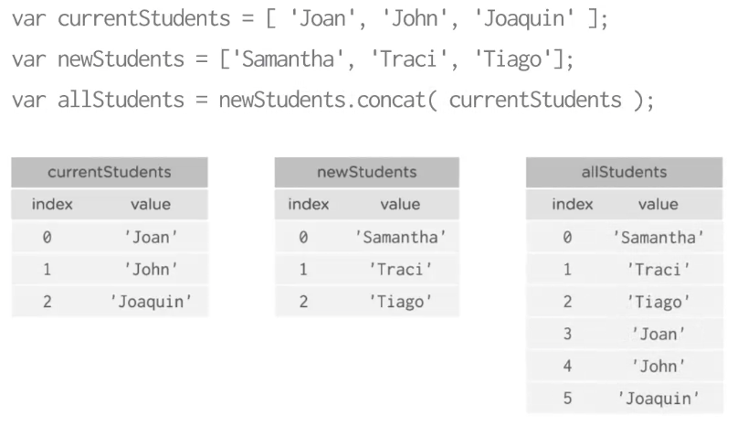
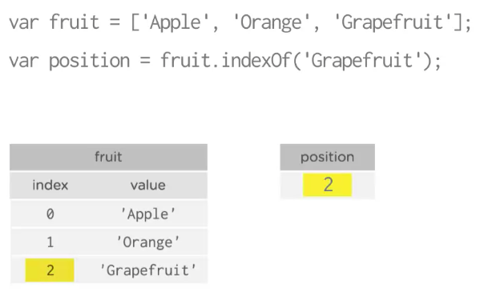
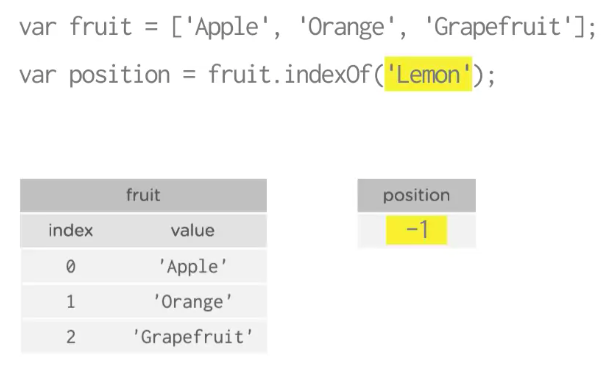

# `.join` Method

`join` method takes an `array` and returns a string with all the items in the `array` separated by a supplied character, such as a comma or a semicolon, or even a letter. In fact, you can pass  more than one character. This a great way to display all the `items` in the `array` in a single line. 

# `.concat` Method

You can use it to add one `array` to anorther.

If we want the `newStudents` list to be first, we just swap the `array` names.

# `.indexOf` Method

This methods lets you search an `array` for a particular `value`. If the `value` is in the list, that element's position is returned. 

If the `value` is not in the lise, then the `.indexOf` method returns the value `-1`. You can use this information to see if the `value` is in an `array` or not. 

