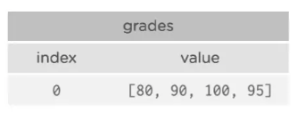
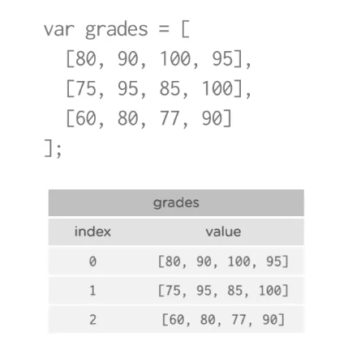
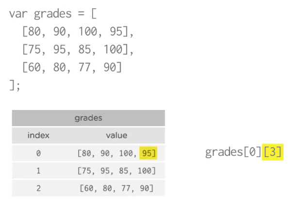
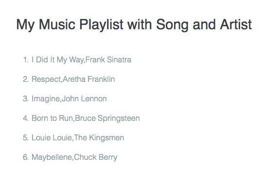
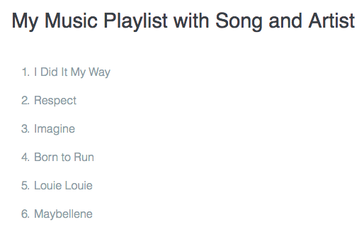
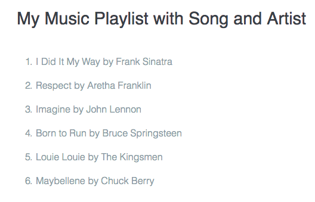

# Two-dimensional Arrays

```js
var grades [
    [80, 90, 100, 95]
];
```


We can have several `arrays` inside the outer `array`



How do we access these different grades?



How do we get the first grade of the last student(last inner array)?

```js
grades[2][0]
```

### Example

```js
var playList = [
  ['I Did It My Way', 'Frank Sinatra'],
  ['Respect', 'Aretha Franklin'],
  ['Imagine', 'John Lennon'],
  ['Born to Run', 'Bruce Springsteen'],
  ['Louie Louie', 'The Kingsmen'],
  ['Maybellene', 'Chuck Berry']
];

function print(message) {
  document.write(message);
}

function printSongs( songs ) {
  var listHTML = '<ol>';
  for ( var i = 0; i < songs.length; i += 1) {
    listHTML += '<li>' + songs[i] + '</li>';
  }
  listHTML += '</ol>';
  print(listHTML);
}

printSongs(playList);
```


But we actually need to access each peace of the array

```js
var playList = [
  ['I Did It My Way', 'Frank Sinatra'],
  ['Respect', 'Aretha Franklin'],
  ['Imagine', 'John Lennon'],
  ['Born to Run', 'Bruce Springsteen'],
  ['Louie Louie', 'The Kingsmen'],
  ['Maybellene', 'Chuck Berry']
];

function print(message) {
  document.write(message);
}

function printSongs( songs ) {
  var listHTML = '<ol>';
  for ( var i = 0; i < songs.length; i += 1) {
    listHTML += '<li>' + songs[i][0] + '</li>'; //here we have amore specific index
  }
  listHTML += '</ol>';
  print(listHTML);
}

printSongs(playList);
``` 


```js
var playList = [
  ['I Did It My Way', 'Frank Sinatra'],
  ['Respect', 'Aretha Franklin'],
  ['Imagine', 'John Lennon'],
  ['Born to Run', 'Bruce Springsteen'],
  ['Louie Louie', 'The Kingsmen'],
  ['Maybellene', 'Chuck Berry']
];

function print(message) {
  document.write(message);
}

function printSongs( songs ) {
  var listHTML = '<ol>';
  for ( var i = 0; i < songs.length; i += 1) {
    listHTML += '<li>' + songs[i][0] + ' by ' + songs[i][1] + '</li>';
  }
  listHTML += '</ol>';
  print(listHTML);
}

printSongs(playList);
```


**N.B.** In two-dimensional `array` you need two sets of `[ ]` - one for the outer `array` and one for the inner `array`.

