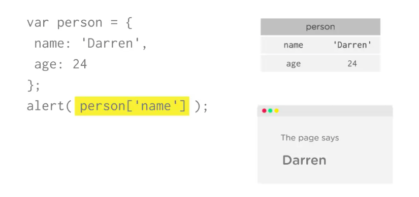
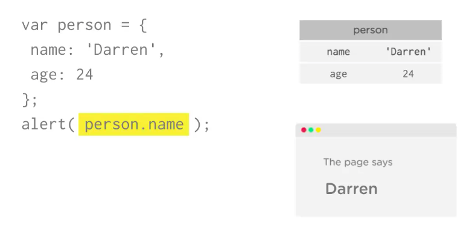
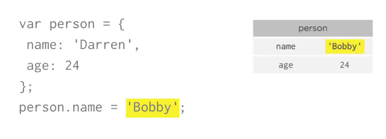
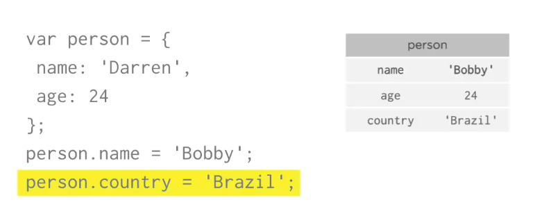
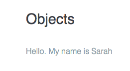
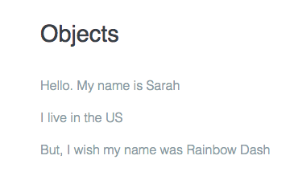
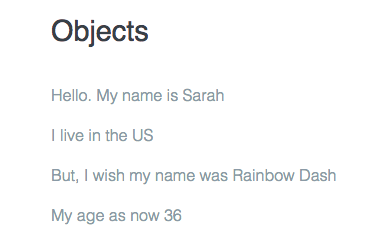
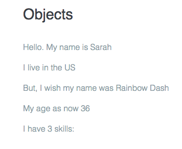
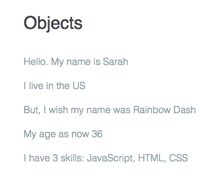

# Accessing Object Properties

An `object` use a `key` to access their properties. 
There are two different ways to access the `value` inside an `object`. First: you use the same `[]` brackets you use in the array, but instead of providing a number, you the `property's` name as a `string`. 



But there is another and more common way: `"dot-notation"`. Just add a dot `.` after the `object` name followed by the `property` name. 



You can also set the `properties` this way. Just use the equal sign `=`. 
E.G. to change the person's name in the `object` you just assign it a new `value`. 



In fact you can even create new `properties` in an `object` this way. 



To use `objects` are very useful. You can pass an `object` and all of its `properties` as a single `argument` to the `function`. This is helpful if you want to return a lot of information form a `function`. 

**Remember** the `return` keyword in JavaScript only lets you return one thing. BUT! By returning an `object` full of information you can create a `function` that returns one thing that is also full of information. 

### Example

Let's use an `object`. Let's access the `property` in the object and combine it with a string. 

```js
var person = {
  name : 'Sarah',
  country : 'US',
  age : 35,
  treehouseStudent : true,
  skills : ['JavaScript', 'HTML', 'CSS']
};

function print(message) {
  var div = document.getElementById('output');
  div.innerHTML = message;
}

var message = '<p>Hello. My name is ' + person.name + '</p>'; //a string combined with the property from the object 
print(message);
```


Let's make some changes: access one more `property`, change the `value` of a `property`. 

```js
var person = {
  name : 'Sarah',
  country : 'US',
  age : 35,
  treehouseStudent : true,
  skills : ['JavaScript', 'HTML', 'CSS']
};

function print(message) {
  var div = document.getElementById('output');
  div.innerHTML = message;
}

var message = '<p>Hello. My name is ' + person.name + '</p>';
message += '<p>I live in the ' + person.country + '</p>';
person.name = 'Rainbow Dash'; //we change the valu here
message += '<p>But, I wish my name was ' + person.name + '</p>';
print(message); 
```


We can perform `math` on the numeric `properties` too. 

```js
var person = {
  name : 'Sarah',
  country : 'US',
  age : 35,
  treehouseStudent : true,
  skills : ['JavaScript', 'HTML', 'CSS']
};

function print(message) {
  var div = document.getElementById('output');
  div.innerHTML = message;
}

var message = '<p>Hello. My name is ' + person.name + '</p>';
message += '<p>I live in the ' + person.country + '</p>';
person.name = 'Rainbow Dash';
message += '<p>But, I wish my name was ' + person.name + '</p>';
person.age += 1; // we use math here 
message += '<p>My age as now ' + person.age + '</p>';
print(message); 
```


You can also access `propreties` of those `values`. E.g. the `skills` property contains an `array`. You can look at the `length` property of the `array` to see how many skill the student has. 



You can also access `methods` of `properties`. E.g. to print out the list of a student's skills, you can use the `array` `.join` method. 

```js
var person = {
  name : 'Sarah',
  country : 'US',
  age : 35,
  treehouseStudent : true,
  skills : ['JavaScript', 'HTML', 'CSS']
};

function print(message) {
  var div = document.getElementById('output');
  div.innerHTML = message;
}

var message = '<p>Hello. My name is ' + person.name + '</p>';
message += '<p>I live in the ' + person.country + '</p>';
person.name = 'Rainbow Dash';
message += '<p>But, I wish my name was ' + person.name + '</p>';
person.age += 1;
message += '<p>My age as now ' + person.age + '</p>';
message += '<p>I have ' + person.skills.length + ' skills: ';
message += pesron.skills.join(', ') + '<p>'; //use join method
print(message); 
```



