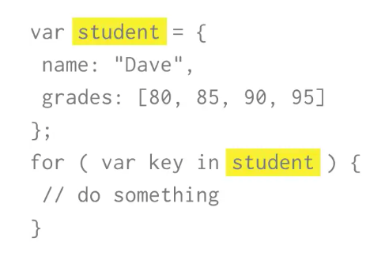
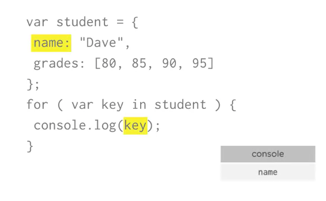
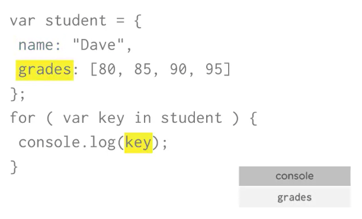
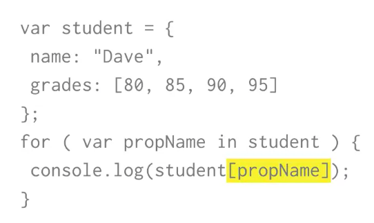
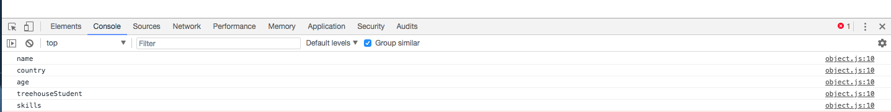
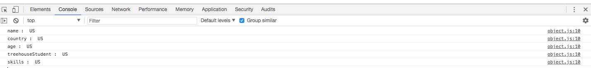
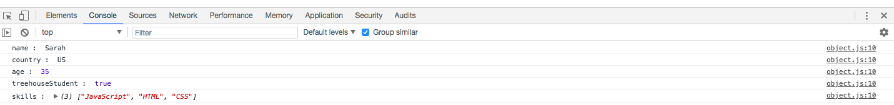

# Using `for..in` to Loop through an Object's Properties

You can also access each `value` in an `object` using a special type of `loop` only available to `objects`. It's called `for...in` loop, and loops through each `key`(property name) in the `object`. 

```js
for (var key in object){
    //do something
};
```


The variable `key` here refers to the `property` name in the object. Each time through the `loop` this variable `key` will hold a different `value`.




How do we get acces to the `values` assosiated with each `key`? You can use square bracket notation `[]` to access the value. **You can't use the dot notation!** 



### Example 

```js
var person = {
  name : 'Sarah',
  country : 'US',
  age : 35,
  treehouseStudent : true,
  skills : ['JavaScript', 'HTML', 'CSS']
};

for (var property in person){
  console.log(property);
}
```
It will give us the names of the `properties` in an `object`. 



To access a `value`

```js
var person = {
  name : 'Sarah',
  country : 'US',
  age : 35,
  treehouseStudent : true,
  skills : ['JavaScript', 'HTML', 'CSS']
};

for (var property in person){
  console.log(property, ': ', person['US']); //access a value with a square brackets
}
```
It will give the same `value` for each `property`



But if we replace it 

```js
var person = {
  name : 'Sarah',
  country : 'US',
  age : 35,
  treehouseStudent : true,
  skills : ['JavaScript', 'HTML', 'CSS']
};

for (var property in person){
  console.log(property, ': ', person[property]); //the name of variable here
}
```



