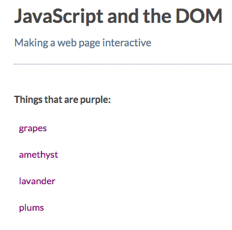

# Select All Elements of a Particular Type

Code snippet

[MDN page for getElementsByTagName](https://developer.mozilla.org/en-US/docs/Web/API/Element/getElementsByTagName)

An HTML collection is similar to an array. Read up on [HTML collections here](https://developer.mozilla.org/en-US/docs/Web/API/HTMLCollection)
.

What if you want to select an `element` that doesn't have an `id`? Or you want to select multiple elements on the page? You can use `document.getElementsByTagName()`. It returns a collection of `elements`. A collection is like an `array`. 

* You can access an element directly, using its index: 

```js
const els = document.getElementsByTagName('p') //first p element on the page
```
* Or loop over the whole collection to access all of them:

```js
for (let i = 0; i < els.length; i += 1){
    els[i] //do something with each element
}
```
### Example

Change the list `items` to purple
**HTML**
```html
<!DOCTYPE html>
<html>
  <head>
    <title>JavaScript and the DOM</title>
    <link rel="stylesheet" href="css/style.css">
  </head>
  <body>
    <h1 id="myHeading">JavaScript and the DOM</h1>
    <p>Making a web page interactive</p>
    <p>Things that are purple:</p>
    <ul>
      <li>grapes</li>
      <li>amethyst</li>
      <li>lavander</li>
      <li>plums</li>
    </ul>
    
    <script src="app.js"></script>
  </body>
</html>
```
**JS**
```js
const myList = document.getElementsByTagName( 'li' );

for( let i = 0; i < myList.length; i +=1){
  myList[i].style.color = 'purple';
}
```



