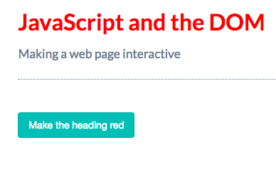
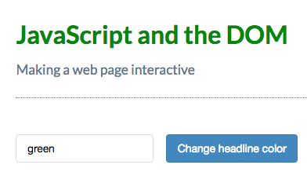

# Select a Page Element by its ID

[MDN page for getElementById](https://developer.mozilla.org/en-US/docs/Web/API/Document/getElementById)

**Accessing the value of an input element**

Use the `value property` to get the text that has been entered into an `input` element. For example, if you have a `text input` stored in a variable `myInput`, you can retrieve any text the user has typed into that `input` like this:

`myInput.value`

### Experiment with the app

* Add a `button` that always resets the title to red.

First we add a `button` in our `html` file. 
**HTML**
```html
<!DOCTYPE html>
<html>
  <head>
    <title>JavaScript and the DOM</title>
    <link rel="stylesheet" href="css/style.css">
  </head>
  <body>
    <h1 id="myHeading">JavaScript and the DOM</h1>
    <p>Making a web page interactive</p>
    <button id="myButton">Make heading red</button> <!-- add button here -->
    <script src="app.js"></script>
  </body>
</html>
```
Now we can find the `button` element in our JavaScript file. 
**JS**
```js
const myHeading = document.getElementById('myHeading'); 
const myButton = document.getElementById('myButton'); //select the element `button`

myHeading.addEventListener('click', () => {
myHeading.style.color = 'red';            
})
```
Now we want the `button` to listen. Let's call `.addEventListner` to `myButton`

```js
const myHeading = document.getElementById('myHeading'); 
const myButton = document.getElementById('myButton');

myButton.addEventListener('click', () => { //make the button to listen
myHeading.style.color = 'red';            
})
```


* Create another field that sets a different style attribute of the headline. Let's make our `button` to change the `heading` to any color.

Let's add the `input` element above the `button`. 

**HTML**
```html
<!DOCTYPE html>
<html>
  <head>
    <title>JavaScript and the DOM</title>
    <link rel="stylesheet" href="css/style.css">
  </head>
  <body>
    <h1 id="myHeading">JavaScript and the DOM</h1>
    <p>Making a web page interactive</p>
    <input type="text" id="myTextInput"> <!-- add input element -->
    <button id="myButton">Change headline color</button>
    <script src="app.js"></script>
  </body>
</html>
```
**JS**
```js
const myHeading = document.getElementById( 'myHeading' ); 
const myButton = document.getElementById( 'myButton' );
const myTextInput = document.getElementById( 'myTextInput' );

myButton.addEventListener('click', () => {
myHeading.style.color = myTextInput.value;    //change the style        
})
```



