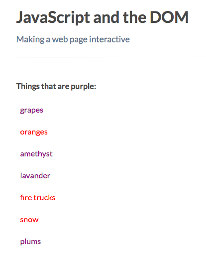

# Selecting Elements with the same Class Name

When working with `HTML`, you'll use `classes` to give elements a particular style with `CSS`. Now, you'll learn to select `elements` with the same `class`, using `document.getElementsByClassName`.

[MDN page for getElementsByClassName](https://developer.mozilla.org/en-US/docs/Web/API/Document/getElementsByClassName)

### Example

**HTML**
```html
<!DOCTYPE html>
<html>
  <head>
    <title>JavaScript and the DOM</title>
    <link rel="stylesheet" href="css/style.css">
  </head>
  <body>
    <h1 id="myHeading">JavaScript and the DOM</h1>
    <p>Making a web page interactive</p>
    <p>Things that are purple:</p>
    <ul>
      <li>grapes</li>
      <li class="error-not-purple">oranges</li> <!--add one more item-->
      <li>amethyst</li>
      <li>lavander</li>
      <li class="error-not-purple">fire trucks</li> <!--add one more item-->
      <li class="error-not-purple">snow</li> <!--add one more item-->
      <li>plums</li>
    </ul>
    
    <script src="app.js"></script>
  </body>
</html>
```
**JS**
```js
const myList = document.getElementsByTagName( 'li' );

for( let i = 0; i < myList.length; i +=1){
  myList[i].style.color = 'purple';
}

const errorNotPurple = document.getElementsByClassName( 'error-not-purple' ); //chose by class

for( let i = 0; i < errorNotPurple.length; i +=1){
  errorNotPurple[i].style.color = 'red';
}
```


