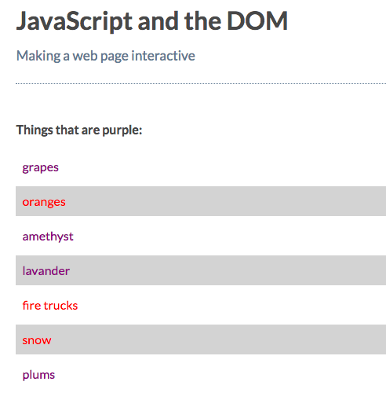

# Using CSS Queries to select Page Elements

The last `selectors` we'll look at are `querySelector` and `querySelectorAll`. These are the most flexible of the selectors we've looked at, as they will accept `ID's`, `classes`, `tag names` and more.

`CSS selector`s are a powerful way to select `DOM` elements. 

[MDN page for querySelector](https://developer.mozilla.org/en-US/docs/Web/API/Document/querySelector)
[MDN page for querySelectorAll](https://developer.mozilla.org/en-US/docs/Web/API/Document/querySelectorAll)

### Example

**HTML**
```html
<!DOCTYPE html>
<html>
  <head>
    <title>JavaScript and the DOM</title>
    <link rel="stylesheet" href="css/style.css">
  </head>
  <body>
    <h1 id="myHeading">JavaScript and the DOM</h1>
    <p>Making a web page interactive</p>
    <p title="lable">Things that are purple:</p> <!--add here a title attribute-->
    <ul>
      <li>grapes</li>
      <li class="error-not-purple">oranges</li>
      <li>amethyst</li>
      <li>lavander</li>
      <li class="error-not-purple">fire trucks</li>
      <li class="error-not-purple">snow</li>
      <li>plums</li>
    </ul>
    
    <script src="app.js"></script>
  </body>
</html>
```

**JS**
```js
const myList = document.getElementsByTagName( 'li' );

for( let i = 0; i < myList.length; i +=1){
  myList[i].style.color = 'purple';
}

const errorNotPurple = document.querySelectorAll( '.error-not-purple' ); //first we change the method and use CSS `.`                                                                            mark of a class

for( let i = 0; i < errorNotPurple.length; i +=1){
  errorNotPurple[i].style.color = 'red';
}
```
Now we want only even items to be changed. We'll use CSS ` nth-child` `pseudo class selector` on all list items.

```js
const myList = document.getElementsByTagName( 'li' );

for( let i = 0; i < myList.length; i +=1){
  myList[i].style.color = 'purple';
}

const errorNotPurple = document.querySelectorAll( '.error-not-purple' );

for( let i = 0; i < errorNotPurple.length; i +=1){
  errorNotPurple[i].style.color = 'red';
}

const evens = document.querySelectorAll( 'li:nth-child(even)' ); //css pseudo class selector

for( let i = 0; i < evens.length; i +=1){
  evens[i].style.backgroundColor = 'lightgray';
}
```
### Result
 
 
