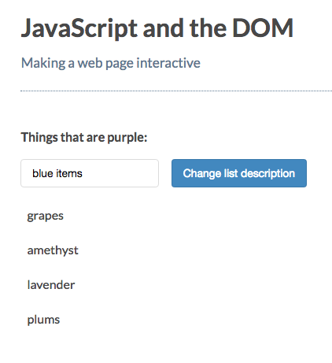
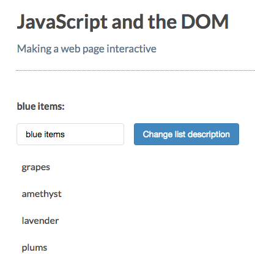
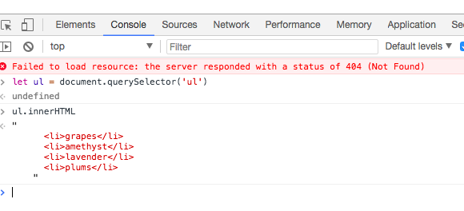
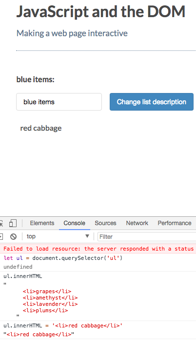

# Getting and Setting Text with Text Content and Inner HTML


[MDN page for textContent](https://developer.mozilla.org/en-US/docs/Web/API/Node/textContent)

[MDN page for innerHTML](https://developer.mozilla.org/en-US/docs/Web/API/Element/innerHTML)

```js
element.textContent
element.innerHTML
```
## You can use `.textContent` to either read or set text values of elements. 

### Example

**HTML**
```html
<!DOCTYPE html>
<html>
  <head>
    <title>JavaScript and the DOM</title>
    <link rel="stylesheet" href="css/style.css">
  </head>
  <body>
    <h1 id="myHeading">JavaScript and the DOM</h1>
    <p>Making a web page interactive</p>    
    <p>Things that are purple:</p>

    <ul>
      <li>grapes</li>
      <li>amethyst</li>
      <li>lavender</li>
      <li>plums</li>
    </ul>
    <script src="app.js"></script>
  </body>
</html>
```

Let's create an input to change the kind of list we are making. First we should add an `input` and the `button`.

**HTML**
```html
<!DOCTYPE html>
<html>
  <head>
    <title>JavaScript and the DOM</title>
    <link rel="stylesheet" href="css/style.css">
  </head>
  <body>
    <h1 id="myHeading">JavaScript and the DOM</h1>
    <p>Making a web page interactive</p>    
    <p class="description">Things that are purple:</p>
    <input type="text" class="description"> <!-- input -->
    <button class="description">Change list description</button> <!-- button -->
    <ul>
      <li>grapes</li>
      <li>amethyst</li>
      <li>lavender</li>
      <li>plums</li>
    </ul>
    <script src="app.js"></script>
  </body>
</html>
```
**JS**
```js
const input = document.querySelector('input');
const p = document.querySelector('p.description');
const button = document.querySelector('button');

button.addEventListener( 'click', () => {
 p.textContent = input.value + ':';                      
});
```

### Result




## `.innerHTML`

If we change just the `method` in our js file, we'll get the same effect

```js
const input = document.querySelector('input');
const p = document.querySelector('p.description');
const button = document.querySelector('button');

button.addEventListener( 'click', () => {
 p.innerHTML = input.value + ':';              //innerHtml here        
});
```

### Result


However `.innerHTML` can also read and alter the text elements on a web page. You can read and replace everyhing between an element's opening and closing tag. 

### Example

Let's select the `ul` element and call `.innerHTML`. It will give us a `string` with the HTML code within the `ul` element.



And if we want to set this list to `string` of HTML tags and text we would **replace** the `ul`'s content with that html. 




