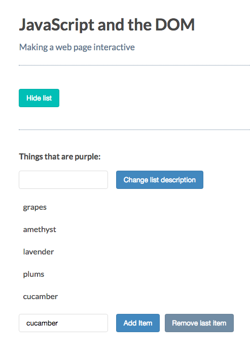
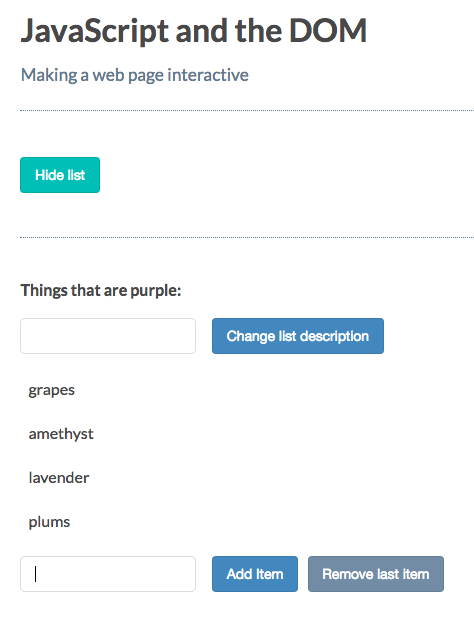

# Removing Nodes

[MDN page for removeChild](https://developer.mozilla.org/en-US/docs/Web/API/Node/removeChild)

### Example
First we add a new `button` in the html to trigger the `element` removal. 

**html**
```html
<!DOCTYPE html>
<html>
  <head>
    <title>JavaScript and the DOM</title>
    <link rel="stylesheet" href="css/style.css">
  </head>
  <body>
    <h1 id="myHeading">JavaScript and the DOM</h1>
    <p>Making a web page interactive</p> 
    <button id="toggleList">Hide list</button>
      <div class="list">
      <p class="description">Things that are purple:</p>
      <input type="text" class="description"> 
      <button class="description">Change list description</button>
      <ul>
        <li>grapes</li>
        <li>amethyst</li>
        <li>lavender</li>
        <li>plums</li>
      </ul>
        <input type="text" class="addItemInput"> 
      <button class="addItemButton">Add Item</button>
        <button class="removeItemButton">Remove last item</button> <!-- new button here -->
        </div>
    <script src="app.js"></script>
  </body>
</html>
```
**JS**
```js
const toggleList = document.getElementById('toggleList');
const listDiv = document.querySelector('.list');
const input = document.querySelector('input');
const p = document.querySelector('p.description');
const button = document.querySelector('button');
const addItemInput = document.querySelector('input.addItemInput');
const addItemButton = document.querySelector('button.addItemButton');
const removeItemButton = document.querySelector('button.removeItemButton'); //select remove button

toggleList.addEventListener('click', () =>{
if(listDiv.style.display == 'none'){
  toggleList.textContent = 'Hide list';
  listDiv.style.display = 'block';
}else{
  toggleList.textContent = 'Show list';
listDiv.style.display = 'none';
}
})
button.addEventListener( 'click', () => {
 p.innerHTML = input.value + ':';                      
});

addItemButton.addEventListener('click', () =>{
let ul = document.getElementsByTagName('ul')[0];                               
let li = document.createElement('li'); 
li.textContent = addItemInput.value;
ul.appendChild(li);
});

removeItemButton.addEventListener('click', () =>{  //listen to the new button event
let ul = document.getElementsByTagName('ul')[0];                               
let li = document.querySelector('li:last-child');  //here we used css selector
ul.removeChild(li); //removeCHild method
});
```

### Result



