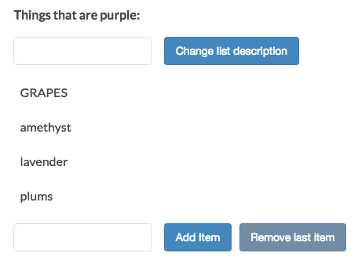

# Listening for Events with `.addEventListner()`

Now you know that there are three basic concepts to making a site interactive. `Selection` is always the first step. Then you can either `manipulate` the element directly, or ask it to `listen for user actions`. Now it's time to learn about the third one, listening for user actions, or events.

[Here is MDN page for addEventListener](https://developer.mozilla.org/en-US/docs/Web/API/EventTarget/addEventListener)

### Example

Let's capitalise an `item` in the `list` when we hover it and change it back to lower case when the mouse was off. 

**HTML**
```html
<!DOCTYPE html>
<html>
  <head>
    <title>JavaScript and the DOM</title>
    <link rel="stylesheet" href="css/style.css">
  </head>
  <body>
    <h1 id="myHeading">JavaScript and the DOM</h1>
    <p>Making a web page interactive</p> 
    <button id="toggleList">Hide list</button>
      <div class="list">
      <p class="description">Things that are purple:</p>
      <input type="text" class="description"> 
      <button class="description">Change list description</button>
      <ul>
        <li>grapes</li>
        <li>amethyst</li>
        <li>lavender</li>
        <li>plums</li>
      </ul>
        <input type="text" class="addItemInput"> 
      <button class="addItemButton">Add Item</button>
        <button class="removeItemButton">Remove last item</button>
        </div>
    <script src="app.js"></script>
   
  </body>
</html>
```
To create this behavior we need to add two `listeners` to each list `item`. We need one, that capitalises the `element's` text when the mouse enters the `list` boundaries and we'll need anorther one that changes it back when the mouse leaves. 

First we select all the list `items` at the top of the page. Then call `.addEventListner` on list `items`. And let the first argument we'll type the `event` which we want this `element` listen to. And add a `function` to change the text to capitel letters. 

**JS**

```js
const toggleList = document.getElementById('toggleList');
const listDiv = document.querySelector('.list');
const input = document.querySelector('input');
const p = document.querySelector('p.description');
const button = document.querySelector('button');
const addItemInput = document.querySelector('input.addItemInput');
const addItemButton = document.querySelector('button.addItemButton');
const removeItemButton = document.querySelector('button.removeItemButton');
const listItems = document.getElementsByTagName('li')[0]; //select list item

listItems.addEventListener('mouseover', () =>{
listItems.textContent = listItems.textContent.toUpperCase();  //call eventListener and use a function           
})

toggleList.addEventListener('click', () =>{
if(listDiv.style.display == 'none'){
  toggleList.textContent = 'Hide list';
  listDiv.style.display = 'block';
}else{
  toggleList.textContent = 'Show list';
listDiv.style.display = 'none';
}
})
button.addEventListener( 'click', () => {
 p.innerHTML = input.value + ':';                      
});

addItemButton.addEventListener('click', () =>{
let ul = document.getElementsByTagName('ul')[0];                               
let li = document.createElement('li'); 
li.textContent = addItemInput.value;
ul.appendChild(li);
});

removeItemButton.addEventListener('click', () =>{
let ul = document.getElementsByTagName('ul')[0];                               
let li = document.querySelector('li:last-child'); 
ul.removeChild(li);
});
```
Now we want to change the text back to lowercase. We need to change the `event` to `mouseout` 

```js
const toggleList = document.getElementById('toggleList');
const listDiv = document.querySelector('.list');
const input = document.querySelector('input');
const p = document.querySelector('p.description');
const button = document.querySelector('button');
const addItemInput = document.querySelector('input.addItemInput');
const addItemButton = document.querySelector('button.addItemButton');
const removeItemButton = document.querySelector('button.removeItemButton');
const listItems = document.getElementsByTagName('li')[0];

listItems.addEventListener('mouseover', () =>{
listItems.textContent = listItems.textContent.toUpperCase();
});

listItems.addEventListener('mouseout', () =>{   //change the event
listItems.textContent = listItems.textContent.toLowerCase(); // text to lowercase
});

toggleList.addEventListener('click', () =>{
if(listDiv.style.display == 'none'){
  toggleList.textContent = 'Hide list';
  listDiv.style.display = 'block';
}else{
  toggleList.textContent = 'Show list';
listDiv.style.display = 'none';
}
});

button.addEventListener( 'click', () => {
 p.innerHTML = input.value + ':';                      
});

addItemButton.addEventListener('click', () =>{
let ul = document.getElementsByTagName('ul')[0];                               
let li = document.createElement('li'); 
li.textContent = addItemInput.value;
ul.appendChild(li);
});

removeItemButton.addEventListener('click', () =>{
let ul = document.getElementsByTagName('ul')[0];                               
let li = document.querySelector('li:last-child'); 
ul.removeChild(li);
});
```


Let's do the same but for all `list items`. Here we need a `for` loop. 

```js
const toggleList = document.getElementById('toggleList');
const listDiv = document.querySelector('.list');
const input = document.querySelector('input');
const p = document.querySelector('p.description');
const button = document.querySelector('button');
const addItemInput = document.querySelector('input.addItemInput');
const addItemButton = document.querySelector('button.addItemButton');
const removeItemButton = document.querySelector('button.removeItemButton');
const listItems = document.getElementsByTagName('li'); //select all items

for (let i = 0; i < listItems.length; i += 1){        //loop through each item
listItems[i].addEventListener('mouseover', () =>{
listItems[i].textContent = listItems[i].textContent.toUpperCase();
});

listItems[i].addEventListener('mouseout', () =>{
listItems[i].textContent = listItems[i].textContent.toLowerCase(); 
});
}

toggleList.addEventListener('click', () =>{
if(listDiv.style.display == 'none'){
  toggleList.textContent = 'Hide list';
  listDiv.style.display = 'block';
}else{
  toggleList.textContent = 'Show list';
listDiv.style.display = 'none';
}
});

button.addEventListener( 'click', () => {
 p.innerHTML = input.value + ':';                      
});

addItemButton.addEventListener('click', () =>{
let ul = document.getElementsByTagName('ul')[0];                               
let li = document.createElement('li'); 
li.textContent = addItemInput.value;
ul.appendChild(li);
});

removeItemButton.addEventListener('click', () =>{
let ul = document.getElementsByTagName('ul')[0];                               
let li = document.querySelector('li:last-child'); 
ul.removeChild(li);
});
```
What if a user adds a new `item` to the list? This new `item` will not listen to our event. To solve this we need to add this `behavior` to each new `item` the list creates. 
Look at `020_Event Bubbling and Delegation` lesson. 


