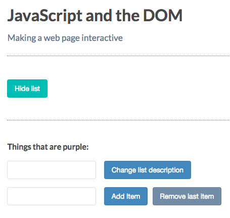
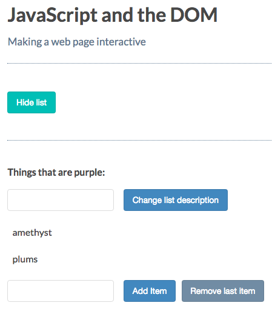
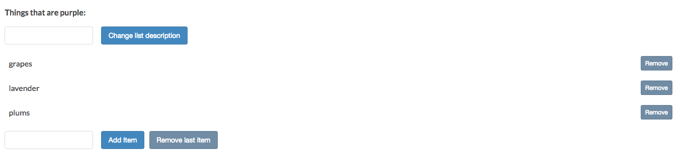

# Using `parentNode` to Traverse Up the DOM

`Traversal` is similar to selection. It's the way to move from one part of the DOM to another and select an element based on its relationships to another element. 

```js
let paragraph = document.getElementById('myParagraph');
`parent`.removeChild('paragraph');
```
To get a reference to an element's `parent Node`, you can use the `parentNode` property. Frist you get the paragraph's parent node and assign it to a variable `parent`. Then use the `parent` to remove the paragraph.  

```js
let paragraph = document.getElementById('myParagraph');
let parent = paragraph.parentNode; // get the paragraph's parent node
`parent`.removeChild('paragraph');
```
### Example

Let's change the capitalisation behavior. Let's delete capitalisation of the list items. 

**HTML**
```html
<!DOCTYPE html>
<html>
  <head>
    <title>JavaScript and the DOM</title>
    <link rel="stylesheet" href="css/style.css">
  </head>
  <body>
    <h1 id="myHeading">JavaScript and the DOM</h1>
    <p>Making a web page interactive</p> 
    <button id="toggleList">Hide list</button>
      <div class="list">
      <p class="description">Things that are purple:</p>
      <input type="text" class="description"> 
      <button class="description">Change list description</button>
      <ul>
        <li>grapes</li>
        <li>amethyst</li>
        <li>lavender</li>
        <li>plums</li>
      </ul>
        <input type="text" class="addItemInput"> 
      <button class="addItemButton">Add Item</button>
        <button class="removeItemButton">Remove last item</button>
        </div>
    <script src="app.js"></script>
   
  </body>
</html>
```

To delete an item we need to to DOM `traversal` first to get the hold of the list items `parent`. 

**JS**
```js
const toggleList = document.getElementById('toggleList');
const listDiv = document.querySelector('.list');
const input = document.querySelector('input');
const p = document.querySelector('p.description');
const button = document.querySelector('button');
const addItemInput = document.querySelector('input.addItemInput');
const addItemButton = document.querySelector('button.addItemButton');
const removeItemButton = document.querySelector('button.removeItemButton');


listDiv.addEventListener('mouseover', (event) =>{  
  if(event.target.tagName == 'LI'){
event.target.textContent = event.target.textContent.toUpperCase(); //we should delete the line of code with uppercase
  }
});

listDiv.addEventListener('mouseout', (event) =>{     //we should delete mouseout event 
  if(event.target.tagName == 'LI'){
event.target.textContent = event.target.textContent.toLowerCase(); 
  }
});


toggleList.addEventListener('click', () =>{
if(listDiv.style.display == 'none'){
  toggleList.textContent = 'Hide list';
  listDiv.style.display = 'block';
}else{
  toggleList.textContent = 'Show list';
listDiv.style.display = 'none';
}
});

button.addEventListener( 'click', () => {
 p.innerHTML = input.value + ':';                      
});

addItemButton.addEventListener('click', () =>{
let ul = document.getElementsByTagName('ul')[0];                               
let li = document.createElement('li'); 
li.textContent = addItemInput.value;
ul.appendChild(li);
});

removeItemButton.addEventListener('click', () =>{
let ul = document.getElementsByTagName('ul')[0];                               
let li = document.querySelector('li:last-child'); 
ul.removeChild(li);
});
```

```js
const toggleList = document.getElementById('toggleList');
const listDiv = document.querySelector('.list');
const input = document.querySelector('input');
const p = document.querySelector('p.description');
const button = document.querySelector('button');
const addItemInput = document.querySelector('input.addItemInput');
const addItemButton = document.querySelector('button.addItemButton');
const removeItemButton = document.querySelector('button.removeItemButton');


listDiv.addEventListener('mouseover', (event) =>{
  if(event.target.tagName == 'LI'){
    let li = event.target; // assign target list item to a variable of its own
    let ul = li.parentNode; // get reference to the target li element's parent
    ul.removeChild(li); // call a remove child 
  }
});


toggleList.addEventListener('click', () =>{
if(listDiv.style.display == 'none'){
  toggleList.textContent = 'Hide list';
  listDiv.style.display = 'block';
}else{
  toggleList.textContent = 'Show list';
listDiv.style.display = 'none';
}
});

button.addEventListener( 'click', () => {
 p.innerHTML = input.value + ':';                      
});

addItemButton.addEventListener('click', () =>{
let ul = document.getElementsByTagName('ul')[0];                               
let li = document.createElement('li'); 
li.textContent = addItemInput.value;
ul.appendChild(li);
});

removeItemButton.addEventListener('click', () =>{
let ul = document.getElementsByTagName('ul')[0];                               
let li = document.querySelector('li:last-child'); 
ul.removeChild(li);
});
```


Let chanche `mouseover` to `click`. It gives more control on removing the items. 



Still it would be easier to the user to know the item is removable is to if there was a button next to it. So let's add one next to each item. In html let's add a `button` element with the text "Remove". 

**HTML**
```html
<!DOCTYPE html>
<html>
  <head>
    <title>JavaScript and the DOM</title>
    <link rel="stylesheet" href="css/style.css">
  </head>
  <body>
    <h1 id="myHeading">JavaScript and the DOM</h1>
    <p>Making a web page interactive</p> 
    <button id="toggleList">Hide list</button>
      <div class="list">
      <p class="description">Things that are purple:</p>
      <input type="text" class="description"> 
      <button class="description">Change list description</button>
      <ul>
        <li>grapes <button>Remove</button></li> <!--add a button -->
        <li>amethyst<button>Remove</button></li> <!--add a button -->
        <li>lavender<button>Remove</button></li> <!--add a button -->
        <li>plums<button>Remove</button></li> <!--add a button -->
      </ul>
        <input type="text" class="addItemInput"> 
      <button class="addItemButton">Add Item</button>
        <button class="removeItemButton">Remove last item</button>
        </div>
    <script src="app.js"></script>
   
  </body>
</html>
```
Now lets's modifi the `click` handler to target and respond to `button` elements only. Also we need to update our list items reference. Since the `li` element is the parent of the `button`, we can use the button's parent node property to refer to it. 

```js
listDiv.addEventListener('click', (event) =>{
  if(event.target.tagName == 'BUTTON'){   //target the buttons only
    let li = event.target.parentNode;  // update our list items reference
    let ul = li.parentNode;
    ul.removeChild(li);
  }
});
```


But now there is a problem. Clicking to any orther `button` makes the entire `div` disappear. We can e.g change the location of the `listener` to be closer to our buttons. Let's put it on the `ul` element. In js file we need first to select the `ul` element. 
Then we need to set our `listener` to our newly selected element. 

```js
const toggleList = document.getElementById('toggleList');
const listDiv = document.querySelector('.list');
const input = document.querySelector('input');
const p = document.querySelector('p.description');
const button = document.querySelector('button');
const listUl = listDiv.querySelector('ul');  //select ul item
const addItemInput = document.querySelector('input.addItemInput');
const addItemButton = document.querySelector('button.addItemButton');
const removeItemButton = document.querySelector('button.removeItemButton');


listUl.addEventListener('click', (event) =>{ //set listener to the ul
  if(event.target.tagName == 'BUTTON'){
    let li = event.target.parentNode;
    let ul = li.parentNode;
    ul.removeChild(li);
  }
});


toggleList.addEventListener('click', () =>{
if(listDiv.style.display == 'none'){
  toggleList.textContent = 'Hide list';
  listDiv.style.display = 'block';
}else{
  toggleList.textContent = 'Show list';
listDiv.style.display = 'none';
}
});

button.addEventListener( 'click', () => {
 p.innerHTML = input.value + ':';                      
});

addItemButton.addEventListener('click', () =>{
let ul = document.getElementsByTagName('ul')[0];                               
let li = document.createElement('li'); 
li.textContent = addItemInput.value;
ul.appendChild(li);
});

removeItemButton.addEventListener('click', () =>{
let ul = document.getElementsByTagName('ul')[0];                               
let li = document.querySelector('li:last-child'); 
ul.removeChild(li);
});
```


