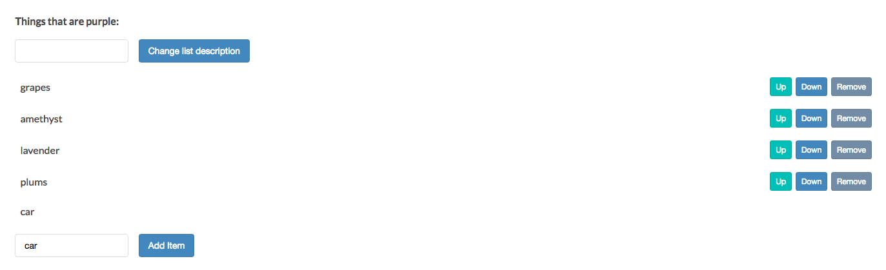
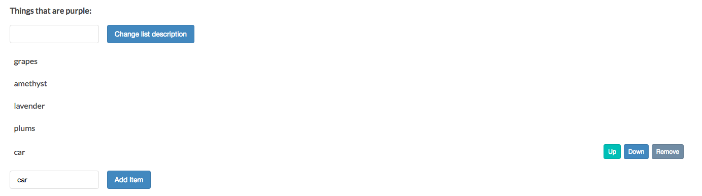

# Getting All Children of a Node with children

Let's learn to get `all children` elements of a `node`, with the `children` property.
Here is [MDN page for children](https://developer.mozilla.org/en-US/docs/Web/API/ParentNode/children)
`Children` will return only `html` elements.
### Example



Now in our example if we add a new `item` to the `list`, no `buttons` are placed on this `new list item`. This means it can't be moved through the list or removed. Let's fix this. Let's add the `buttons` entirely with `JavaScript` to begin with, so our `html` doesn't need to have these `button elements` at all. 

Now our html doesn't have any button with the list. 
```html
<!DOCTYPE html>
<html>
  <head>
    <title>JavaScript and the DOM</title>
    <link rel="stylesheet" href="css/style.css">
  </head>
  <body>
    <h1 id="myHeading">JavaScript and the DOM</h1>
    <p>Making a web page interactive</p> 
    <button id="toggleList">Hide list</button>
      <div class="list">
      <p class="description">Things that are purple:</p>
      <input type="text" class="description"> 
      <button class="description">Change list description</button>
      <ul>
        <li>grapes</li>
        <li>amethyst</li>
        <li>lavender</li>
        <li>plums</li>
      </ul>
        <input type="text" class="addItemInput"> 
      <button class="addItemButton">Add Item</button>
        </div>
    <script src="app.js"></script>
   
  </body>
</html>
```

In our JS, when a user clicks the `button` to create a new `list item` the handler `addItemButton` runs: it creates the `new list item`, sets the text and appends it to the `DOM`. So somwhere inhere we need to create three `buttons` and depend them to the `list` item. Remember we don't just need it to do for the new `list items` , we also need to create the same `list buttons` for any `list items` that are already present when the page loads. So for this reason it makes sense to write a separate `function` that can work in both of these cases. 
So, let's write a `function` that accepts a `list item ` and attaches the needed buttons to it. Under the elements' selections let's declare a `function`. It accepts the `list` item as a parameter. First inside the `function` let's declare three `buttons`. Next, let's add the appropriate `classes` and `text`. And finally let's append each `button` to the `list item` element.

```js
const toggleList = document.getElementById('toggleList');
const listDiv = document.querySelector('.list');
const input = document.querySelector('input');
const p = document.querySelector('p.description');
const button = document.querySelector('button');
const listUl = listDiv.querySelector('ul');
const addItemInput = document.querySelector('input.addItemInput');
const addItemButton = document.querySelector('button.addItemButton');
const removeItemButton = document.querySelector('button.removeItemButton');

function attachListItemButtons (li){     //declare a function
  let up = document.createElement('button'); //create a button
  up.className = 'up'; //set the class
  up.textContent = 'Up'; //set the text
  li.appendChild(up); //append a button

  let down = document.createElement('button');
  down.className = 'down';
  down.textContent = 'Down';
  li.appendChild(down);

  let remove = document.createElement('button');
  remove.className = 'remove';
  remove.textContent = 'Remove';
  li.appendChild(remove);
}

listUl.addEventListener('click', (event) =>{
  if(event.target.tagName == 'BUTTON'){
    if(event.target.className == 'remove'){
        let li = event.target.parentNode;
        let ul = li.parentNode;
        ul.removeChild(li);
    }
    if(event.target.className == 'up'){
        let li = event.target.parentNode;
        let prevLi = li.previousElementSibling;
        let ul = li.parentNode;
       if(prevLi){
        ul.insertBefore(li, prevLi); 
       }
    }
    if(event.target.className == 'down'){
        let li = event.target.parentNode;
        let nextLi = li.nextElementSibling;
        let ul = li.parentNode;
      if(nextLi){
        ul.insertBefore( nextLi, li);
      }
    }
  }
});

toggleList.addEventListener('click', () =>{
if(listDiv.style.display == 'none'){
  toggleList.textContent = 'Hide list';
  listDiv.style.display = 'block';
}else{
  toggleList.textContent = 'Show list';
listDiv.style.display = 'none';
}
});

button.addEventListener( 'click', () => {
 p.innerHTML = input.value + ':';                      
});

addItemButton.addEventListener('click', () =>{
let ul = document.getElementsByTagName('ul')[0];                               
let li = document.createElement('li'); 
li.textContent = addItemInput.value;
ul.appendChild(li);
});
```

Now in our `addItem` handler we can call our `function` on the new `list items`. 

```js
const toggleList = document.getElementById('toggleList');
const listDiv = document.querySelector('.list');
const input = document.querySelector('input');
const p = document.querySelector('p.description');
const button = document.querySelector('button');
const listUl = listDiv.querySelector('ul');
const addItemInput = document.querySelector('input.addItemInput');
const addItemButton = document.querySelector('button.addItemButton');
const removeItemButton = document.querySelector('button.removeItemButton');

function attachListItemButtons (li){
  let up = document.createElement('button');
  up.className = 'up';
  up.textContent = 'Up';
  li.appendChild(up);
  
  let down = document.createElement('button');
  down.className = 'down';
  down.textContent = 'Down';
  li.appendChild(down);
  
  let remove = document.createElement('button');
  remove.className = 'remove';
  remove.textContent = 'Remove';
  li.appendChild(remove);
}

listUl.addEventListener('click', (event) =>{
  if(event.target.tagName == 'BUTTON'){
    if(event.target.className == 'remove'){
        let li = event.target.parentNode;
        let ul = li.parentNode;
        ul.removeChild(li);
    }
    if(event.target.className == 'up'){
        let li = event.target.parentNode;
        let prevLi = li.previousElementSibling;
        let ul = li.parentNode;
       if(prevLi){
        ul.insertBefore(li, prevLi); 
       }
    }
    if(event.target.className == 'down'){
        let li = event.target.parentNode;
        let nextLi = li.nextElementSibling;
        let ul = li.parentNode;
      if(nextLi){
        ul.insertBefore( nextLi, li);
      }
    }
  }
});

toggleList.addEventListener('click', () =>{
if(listDiv.style.display == 'none'){
  toggleList.textContent = 'Hide list';
  listDiv.style.display = 'block';
}else{
  toggleList.textContent = 'Show list';
listDiv.style.display = 'none';
}
});

button.addEventListener( 'click', () => {
 p.innerHTML = input.value + ':';                      
});

addItemButton.addEventListener('click', () =>{
let ul = document.getElementsByTagName('ul')[0];                               
let li = document.createElement('li'); 
li.textContent = addItemInput.value;
attachListItemButtons('li');  //call the function here
ul.appendChild(li);
});
```
Now when we add a new `item` to the list, all three `buttons` appear.



Now we want to add the `buttons` to the existed `list items`. We'll store the button in the `constant` "lis" and select then using the `.children` property. Next below the new `function` we can loop through the `list item` elements calling through attached `list item buttons function` on each one. 

```js
const toggleList = document.getElementById('toggleList');
const listDiv = document.querySelector('.list');
const input = document.querySelector('input');
const p = document.querySelector('p.description');
const button = document.querySelector('button');
const listUl = listDiv.querySelector('ul');
const addItemInput = document.querySelector('input.addItemInput');
const addItemButton = document.querySelector('button.addItemButton');
const removeItemButton = document.querySelector('button.removeItemButton');
const lis = listUl.children; //store and select existed list items to add buttons

function attachListItemButtons (li){
  let up = document.createElement('button');
  up.className = 'up';
  up.textContent = 'Up';
  li.appendChild(up);
  
  let down = document.createElement('button');
  down.className = 'down';
  down.textContent = 'Down';
  li.appendChild(down);
  
  let remove = document.createElement('button');
  remove.className = 'remove';
  remove.textContent = 'Remove';
  li.appendChild(remove);
}

for (let i = 0; i < lis.length; i += 1){ //loop through items 
  attachListItemButtons(lis[i]);        // call a function to add buttons
}
listUl.addEventListener('click', (event) =>{
  if(event.target.tagName == 'BUTTON'){
    if(event.target.className == 'remove'){
        let li = event.target.parentNode;
        let ul = li.parentNode;
        ul.removeChild(li);
    }
    if(event.target.className == 'up'){
        let li = event.target.parentNode;
        let prevLi = li.previousElementSibling;
        let ul = li.parentNode;
       if(prevLi){
        ul.insertBefore(li, prevLi); 
       }
    }
    if(event.target.className == 'down'){
        let li = event.target.parentNode;
        let nextLi = li.nextElementSibling;
        let ul = li.parentNode;
      if(nextLi){
        ul.insertBefore( nextLi, li);
      }
    }
  }
});

toggleList.addEventListener('click', () =>{
if(listDiv.style.display == 'none'){
  toggleList.textContent = 'Hide list';
  listDiv.style.display = 'block';
}else{
  toggleList.textContent = 'Show list';
listDiv.style.display = 'none';
}
});

button.addEventListener( 'click', () => {
 p.innerHTML = input.value + ':';                      
});

addItemButton.addEventListener('click', () =>{
let ul = document.getElementsByTagName('ul')[0];                               
let li = document.createElement('li'); 
li.textContent = addItemInput.value;
attachListItemButtons(li);
ul.appendChild(li);
});
```
