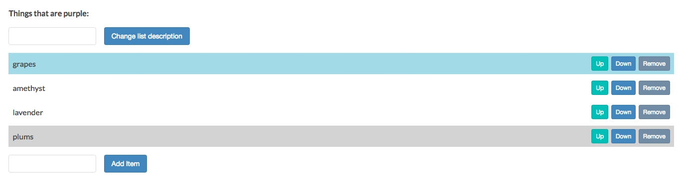

# Getting the First and Last Child

Let's learn to use `firstElementChild` to get the first child element of a selected element, and `lastElementChild`, to get the last element.

Here is [MDN page for firstElementChild](https://developer.mozilla.org/en-US/docs/Web/API/ParentNode/firstElementChild)

Here is [MDN page for lastElementChild](https://developer.mozilla.org/en-US/docs/Web/API/ParentNode/lastElementChild)

### Example
Let's traverse from the `ul` element to its `first` and `last` child. Then we can chang the background color of each. First we create two new `constants` and traverse them. 

```js
const toggleList = document.getElementById('toggleList');
const listDiv = document.querySelector('.list');
const input = document.querySelector('input');
const p = document.querySelector('p.description');
const button = document.querySelector('button');
const listUl = listDiv.querySelector('ul');
const addItemInput = document.querySelector('input.addItemInput');
const addItemButton = document.querySelector('button.addItemButton');
const removeItemButton = document.querySelector('button.removeItemButton');
const lis = listUl.children;
const firstListItem = listUl.firstElementChild; //new const + traverse
const lastListItem = listUl.lastElementChild; //new const + traverse

firstListItem.style.backgroundColor = "babyblue"; //change the background color
lastListItem.style.backgroundColor = "lightgray"; //change the background color


function attachListItemButtons (li){
  let up = document.createElement('button');
  up.className = 'up';
  up.textContent = 'Up';
  li.appendChild(up);
  
  let down = document.createElement('button');
  down.className = 'down';
  down.textContent = 'Down';
  li.appendChild(down);
  
  let remove = document.createElement('button');
  remove.className = 'remove';
  remove.textContent = 'Remove';
  li.appendChild(remove);
}

for (let i = 0; i < lis.length; i += 1){
  attachListItemButtons(lis[i]);
}

listUl.addEventListener('click', (event) =>{
  if(event.target.tagName == 'BUTTON'){
    if(event.target.className == 'remove'){
        let li = event.target.parentNode;
        let ul = li.parentNode;
        ul.removeChild(li);
    }
    if(event.target.className == 'up'){
        let li = event.target.parentNode;
        let prevLi = li.previousElementSibling;
        let ul = li.parentNode;
       if(prevLi){
        ul.insertBefore(li, prevLi); 
       }
    }
    if(event.target.className == 'down'){
        let li = event.target.parentNode;
        let nextLi = li.nextElementSibling;
        let ul = li.parentNode;
      if(nextLi){
        ul.insertBefore( nextLi, li);
      }
    }
  }
});

toggleList.addEventListener('click', () =>{
if(listDiv.style.display == 'none'){
  toggleList.textContent = 'Hide list';
  listDiv.style.display = 'block';
}else{
  toggleList.textContent = 'Show list';
listDiv.style.display = 'none';
}
});

button.addEventListener( 'click', () => {
 p.innerHTML = input.value + ':';                      
});

addItemButton.addEventListener('click', () =>{
let ul = document.getElementsByTagName('ul')[0];                               
let li = document.createElement('li'); 
li.textContent = addItemInput.value;
attachListItemButtons(li);
ul.appendChild(li);
addItemInput.value = ' '; 
});
```

