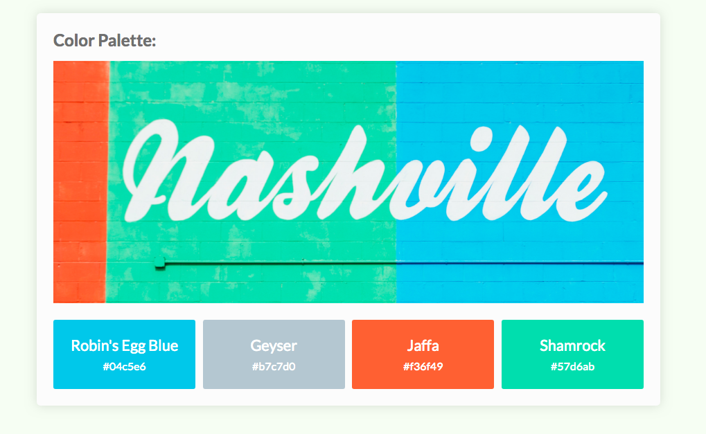

# Challenge DOM Traversal

Create the colored pallete page using DOM traversal. 

**Tasks:**

1. Store the first child of the `ul` in the variable `firstItem` 
2. Using traversal, store the second list item in a variable named `nextItem`
3. Store the last child of the `ul` in a variable named `lastItem`
4. Using traversal, store the second-to-last list item in a variable named `prevItem`
5. Store the nested div in a variable named `banner`
6. Using traversal, store the wrapper div in a variable named `wrapper`
7. Using traversal, store the body in a variable named `body`

**HTML**
```html
<!DOCTYPE html>
<html lang="en">
  <head>
    <meta charset="utf-8">
    <meta name="viewport" content="width=device-width, initial-scale=1, shrink-to-fit=no">
    <link href="https://fonts.googleapis.com/css?family=Courgette" rel="stylesheet">
    <link href="https://fonts.googleapis.com/css?family=Lato:400,700" rel="stylesheet">
    <title>Traversing the DOM</title>
    <link rel="stylesheet" href="css/style.css">
  </head>
  <body>
    <div class="wrapper">
      <h1>Color Palette:</h1>
      <div id="bdiv"></div>
      <ul class="list">
        <li>
          <span>Robin's Egg Blue</span>
          #04c5e6
        </li>
        <li>
          <span>Geyser</span>
          #b7c7d0
        </li>
        <li>
          <span>Jaffa</span>
          #f36f49
        </li>
        <li>
          <span>Shamrock</span>
          #57d6ab
        </li>
      </ul>
    </div>
    <script src="js/scripts.js"></script>
  </body>
</html>
```
### Solution 1

**JS**
```js
// STARTING POINT
const list = document.querySelector('.list');

// 1: Store the first child of the `ul` in the variable `firstItem`
const firstItem = list.firstElementChild;
firstItem.style.backgroundColor = '#04c5e6';

// 2: Using traversal, store the second list item in a variable named `nextItem`
const nextItem = firstItem.nextElementSibling;
nextItem.style.backgroundColor = '#b7c7d0';

// 3: Store the last child of the `ul` in a variable named `lastItem`
const lastItem = list.lastElementChild;
lastItem.style.backgroundColor = '#57d6ab';

// 4: Using traversal, store the second-to-last list item in a variable named `prevItem`
const prevItem = lastItem.previousElementSibling;
prevItem.style.backgroundColor = '#f36f49';

// 5: Store the nested div in a variable named `banner`
const banner = document.querySelector('#bdiv');
banner.className = 'banner';

// 6: Using traversal, store the wrapper div in a variable named `wrapper`
const wrapper = document.querySelector('div.wrapper');
wrapper.style.backgroundColor = '#fcfcfc';

// 7: Using traversal, store the body in a variable named `body`
const body = document.querySelector('body')
body.style.backgroundColor = '#f8fdf3';
```



### Solution 2

**JS**

```js
// STARTING POINT
const list = document.querySelector('.list');

// 1: Store the first child of the `ul` in the variable `firstItem`
const firstItem = list.firstElementChild;
firstItem.style.backgroundColor = '#04c5e6';

// 2: Using traversal, store the second list item in a variable named `nextItem`
const nextItem = firstItem.nextElementSibling;
nextItem.style.backgroundColor = '#b7c7d0';

// 3: Store the last child of the `ul` in a variable named `lastItem`
const lastItem = list.lastElementChild;
lastItem.style.backgroundColor = '#57d6ab';

// 4: Using traversal, store the second-to-last list item in a variable named `prevItem`
const prevItem = lastItem.previousElementSibling;
prevItem.style.backgroundColor = '#f36f49';

// 5: Store the nested div in a variable named `banner`
const banner = list.previousElementSibling;
banner.className = 'banner';

// 6: Using traversal, store the wrapper div in a variable named `wrapper`
const wrapper = list.parentNode;
wrapper.style.backgroundColor = '#fcfcfc';

// 7: Using traversal, store the body in a variable named `body`
const body = wrapper.parentNode;
body.style.backgroundColor = '#f8fdf3';
```

