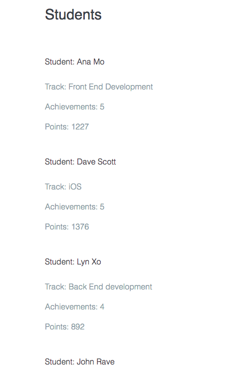

# The build an Object Challenge

### **Part 1** 

You'll create a script that creates a bunch of student records, then prints those records to a web page. 
You'll create a data structure to hold information about a group of students. This should be an `array` named "students", the `array` will hold a list of `objects`. Each `oblect` will represent a student and should have the following `properties`:

* name
* track (e.g iOS, Web Design, Front End Development. etc.) 
* acvhievements (should hold a number `value`)
* points (holds the number of points a student has earned)

Make sure you create at least `five` student `objects`. 

### Solution

```js
var students = [
  { name : 'Ana Mo', track : 'Front End Development', achievements : 5, points : 1227 },
  { name : 'Dave Scott', track: 'iOS', achievements: 5, points: 1376 },
  { name: 'Lyn Xo', track: 'Back End development', achievements: 4, poins: 892 },
  { name: 'John Rave', track: 'Web Design', achievements: 5, points: 1025 },
  { name: 'Pauline Aultry', track: 'Web Design', achievements: 3, poins: 579  }
];
```
### **Part 2**

We need to print the data to the page. For this challenge you need to access each student `record` in the `array`, and print out student's name, track, points and achievements. To do this you need to use a `loop`. Loop through each element of the `array` and build up a `message` that contains all of the student's records. Then print that message to the page. 

### Solution

```js
var students = [
  { name : 'Ana Mo', track : 'Front End Development', achievements : 5, points : 1227 },
  { name : 'Dave Scott', track: 'iOS', achievements: 5, points: 1376 },
  { name : 'Lyn Xo', track: 'Back End development', achievements: 4, points: 892 },
  { name : 'John Rave', track: 'Web Design', achievements: 5, points: 1025 },
  { name : 'Pauline Aultry', track: 'Web Design', achievements: 3, points: 579  }
];
var message = "";
var student;

function print (message){ 
  var div = document.getElementById('output');
  div.innerHTML = message;
}


for (var eachStudent = 0; eachStudent < students.length; eachStudent += 1){
student = students[eachStudent];
message += '<h2>Student: ' +  student.name + '</h2>'
message += '<p>Track: ' + student.track + '</p>'
message += '<p>Achievements: ' +  student.achievements + '</p>'
message += '<p>Points: ' +  student.points + '</p>'

} 

print(message); 
```
### Result



### **Part 3**

This time we'll make the records searchable. Let's create a simple search mechanism. 

* use a `.prompt` method to open a dialog box and request the name of a student. 
* when a sudent name is typed in in the box, you'll search for the student's recocrd and look for the name that matches 
* if there is a match then print out a student data, but only print out that one student's data 
* in addition you have to `prompt` appear over and over again until the word `quit` appear in the dialog box 
* in orther words you'll use a `loop` to perform multiple student's searches 

### Solution

```js
var students = [
  { name : 'Ana Mo', track : 'Front End Development', achievements : 5, points : 1227 },
  { name : 'Dave Scott', track: 'iOS', achievements: 5, points: 1376 },
  { name : 'Lyn Xo', track: 'Back End development', achievements: 4, points: 892 },
  { name : 'John Rave', track: 'Web Design', achievements: 5, points: 1025 },
  { name : 'Pauline Aultry', track: 'Web Design', achievements: 3, points: 579  }
];
var message = "";
var student;
var search;

function print (message){ 
  var div = document.getElementById('output');
  div.innerHTML = message;
}

function getStudentReport (student){
var report = '<h2>Student: ' +  student.name + '</h2>'
report += '<p>Track: ' + student.track + '</p>'
report += '<p>Achievements: ' +  student.achievements + '</p>'
report += '<p>Points: ' +  student.points + '</p>'
return report;
}

while(true){
  search = prompt("Type the name of a student or 'quit' to end")
if (search.toLowerCase() === 'quit'){
  break;
} 
for (var eachStudent = 0; eachStudent < students.length; eachStudent += 1){
student = students[eachStudent];
 if (student.name === search){
   message = getStudentReport(student);
 }
} 
}

print(message); 
```

### **Part 4**

* if we type a name that doestn't exist? The prompt just reappeares with no information why. - We need to solve it. It'll be better if a message appeared like: "No student in the list"
* what happens if there is more than one student with the same name. We need a solution for finding all of the students whose names match, and then printing out the matching students' data


                        
                             
                             
                             