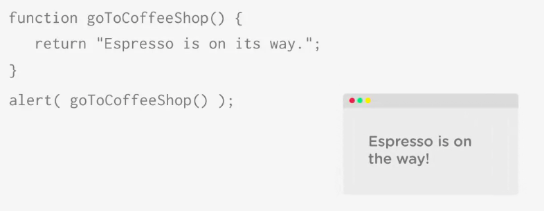

# Getting Information from a Function

Functions can give something back when they are finished. this is called - returning a value. 
To return a value from a function we use the keyword `return` to create the return statement.

```js
function goToCofeeShop(){
    return 'Espresso is on its way';
}
```
Wnen the JavaScript interpteter encounters the `return` keyword it leads a function and provides a `value` following the keyword. The `value` that's returned by the function then can  be used by the program. 



### BUT we can use this `return` value in many different ways: 

1. Print to the console

```js
function goToCofeeShop(){
    return 'Espresso is on its way';
}
console.log(goToCofeeShop());
```

2. Or even save it in a variable

```js
function goToCofeeShop(){
    return 'Espresso is on its way';
}
var cofeeStatus = goToCofeeShop();
```

### More Examples

* we can use returned value in an alert box

```js
function getRandomNumber(){
 var randomNumber = Math.floor( Math.random() * 6 ) + 1;
  return randomNumber;
}
alert(getRandomNumber());
```

* we can print it to the console

```js
function getRandomNumber(){
 var randomNumber = Math.floor( Math.random() * 6 ) + 1;
  return randomNumber;
}
console.log(getRandomNumber()); 
```

* store it in a variable that we can use later 

```js
function getRandomNumber(){
 var randomNumber = Math.floor( Math.random() * 6 ) + 1;
  return randomNumber;
}
var dieRoll = getRandomNumber();
```

## It's possible for the `function` to return more than one statement in it

```js 
function isEmailEmpty(){
    var field = document.getElementById('email'); 
    /* (line 71)   first we access the form field, this code accesses an                                                              element on a web page with an id of "email", and                                                                    stores the reference to that element in a variable                                                                  named "field" */
    if(field.value === ' '){
        return true; 
    } else {
        return false;
    }
}
```
Now the function has two return statements. Let's create a variable to hold the return value form the function.

```js 
function isEmailEmpty(){
    var field = document.getElementById('email'); 
    if(field.value === ' '){
        return true; 
    } else {
        return false;
    }
}
var fieldTest = isEmailEmpty();
```
Then we can use the conditional statement to see if the field is empty

```js 
function isEmailEmpty(){
    var field = document.getElementById('email'); 
    if(field.value === ' '){
        return true; 
    } else {
        return false;
    }
}
var fieldTest = isEmailEmpty();
if(fieldTest === true){
    alert ('Please, provide your email address!');
} 
```
### There are couple of things to remember about the JavaScript `return` statement:

* A `return` statement causes the JavaScript interpreter to exit the function immediately

```js
function noAlert(){
    return 5;
    alert "This will not appear";
}
noAlert();
alert ("This will appear!")
```
Another words the `return statement` should be the last thing in a function.

```js
function good(){
    var message = 'Hello';
    return message;
}
```

* A `return` statement can only return a single value. You can only return one thing:
- - a string
- - a number
- - a boolean value
- - or the contents of a variable 

```js
function good(){
    var message = 'Hello';
    return message;
}
```
```js
function noGood(){
    var message = 'Hello';
```

<pre><code><del>return 1</del><del>message</del><del>'a string'</del></pre></code>   
```js
}
```

**N.B.** You can't return multiple thing at once!

