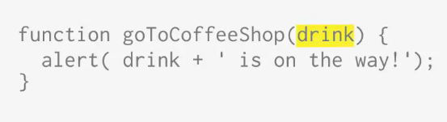
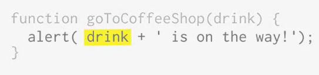
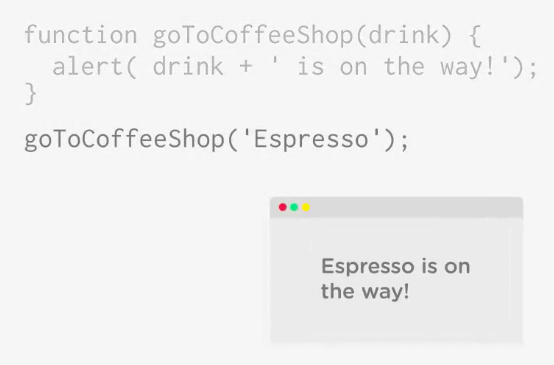

# Adding parameters to a function

```js
function calculateArea( width, length ) {
  return width * length;
}

calculateArea( 5, 4 ); // 20
calculateArea( 30, 4 ); // 120
```

JavaScript `functions` can accept information - called an `argument`, which you send to a function. The `argument` is stored in a variable - called the `parameter`, that you can use inside the function. 



To do this you add the parameter name inside the `()` when you are creating a function. The parameter works just like a variable. We can use the parameter inside the function, just like any variable. 



Now when we call the function we could pass the information into the function. 



We can pass different values and get different results. 

```js
function goToCofeeShop(drink){
  alert( +drink + ' is on the way');
}

goToCofeeShop('Latte'); 
```
```js
function goToCofeeShop(drink){
  alert( +drink + ' is on the way');
}

goToCofeeShop('Chamomile Tea'); 
```
```js
function goToCofeeShop(drink){
  alert( +drink + ' is on the way');
}

goToCofeeShop('Ice Tea'); 
```

### Example

We can make the random number function more flexible by accepting a value that sets the upper limit of each random number. 

First we add the parameter `upper` to the function. This parameter will hold the value that's passed to the function, that is the upper limit of our random number. We can then use this parameter in the program. 

```js
function getRandomNumber(upper) {
  var randomNumber = Math.floor( Math.random() * 6 ) + 1; 
  return randomNumber;
}
```

To use the parameter we need to replace the number `6` with the `parameter` name. 

```js
function getRandomNumber(upper) {
  var randomNumber = Math.floor( Math.random() * upper ) + 1; 
  return randomNumber;
}
```
Now we can generate all kinds of random numbers simply by calling a `function` and passing an `argument` - the upper value of the random number. 

```js
function getRandomNumber(upper) {
  var randomNumber = Math.floor( Math.random() * upper ) + 1; 
  return randomNumber;
}
getRandomNumber(6);
```
`Function` can accept multiple `arguments`. When calling a `function` we can pass multiple `argumets` to the `function`. Each `argument` is then stored in a separate `paremeter`, and is used as a separate `variable` inside the `function`. 

```js
function goToCofeeShop(drink, pastry){
  alert( + drink + 'and ' + pastry+ ' are on the way');
}

goToCofeeShop('Ice Tea', 'croissant'); 
```
Let's create a function that counts the area of a rectangle. 

```js
function getArea(width,lenght){
  var area = width + lengh;
  return area;
}
console.log( getArea(10,20) );
```
If we want a `return` value also contain measure. We can just add a third parameter, then add that to the return value.

```js
function getArea(width, lenght, unit){
  var area = width + lengh;
  return area + " " + unit;
}
console.log( getArea(10, 20, 'sq ft') );
```
