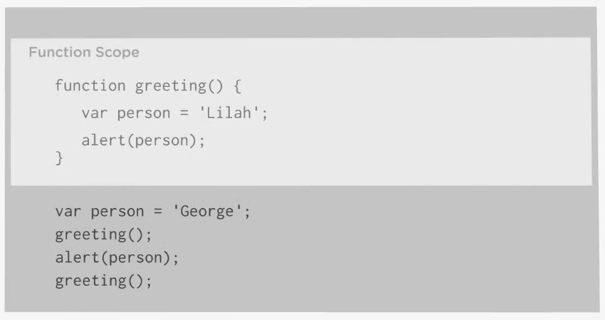
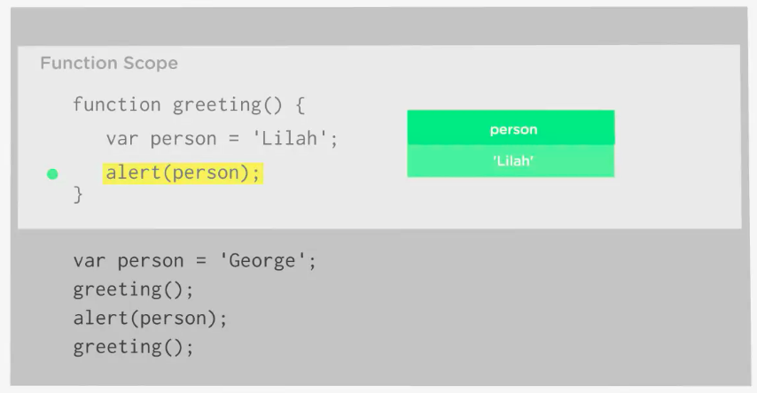
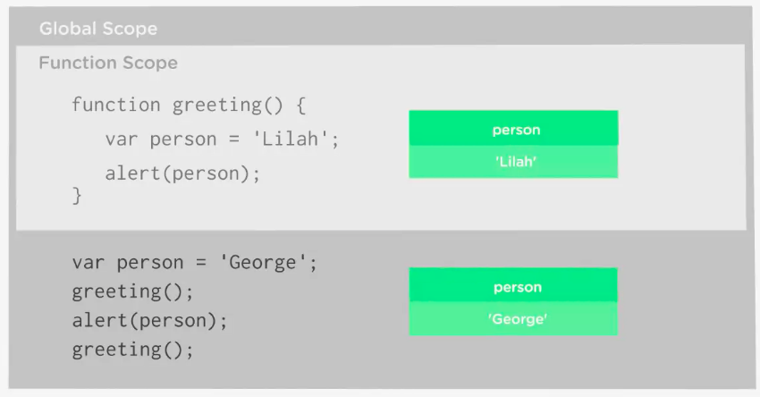
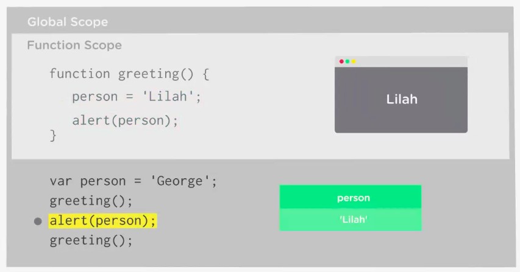

# Scope

JavaScript provides separate `scopes` for each `function`. Each f`unction` acts like its own individual universe. And the `variables` that are created within h=that universe don't interact with the variables created in another universe (function). 

### Example

```js
function greeting (){
    var person = "Lilah";
    alert (person);
}
```
Outside the `function` we'll create a variable also called "person" and store a different string in it.

```js
function greeting (){
    var person = "Lilah";
    alert (person);
}
var person = "George";
greeting();
```
When you call a `function`, JavaScript interpreter jumps into the function, sets the variable to "Lilah", then opens the alert dialog. 

We can give anorther alert and give it the name of the variable. 

```js
function greeting (){
    var person = "Lilah";
    alert (person);
}
var person = "George";
greeting();
alert(person);
```
Now we'll get one alert with "Lilah" and one alert with "George". And if we call the `function` one more time, we'll get the strings "Lilah" - "George" - "Lilah" 

```js
function greeting (){
    var person = "Lilah";
    alert (person);
}
var person = "George";
greeting();
alert(person);
greeting();
```

Well, in this script we have two different `variables` named "person" with two different `values`. Each `variable` livs in its personal scope. 



There is the `scope` of the `function`. The "person" variable declaired in that `function` only livs inside that `function`, and can't be accessed or changed outside of that function. 



There is also a `scope` outside the `function`. This is called - `the global scope`. It's the scope where the other "person" `variable` livs. Any variables in the script that aren't contained in the `function` are in the `global scope`. 



The `global scope` is a bigger universe, cos all `functions` can access the `global scope`. In other words - a `function` can change the `value` of the `variable` from the `global scope`. **BUT this is usually a bad idea.**

For example: If we remove the `var` keyword from our `function`, our program will change drammaticaly. Without `var` keyword the `function` is looking for the `variable` in the `global scope`. Finds one, and then changes it to "Lilah". Now the "person" `variable` in the `global scope` contains the string "Lilah". The "George" `value` is gone forever! 

 ```js
function greeting (){
    person = "Lilah";
    alert (person);
}
var person = "George";
greeting();
alert(person);
greeting();
```


