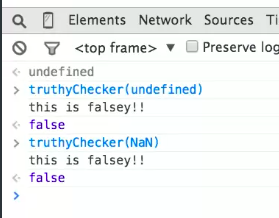

# Booleans

### Truthy values

* "any string" : `"false"`, `"0"`
* `{}`
* `[]`
* `new Date()`
*  `100`
* `2.0`
* etc. 

```js
function truthyChecker(someValue) {
    if (someValue) {
      console.log("this is truthy!!");
      return true
    } else {
      console.log("this is falsey!!");
      return false
    }
};
```


Or we can use any truthy `value`. Finally any `string` that is not empty and any floating value or integer, that is not 0, will give us truthyness. 


### Falsy values 

* `false`
* `0`
* `0.0`
* `null`
* `undefined`
* `NaN`
* `‟ ”` - empty string




