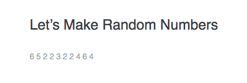
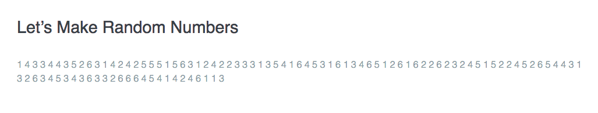
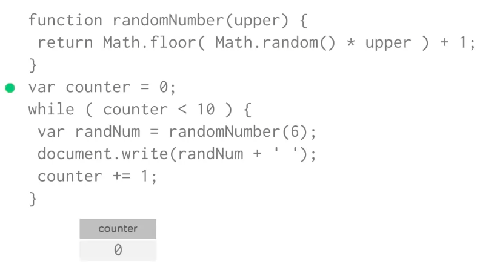

# `While` Loop

Structure of a `while` Loop

```js
while ( ) {
  // this is the loop
}
```
Example: `loop` that runs 10 times

```js
var counter = 1;
while ( counter <= 10 ) {
  console.log(counter);
  counter += 1;
}
```
### Example

Lets use a `loop` to create several random numbers.

```js
function randomNumber(upper) {
  return Math.floor( Math.random() * upper ) + 1;
}

var counter = 0;
while ( counter < 10 ){
  var randNum = randomNumber(6);
  document.write(randNum + ' ' );
  counter +=1;
  }
```

  


  If we need a 100 random numbers?

```js
function randomNumber(upper) {
  return Math.floor( Math.random() * upper ) + 1;
}

var counter = 0;
while ( counter < 100 ){
  var randNum = randomNumber(6);
  document.write(randNum + ' ' );
  counter +=1;
  }
```

 

 ## How JavaScript Interpreter Works

```js
function randomNumber(upper) {
  return Math.floor( Math.random() * upper ) + 1;
}

var counter = 0;
while ( counter < 10 ){
  var randNum = randomNumber(6);
  document.write(randNum + ' ' );
  counter +=1;
  }
  ```
  * first the JavaScript Interpreter reads through the program, it memorises a `function` and checks any `syntax errors`
  * then it starts to run the program, it creates a `variable` named "counter" and stores the `value` `0` in it

  

  * it then looks at the `while` loop, it test the condition. At this point the counter `variable` holds the `value` of `0`. The `loop` condition asks if `counter` is `less than ten`. Yes `0` is less than ten, so the JavaScript Interpreter enters the code block and does several things. 
  - - first it generates a new random number from `1` to `6`
  - - it writes that `random number` and a `space character` to the page
  - - it adds `1` to the counter `variable`, now the counter `variable` has the `value` of `1`
  * the `loop` goes back to the while condition and checks it again: is `1` less than `10`? Yes, it it! So, the `loop` runs again and again and again untill the `loop` condition is no longer tue  - when the counter is equal to `10` the condition is no longer true. 
  * the `loop` end and the program continues 


