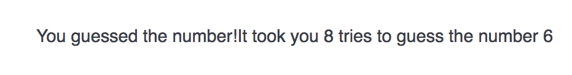

# Do...while Loop

```js
do {
  // code for loop goes here
  // it runs AT least one time
} while ( condition );
 ```
The do/while statement creates a loop that executes a block of code once, before checking if the condition is true, then it will repeat the loop as long as the condition is true.

The do/while statement is used when you want to run a loop at least one time, no matter what.

### Documentation
* do...while [documentation at the Mozilla Developer Network](https://developer.mozilla.org/en-US/docs/Web/JavaScript/Reference/Statements/do...while)

Why would you use a `do...while` loop?
* if you want to prompt a user for some information and make sure the user gives it to you 

### Example "Basic number guessing game that pits a user against the computer"

```js 
var randomNumber = getRandomNumber(10);
var guess;
var guessCount = 0;
var correctGuess = false;

function getRandomNumber( upper ) {
  var num = Math.floor(Math.random() * upper) + 1; 
  return num;
}

do{
  guess = prompt("I'm thinking of a number between 1 and 10. What is it?");
  guessCount +=1;
  if (parseInt(guess) === randomNumber){
    correctGuess = true;
  }
} while( ! correctGuess )
  document.write("<h1>You guessed the number!</h>");
document.write("It took you " + guessCount + " tries to guess the number " + randomNumber);
```



