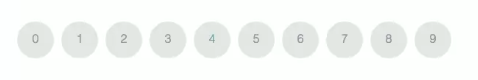

# Foor Loop

### Basic Structure of a For Loop

```js
for (var i = 0; i < 10; i += 1) {
   // do something in here
}
```

You can also increment the counter using the ++ operator like this:

```js
for (var i = 0; i < 10; i++) {
   // do something in here
}
```
**Resources**

[for Loops](https://developer.mozilla.org/en-US/docs/Web/JavaScript/Reference/Statements/for) on the Mozilla Developer Network

`for` loops are frequently used for actions that run a particular number of times. `for` loops are also a common way to work with arrays. 

### Example

Add ten `divs` to a webpage. In orther words we'll use a `for` loop to repeat the same action, adding a `div` to a page ten times. 



```js
var html = ' '; //holds html to be print to the page 

for( var i = 1; i <=10; i +=1){
  html += "<div>" + i + "</div>";
}
document.write( html ); 
```


