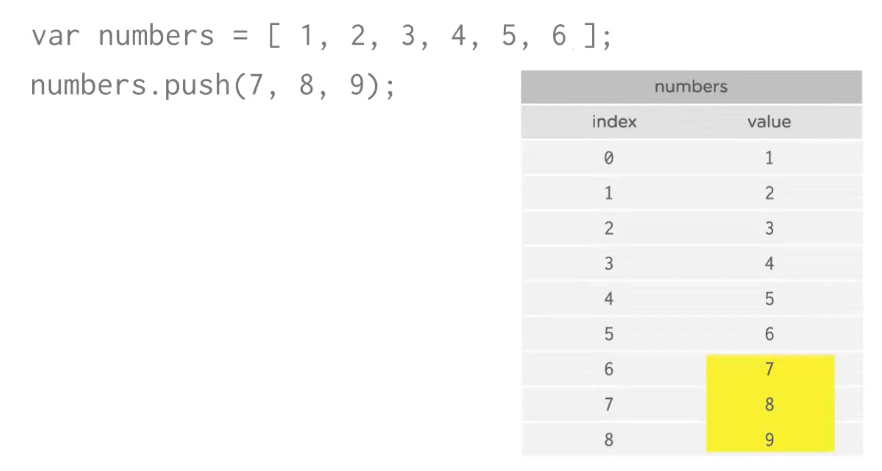
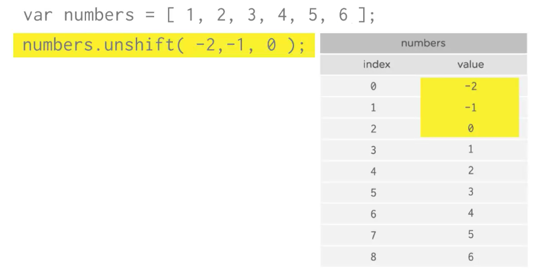
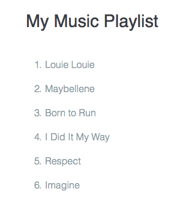

# Adding data to arrays

* Add items to the end of an array with `.push()`
```js
var items = ['Hat', 'Ball', 'Shoes'];
items.push('Socks','Scarf');
// items is now ['Hat', 'Ball', 'Shoes', 'Socks', 'Scarf']
```
* Add items to the beginning of an array with `.unshift()`
```js
var items = ['Hat', 'Ball', 'Shoes'];
items.unshift('Socks','Scarf');
// items is now ['Socks', 'Scarf', 'Hat', 'Ball', 'Shoes']
```

**Resources**
[Array .push()](https://developer.mozilla.org/en-US/docs/Web/JavaScript/Reference/Global_Objects/Array/push) method on Mozilla Developer Network
[Array .unshift()](https://developer.mozilla.org/en-US/docs/Web/JavaScript/Reference/Global_Objects/Array/unshift) method on Mozilla Developer Network

### Example

```js
var numbers = [1,2,3,4,5,6];
numbers[numbers.length] = 7;
[1,2,3,4,5,6,7];
```
A lot easier is to use `.push` method, like this

```js
var numbers = [1,2,3,4,5,6];
numbers.push(7);
```
You also can add more that one item at the end of the array:

```js
var numbers = [1,2,3,4,5,6];
numbers.push(7,8,9);
```


To add items to the beginning of the array we use `.unshift` method:

```js
var numbers = [1,2,3,4,5,6];
numbers.unshift(0); //result will be [0,1,2,3,4,5,6]
```
As well as several items:

```js
var numbers = [1,2,3,4,5,6];
numbers.unshift(-2,-1,0); //result will be [-2, -1, 0,1,2,3,4,5,6]
```


### Example

To make a playlist 

```js
var playlist = [];
playlist.push( 'I Did It My Way');
playlist.push( 'Respect', 'Imagine');
playlist.unshift( 'Born to Run');
playlist.unshift('Louie Louie', 'Maybellene' );
printList( playlist );    
```


